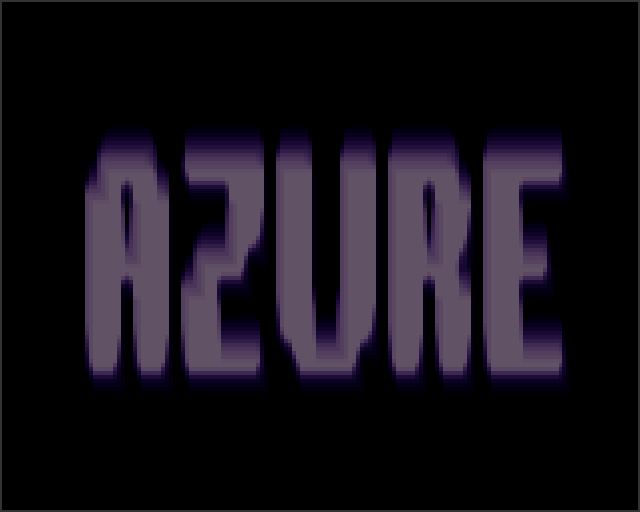
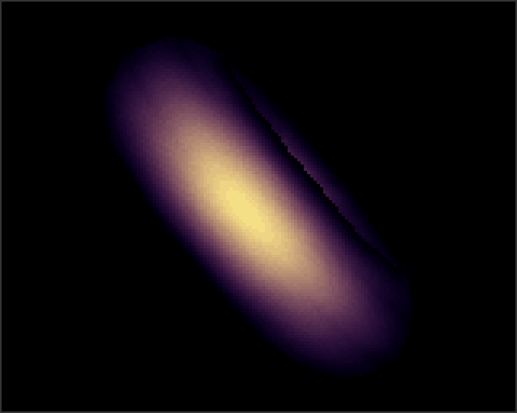

# Dawn — RP2040 port

Port of [Dawn](https://www.pouet.net/prod.php?which=9213) — the 1995 Amiga 1200
4K intro by AZURE/ARTWORK — to the Raspberry Pi Pico (RP2040)
with VGA output via the Pimoroni Pico VGA Demo Base.

## Visuals & Web Demo

A TypeScript/Canvas 2D reference port is included in this repository. You can run the interactive web preview directly in your browser:
🌐 **[Run Web Preview on GitHub Pages](https://cpldcpu.github.io/PicoDemos/)**

Local source: [web_port/web/index.html](web_port/web/index.html)

### Scene Gallery
| DAWN Text | BY Text | AZURE Text |
|:---:|:---:|:---:|
|  |  |  |

| Red Torus Zoom | Swirling Light Torus | Voxel Landscape |
|:---:|:---:|:---:|
|  |  |  |

| Golden Checker Torus | Golden Torus Blur | Grayscale Finale |
|:---:|:---:|:---:|
|  |  |  |

The port runs the original demo end-to-end: text intros, environment-mapped
torus with morphing, voxel landscape, blur trails, and the finale, all from
a 264 KB SRAM budget that the original Amiga didn't have to think about.

## Prebuilt Firmware

The checked-in RP2040 VGA firmware is [dawn_vga_rp2040.uf2](dawn_vga_rp2040.uf2).
Hold BOOTSEL while plugging in the Pico, then drag the UF2 onto the RPI-RP2
USB drive.

## Build (Windows / MSYS2 UCRT64)

Toolchain assumed at `XXX:\msys64\ucrt64`, SDK at `XXX:\Pico\pico-sdk`,
pico-extras at `XXX:\Pico\pico-extras`.

```powershell
$env:PICO_SDK_PATH='XXX:\Pico\pico-sdk'
$env:PICO_EXTRAS_PATH='XXX:\Pico\pico-extras'
$env:PATH = 'XXX:\msys64\ucrt64\bin;' + $env:PATH

cd \PicoDemos\02_Dawn\pico
mkdir build_rp2040
cd build_rp2040
cmake -G "MinGW Makefiles" ..
cmake --build . -j 4
```

The build result is `build_rp2040\dawn_pico.uf2` (~94 KB). The release copy
checked into this folder is [dawn_vga_rp2040.uf2](dawn_vga_rp2040.uf2).

The RP2040 is overclocked to **250 MHz** at vreg 1.20 V (set in
[main.c](pico/main.c) before `stdio_init_all`, mirroring SOTA's pattern).
The stock 125 MHz can't sustain 60 Hz on the FINALE scene (text + torus +
blur every frame); 250 MHz holds the deadline comfortably.

## Hardware

[Pimoroni Pico VGA Demo Base](https://shop.pimoroni.com/products/pimoroni-pico-vga-demo-base)
gives RGB DAC ladders on the standard RPi-Foundation VGA pinout:

| Pin     | Use                |
| ------- | ------------------ |
| GP0–4   | Red bits 0–4       |
| GP6–10  | Green bits 0–4     |
| GP11–15 | Blue bits 0–4      |
| GP16    | HSYNC              |
| GP17    | VSYNC              |
| GP22    | Button A (poll, rising-edge → skip to next scene) |
| GP27/28 | PWM audio L/R (TBD) |

## What you see

The original timeline is preserved:

1. `DAWN` text fade-in
2. `BY` text fade-in
3. `AZURE` text fade-in
4. Environment-mapped torus (warm-red palette) zooming in
5. Same torus with swirling-highlight light offset
6. Voxel landscape flying over sine-wave terrain
7. Torus with checkered env map (golden palette)
8. Torus with checkered env map + blur trail
9. Finale: `DAWN` text on the torus, full grayscale palette
10. Loops back

Each scene fades to the next via the original 70-frame blur fadeout
(dawn_final.s:499-509).

## Architecture

```
        main.c (60 Hz tick, vblank-paced)
            │
            v
       sequencer.c ── scene switcher
            │
   ┌────────┼────────┬─────────┬─────────┐
   v        v        v         v         v
torus.c  texmap.c  voxel.c  effects.c   palette.c
            │        │         │          │
            └────►   chunky[160×128]  ◄────┘
                         │
              core 1 scanline reader (vga.c)
                         │
                   pico_scanvideo
                         │
                     VGA 320×240@60
```

- **Engine native resolution: 160×128**, palette-indexed (6 bits/pixel).
  Same as the original chunky buffer.
- **Display: 320×240@60** via pico-extras `vga_mode_320x240_60`. Core 1
  reads each chunky byte, looks up `palette_rgb565[]`, and writes two
  consecutive RGB-565 pixels per source byte (2× horizontal scale; 2×
  vertical via line doubling). The 4 rows top and bottom of the chunky
  buffer are cropped — content is centered, loss is invisible.
- **No chunky-to-planar conversion**: the original needed it to feed AGA
  bitplanes; the Pico scans chunky directly.

## Engine differences from the original

The Amiga had 2 MB of Chip RAM. The RP2040 has 264 KB. Most of the
original's lookup tables are mechanically reproducible at runtime; we drop
them rather than pay the SRAM.

| Original LUT             | Size  | Pico approach                          |
| ------------------------ | ----- | -------------------------------------- |
| Division table 256×256   | 128 KB | Use HW divider (`/`)                   |
| Normalization 65536      | 128 KB | Compute via `sqrt`; called rarely      |
| Env map 256×256          | 64 KB  | Compute inline in texmap inner loop    |
| Heightmap 256×256        | 64 KB  | Kept full size (shrunk to 128² distorts the radial-wave count) |
| Colormap 256×256         | 64 KB  | Kept full size                         |
| Voxel shade 65×256       | 16 KB  | Trivially computed inline              |
| Blur pair LUT 16384      | 32 KB  | Computed inline (4 ops)                |
| Sine table (8 copies)    | 16 KB  | Single 2 KB copy with `& 0x3FF` mask   |
| Torus morph 40 keyframes | ~110 KB | Regenerate one frame parametrically   |

The torus regeneration runs once per scene change (TORUS_1..TORUS_BLUR)
or once per frame for the FINALE — about 30 µs of CPU per frame at 250 MHz.

## Memory footprint

After `cmake --build`, `arm-none-eabi-size dawn_pico.elf`:

```
   text     data     bss     dec     hex   filename
  51836        0  199324  251160   3d518   dawn_pico.elf
```

- **Flash**: 52 KB of code + scanvideo PIO tables. Pico has 2 MB flash.
- **SRAM (BSS)**: 199 KB. Largest consumers: voxel heightmap (64 KB),
  colormap (64 KB), chunky front+back framebuffers (2 × 20 KB), scanvideo
  line pool (~13 KB), torus/scratch/palette state (~18 KB). ~65 KB of
  SRAM headroom remaining (stack + heap + future audio buffers).

## Audio

Phase 1: silent stub. The original is a fixed 8-byte triangle waveform on 4
detuned Paula channels (periods 9724/9740/9756/9772 → ~46 Hz each). Will
add PWM-DMA playback through GP27/28 on the VGA Base once visuals are
hardware-verified.

## File layout

```
02_Dawn/
├── README.md                 # This file
├── dawn_vga_rp2040.uf2       # Checked-in RP2040 VGA firmware
├── pico/                     # RP2040 port — primary
│   ├── CMakeLists.txt
│   ├── main.c                # Boot, 250 MHz overclock, 60 Hz vblank-paced loop
│   ├── vga.c/.h              # pico_scanvideo backend on core 1
│   ├── audio.c/.h            # PWM-DMA Paula (stub for now)
│   ├── chunky.c/.h           # 160×128 framebuffer (ping-pong) + vertical blur
│   ├── palette.c/.h          # 5 color schemes → RGB-565
│   ├── mathtab.c/.h          # 1024-entry sine table
│   ├── vector3d.c/.h         # Rotate, project, normal→UV
│   ├── torus.c/.h            # Parametric one-frame torus
│   ├── texmap.c/.h           # Polygon rasterizer + inline env sampler
│   ├── voxel.c/.h            # 256×256 voxel raycaster
│   ├── effects.c/.h          # Text glyphs + fadeout state machine
│   ├── button.c/.h           # GP22 button-A polling (skip-to-next-scene)
│   └── sequencer.c/.h        # Scene timeline
└── web_port/                 # TypeScript reference (Oct 2025)
    ├── original_source/
    │   ├── dawn_final.s      # 68020 assembly (1874 lines)
    │   └── README.md         # Asm→TS cross-reference
    └── web/src/              # TypeScript implementation
```

The TypeScript port in `web_port/` is the line-by-line translation that
drove the algorithm choices here. When in doubt about a specific
calculation, the TS code is the canonical reference for what the asm does
in modern terms.

## Credits

- Original demo: AZURE/ARTWORK, 1995, Amiga 1200, exactly 4096 bytes.
- TypeScript reference port: October 2025, this repo's `web_port/`.
- RP2040 port: May 2026, this repo's `pico/`.

> *"Environment-mapping rulez !!"* — dawn_final.s:12
