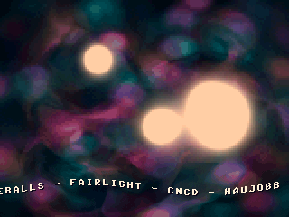
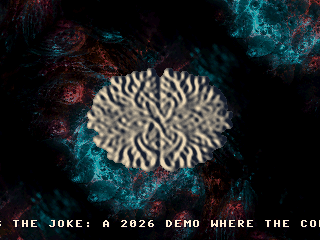

# 10_TheDemo (SLOP)

An original demoscene production for the **Raspberry Pi Pico 2 (RP2350)**, targeting Waveshare RP2350-Plus + Pimoroni VGA Demo Base. Bio-organic aesthetic, three VGA modes plus a copper-style raster split, QOA-encoded soundtrack, AI-generated still imagery.

This is *not* a port — everything in [thedemo/](thedemo/) is new code, written for RP2350's capabilities (dual M33 with FPU, 520 KB SRAM, PIO scanvideo).

## Visuals & Demo Video

Watch the complete, high-fidelity demoscene production in smooth 60fps high-definition:
📺 **[Download & Play: SLOP / TheDemo 60FPS HD Video (media/thedemo_60fps.mp4)](media/thedemo_60fps.mp4)**

Direct video file:

- [media/thedemo_60fps.mp4](media/thedemo_60fps.mp4)

## Prebuilt Firmware

The checked-in RP2350 VGA firmware is [slop_vga_rp2350.uf2](slop_vga_rp2350.uf2).
Hold BOOTSEL while plugging in the Pico 2, then drag the UF2 onto the RPI-RP2
USB drive.

### Scene Gallery
| Copper Title (Intro) | Voxel Landscape | Fluid Portraits | Copperbar Scroll |
|:---:|:---:|:---:|:---:|
|  |  |  |  |

| Raytraced Reflective Spheres | Reaction-Diffusion | Tunnel Particles | Rotozoom Credits (Outro) |
|:---:|:---:|:---:|:---:|
|  |  |  |  |

## Demo arc

≈4:34, beat-synced to a 4:06 track. Boundaries aligned to the music's structural segments via librosa analysis (see [thedemo/tools/analyze_music.py](thedemo/tools/analyze_music.py)) — they fall on the actual section transitions, not chosen by feel. Mode switches happen during the brief fade-to-black between scenes.

| Time | Mode | Scene |
|---|---|---|
| 0:00–0:36 | 320×240 | Title fade-in over copper-bar pulse — holds through the intro, lands on the 0:36 beat-drop |
| 0:36–1:01 | 320×240 | Voxel landscape flyover |
| 1:01–1:31 | 160×120 | Fluid sim with dye-injected AI portraits |
| 1:31–2:07 | split   | Truecolor metaballs over 8bpp greetz scroller |
| 2:07–2:44 | 160×120 | Raytraced reflective spheres with envmap + floor + shadows — ends on the big musical breakdown |
| 2:44–3:04 | 160×120 | Reaction-diffusion + shear-flow advection, morphing to wireframe logo |
| 3:04–3:39 | 320×240 | Tunnel twist + particle storm forming the endcard |
| 3:39–4:34 | 320×240 | Rotozoomed bumpmap logo + scrolling credits (audio ends at 4:06, scroller finishes against silence) |

## Architecture

### Cores

- **Core 0**: scene runner, effect `frame()` rendering, audio sample feed.
- **Core 1**: scanvideo scanline callback. Reads from the published "front" framebuffer and emits the composable-scanline stream the SDK's `scanvideo_dpi` expects. Per-scanline mode dispatch handles the split mode.

QOA decode runs on core 0 between frames. DMA paces I2S/PWM audio output.

### Screen modes

| Mode | Resolution | Pixel format | Used by |
|---|---|---|---|
| `MODE_320` | 320×240 | 8bpp palette (256-RGB555 LUT) | title, voxel, tunnel, credits |
| `MODE_160` | 160×120 | RGB565 (PIO-native layout — see [thedemo/rgb565.h](thedemo/rgb565.h)) | fluid, spheres, RD |
| `MODE_SPLIT_160_OVER_320` | 160 + 320 | upper rows fb160 (RGB565), lower rows fb320 (palette) | greetz scroller |

The RGB565 layout matches the default `pico_scanvideo_dpi` GPIO mapping on the Pimoroni VGA Demo Base (R at LSB, gap at bit 5, G at bits 6-10, B at bits 11-15 — 5 bits per channel). All effects and the asset packer use the `rgb565_pack` / `rgb565_r8`/`g8`/`b8` macros from [thedemo/rgb565.h](thedemo/rgb565.h) so the same value is stored in BSS, blended, and written to GPIO without per-pixel re-layout work in scanout.

### Memory budget (RP2350, 520 KB SRAM)

Heavy per-scene buffers (76 KB backdrop caches, 4× 19 KB Gray-Scott fields, tunnel LUTs) share a single union via [thedemo/scene_scratch.h](thedemo/scene_scratch.h). Only one scene is active at a time, so giving each its own static would waste ~400 KB of BSS for nothing.

Current BSS ≈ 449 KB (.text ≈ 3.0 MB, sits in flash), leaving ~70 KB SRAM headroom before stacks.

### Scene/effect interface

See [thedemo/scene.h](thedemo/scene.h). An effect is `{name, mode, init, frame, done}`. The timeline lives in [thedemo/timeline.c](thedemo/timeline.c). The scene runner reads the audio playback ms each main-loop iteration, finds the active entry, calls `done()` on the previous scene and `init()` on the new one when crossing a boundary, then calls `frame(t_into, t_global)` every frame.

### Mode switching

The active mode is picked by the scene_runner at the boundary. Scanvideo is stopped, reconfigured, and re-started while the screen is black, hiding the ~1-frame glitch.

## Build

### Pico (target hardware)

Requires a [pico-sdk](https://github.com/raspberrypi/pico-sdk) and [pico-extras](https://github.com/raspberrypi/pico-extras) checkout. Set environment variables pointing at them, then run cmake:

```powershell
# PowerShell
$env:PICO_SDK_PATH    = "C:\path\to\pico-sdk"
$env:PICO_EXTRAS_PATH = "C:\path\to\pico-extras"

cd thedemo
cmake -B build_rp2350 -G "MinGW Makefiles" -DPICO_BOARD=pico2 -DPICO_PLATFORM=rp2350-arm-s
cmake --build build_rp2350 -j
```

```bash
# bash / zsh
export PICO_SDK_PATH=/path/to/pico-sdk
export PICO_EXTRAS_PATH=/path/to/pico-extras

cd thedemo
cmake -B build_rp2350 -DPICO_BOARD=pico2 -DPICO_PLATFORM=rp2350-arm-s
cmake --build build_rp2350 -j
```

Output: `build_rp2350/thedemo.uf2`. The release copy checked into this folder
is [slop_vga_rp2350.uf2](slop_vga_rp2350.uf2).

### Host (SDL2 desktop preview)

Same C sources as the device build, with `main.c`/`vga.c`/`audio_qoa.c` swapped for SDL2 stand-ins under [thedemo/host/](thedemo/host/). Needs MSYS2 UCRT64 with `sdl2` and `pkg-config`:

```bash
cd thedemo/host
make
./thedemo.exe
```

Keys: `ESC`/`Q` quit · `S` screenshot to `screenshots/screenshot_NNN.bmp` · `SPACE`/`→` next scene · `←` previous scene · `R` restart.

CLI flags useful for non-interactive snapshots:

- `--start-ms N` skip the demo clock ahead by N ms before scene 0 (visuals only — audio still plays from t=0)
- `--screenshot-at N` auto-capture at clock = N ms, then exit
- `--exit-after N` exit cleanly after N ms

## Music pipeline (MP3 → QOA)

The MP3 source lives at [thedemo/assets/music.mp3](thedemo/assets/music.mp3); the build incbins the encoded `thedemo/music.qoa` next to the rest of the SDK sources. To re-encode after swapping the MP3:

1. Convert to mono 22050 Hz s16le PCM with ffmpeg:
   ```bash
   ffmpeg -i thedemo/assets/music.mp3 -ac 1 -ar 22050 -f s16le music.raw
   ```
2. Build the QOA encoder (one-time) and encode:
   ```bash
   cd thedemo/tools
   gcc qoaconv_s16.c -std=gnu99 -lm -O3 -o qoaconv_s16
   ./qoaconv_s16 ../../music.raw ../music.qoa 22050 1
   rm ../../music.raw
   ```
3. The CMake build will pick up the new `thedemo/music.qoa` on the next make.

QOA at 22050 Hz mono ≈ 5.5 KB/sec → 4:06 ≈ 1.3 MB. Fits in flash with room for asset bitmaps.

To re-sync the scene boundaries after swapping the soundtrack, run [thedemo/tools/analyze_music.py](thedemo/tools/analyze_music.py) on the new MP3:

```bash
python thedemo/tools/analyze_music.py thedemo/assets/music.mp3 -k 8
```

It reports tempo (librosa DP beat tracker), strongest onsets, and structural segments (agglomerative clustering of beat-synchronous chroma+MFCC features). Cross-reference the segment boundaries against the timeline in [thedemo/timeline.c](thedemo/timeline.c) and the per-scene `SCENE_LEN_MS` constants. Needs `pip install librosa soundfile`.

## AI image assets

Full prompts and post-processing recipes live in [thedemo/assets/PROMPTS.md](thedemo/assets/PROMPTS.md). One prompt per asset, each with target resolution, what to look for, what to avoid, and the imagemagick incantation to massage it into the format the engine wants.

[thedemo/tools/pack_assets.py](thedemo/tools/pack_assets.py) does the cooking:

- Quantizes 320-mode images to a 256-color palette and emits `.bin` + per-image palette.
- Converts RGB565 images for 160-mode direct blits.
- Emits a generated `assets.S` that incbins everything.

The packed outputs live in `thedemo/assets/_packed/` and are checked into the repo so a clone-and-build doesn't require Python+PIL+imagemagick.

## Credits

- Code & direction: Claude Opus 4.7 (Anthropic)
- Human nudging: Azure
- Music: Generated with Suno 4.5, prompt engineering by Claude
- Graphics: Nano Banana Pro (Google) and GPT Image 2 (OpenAI) with prompts by Claude, post-processing recipes by Claude
- QOA codec: Dominic Szablewski (MIT) — `thedemo/qoa.h`
- Pico SDK: Raspberry Pi
