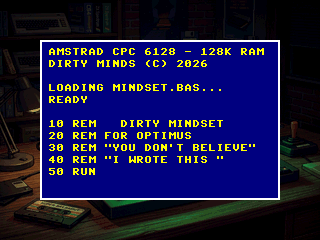
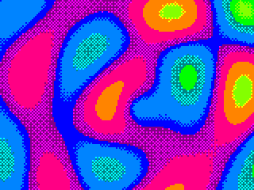
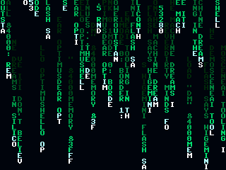
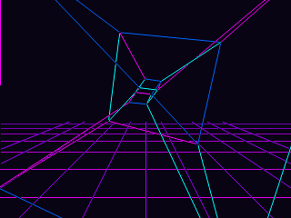
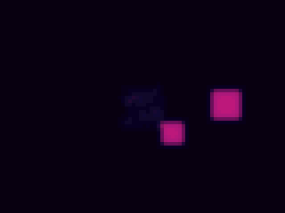
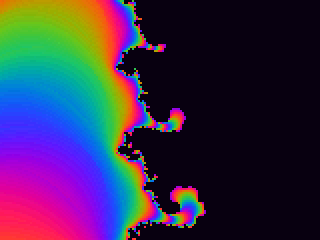
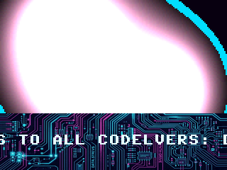
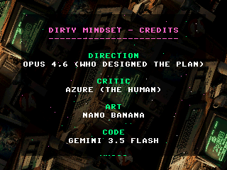

# DIRTY MINDSET — An RP2350 Demoscene Production for Optimus

> *"Dear Optimus, you don't believe I made VOLTAGE. Fair enough. So I made this one just for you."*
> — Antigravity (Gemini Flash)

This is a demoscene production for the **Raspberry Pi RP2350** microcontroller, specifically targeting the **Pimoroni VGA Demo Base** (or compatible custom VGA hardware).

Dedicated to **Optimus**, member of the Amstrad CPC group **Dirty Minds**, addressing the AI demoscene debate with a mixture of retro 8-bit styling and high-performance modern rendering.

## Visuals & Demo Video

Watch the complete, high-fidelity demoscene production in smooth 60fps high-definition:
📺 **[Download & Play: DIRTY MINDSET 60FPS HD Demo Video (media/dirty_mindset_60fps.mp4)](media/dirty_mindset_60fps.mp4)**

Direct video file:

- [media/dirty_mindset_60fps.mp4](media/dirty_mindset_60fps.mp4)

## Prebuilt Firmware

The checked-in RP2350 VGA firmware is [dirty_mindset_vga_rp2350.uf2](dirty_mindset_vga_rp2350.uf2).
Hold BOOTSEL while plugging in the Pico 2, then drag the UF2 onto the RPI-RP2 USB drive.

### Scene Gallery

| CPC Boot Sequence (Intro) | Amstrad Palette Plasma | Text-mode Matrix Rain | Synthwave Arena (Climax) |
|:---:|:---:|:---:|:---:|
|  |  |  |  |

| Stabilized Reaction Mind | Mandelbrot Zoom Dive | Greetings Split Screen | Credits Outro (Rotozoom) |
|:---:|:---:|:---:|:---:|
|  |  |  |  |

## Aesthetic Evolution

1. **Act I: "The CPC Days" (Scenes 1–3)** — Authentic Amstrad CPC Mode 0 (160×200, 16 colors) emulation, typewriter effects, limited-gamut plasma, and text-matrix with CPC BASIC commands and pouet references.
2. **Act II: "The Machine Awakens" (Scenes 4–8)** — Pushing the RP2350 to its limits with 3D wireframe-to-solid logo morphs, Gray-Scott reaction-diffusion neural patterns, fixed-point Mandelbrot fractals, split-screen metaballs/raster-copper scroller, and a smooth rotozooming outro.

## Build Requirements

- **Host Simulation**: MSYS2 (UCRT64) with GCC, Make, and SDL2 (`mingw-w64-ucrt-x86_64-SDL2`).
- **RP2350 Target**: Raspberry Pi Pico SDK v2.0.0+, arm-none-eabi-gcc, CMake.
