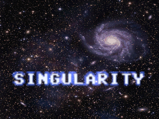
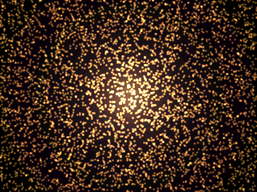
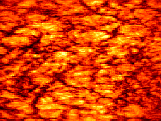
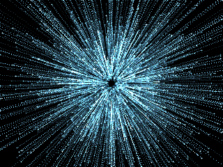
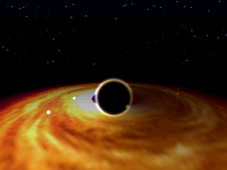
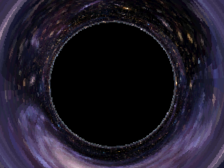
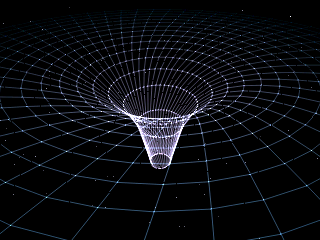
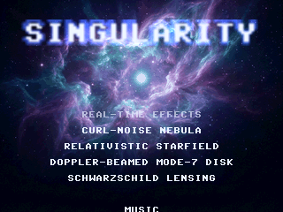

# 13_Singularity (SINGULARITY)

An original demoscene production for the **Raspberry Pi Pico 2 (RP2350)**, targeting Waveshare
RP2350-Plus + Pimoroni VGA Demo Base. A relativistic journey into a black hole — cosmic, physics-
grounded, and rendered in **full 320×240 truecolor** throughout.

This is *not* a port — all of the code in [singularity/](singularity/) is new, written for the
RP2350's M33 FPU, 520 KB SRAM and PIO scanvideo. Aesthetically and technically it is deliberately
unlike the prior originals (10 SLOP's bio-organic, 11 VOLTAGE's neon-cyber): deep cosmic indigo/
violet, accretion gold, relativistic blue→red, with a gravitational-lensing climax that is real
physics baked offline.

## Demo video

Full 5:30 production at 60 fps with the soundtrack:
📺 **[media/singularity_60fps.mp4](media/singularity_60fps.mp4)**

## Prebuilt Firmware

The checked-in RP2350 VGA firmware is [singularity_vga_rp2350.uf2](singularity_vga_rp2350.uf2).
Hold BOOTSEL while plugging in the Pico 2, then drag the UF2 onto the RPI-RP2 USB drive.

### Scene Gallery
| Title | Curl-noise Nebula | Star Ignition | Relativistic Warp |
|:---:|:---:|:---:|:---:|
|  |  |  |  |

| Doppler Accretion Disk | Gravitational Lensing | Spacetime Collapse | Rebirth |
|:---:|:---:|:---:|:---:|
|  |  |  |  |

## Demo arc

≈5:30, beat-synced to the Suno 4.5 track *"Graviton Choir"* (78.3 BPM). Boundaries are snapped to
the music's librosa beat/onset/segment analysis (see [singularity/tools/analyze_music.py](singularity/tools/analyze_music.py)),
not chosen by feel — the star ignites on the strongest early onset (1:14), the singularity whites out
into the loud finale, and the final cadence (5:25) settles the endcard.

| Time | Scene | Technique |
|---|---|---|
| 0:00–0:18 | **Title** | "SINGULARITY" in anti-aliased glowing type over the deep-field panorama |
| 0:18–0:50 | **Curl-noise nebula** | ~6000 dust particles advected by a curl-noise flow + inward pull, coalescing onto a growing proto-star core (cool violet → hot gold) |
| 0:50–1:14 | **Star ignition** | Multi-octave granulation through a blackbody ramp; zoom-in, ignition flare on the 1:14 hit |
| 1:14–1:51 | **Relativistic starfield warp** | Fly-through warp with relativistic **aberration** + **Doppler** blueshift, accelerating to streaks |
| 1:51–2:43 | **Doppler-beamed accretion disk** | Mode-7 tilted spinning disk with relativistic **beaming** (approaching side bright/blue), orbiting hot-spots, a living photon ring, and a dolly descent toward the hole |
| 2:43–3:50 | **Gravitational lensing** *(climax)* | Per-pixel **Schwarzschild geodesic** remap LUT → the Einstein ring + black shadow; accelerating fall-in zoom + roll |
| 3:50–4:37 | **Spacetime collapse** | The "rubber-sheet" gravity well as a glowing anti-aliased wireframe funnel, deepening as we cross the horizon → white singularity flash |
| 4:37–5:30 | **Rebirth + endcard** | Newborn-universe backdrop, title reprise, smooth sub-pixel credits scroll |

## Architecture

Built on the proven dual-core scanvideo engine shared with 10/11.

### Cores
- **Core 0:** scene runner, effect `frame()` rendering, QOA audio sample feed.
- **Core 1:** scanvideo scanline callback — reads the published front buffer and emits the
  composable-scanline stream for `scanvideo_dpi`.

### Screen modes

The engine supports three modes; **SINGULARITY runs entirely in `MODE_HIRES`** (the new full-res
truecolor mode added for this demo).

| Mode | Resolution | Pixel format | Notes |
|---|---|---|---|
| `MODE_320` | 320×240 | 8bpp palette | engine default (unused by this demo) |
| `MODE_160` | 160×120 | RGB565 (PIO-native) | half-res truecolor (used by 10/11) |
| `MODE_HIRES` | **320×240** | **RGB565 (PIO-native)** | **full-res truecolor — every scene here** |

`MODE_HIRES`'s 307 KB double-buffer shares the same framebuffer **arena** as the other modes (only
one mode is live at a time, switches land on a black frame), so full-res truecolor costs no extra
SRAM beyond the largest buffer pair. The title/rebirth backdrops are stored 8bpp-packed in flash and
expanded through a per-frame faded palette directly into the RGB565 buffer. RGB565 uses the
PIO-native GPIO layout — see [singularity/rgb565.h](singularity/rgb565.h); all effects build pixels
via `rgb565_pack` / `rgb565_r8`/`g8`/`b8`.

### Memory budget (RP2350, 520 KB SRAM)
Heavy per-scene buffers (particle arrays, the downsampled disk texture, etc.) share a single union
via [singularity/scene_scratch.h](singularity/scene_scratch.h). BSS ≈ **423 KB / 520 KB**; flash ≈
**3.45 MB / 4 MB** (music.qoa 2.95 MB + packed assets + the 153 KB lensing LUT + code).

### Performance notes (60 fps on the M33)
The per-pixel scenes are written to avoid software transcendentals on the hot path:
- **Lensing** is a flash-LUT gather (the geodesics are integrated offline in
  [singularity/tools/make_lens_lut.py](singularity/tools/make_lens_lut.py)).
- **Nebula** clears via radial r² LUTs (no per-pixel divides) and advects particles through a coarse
  flow grid (no per-particle trig).
- **Disk** downsamples its texture to a 128² unpacked-RGB buffer in scratch so the bilinear tap is
  plain byte reads; per-scanline constants are hoisted and off-disk pixels are culled on r².

### Scene/effect interface
See [singularity/scene.h](singularity/scene.h) — an effect is `{name, mode, init, frame, done}`; the
timeline lives in [singularity/timeline.c](singularity/timeline.c). The runner reads the audio-
playback ms each iteration, switches effects at boundaries, and calls `frame(t_into, t_global)`.

## Build

### Pico (target hardware)
Requires [pico-sdk](https://github.com/raspberrypi/pico-sdk) + [pico-extras](https://github.com/raspberrypi/pico-extras).
```bash
export PICO_SDK_PATH=/path/to/pico-sdk
export PICO_EXTRAS_PATH=/path/to/pico-extras
cd singularity
cmake -B build_rp2350 -G "MinGW Makefiles" -DPICO_BOARD=pico2 -DPICO_PLATFORM=rp2350-arm-s
cmake --build build_rp2350 -j
```
Output `singularity/build_rp2350/singularity.uf2`; the release copy here is
[singularity_vga_rp2350.uf2](singularity_vga_rp2350.uf2).

### Host (SDL2 desktop preview)
Same C sources with `main.c`/`vga.c`/`audio_qoa.c` swapped for SDL2 stand-ins under
[singularity/host/](singularity/host/). Needs MSYS2 UCRT64 with `sdl2` + `pkg-config`:
```bash
cd singularity/host && make && ./singularity.exe
```
Keys: `ESC`/`Q` quit · `S` screenshot · `SPACE`/`→` next scene · `←` previous · `R` restart.
Non-interactive snapshot: `--start-ms N --screenshot-at N --exit-after N`. `--offline` dumps every
frame for the MP4 render.

## Music & assets

- **Music pipeline** (MP3 → QOA): source at
  [singularity/assets/Graviton Choir.mp3](singularity/assets/Graviton%20Choir.mp3);
  `ffmpeg -i "assets/Graviton Choir.mp3" -ac 1 -ar 22050 -f s16le music.raw` then
  `tools/qoaconv_s16 music.raw music.qoa 22050 1`. The build incbins `music.qoa`.
- **Lensing LUT:** `python tools/make_lens_lut.py` integrates the Schwarzschild null geodesics and
  bakes `assets/_packed/lens_lut.bin`. Checked in so a clone builds without Python.
- **Image assets & AI prompts:** [singularity/assets/PROMPTS.md](singularity/assets/PROMPTS.md);
  packed by [singularity/tools/pack_assets.py](singularity/tools/pack_assets.py) into
  `singularity/assets/_packed/` (checked in).
- **Full design doc:** [IMPLEMENTATION.md](IMPLEMENTATION.md).

## Credits

- Code & direction: **Claude Opus 4.8** (Anthropic)
- Human direction & feedback: Azure
- Music: generated with **Suno 4.5** (*"Graviton Choir"*), prompt by Claude
- Graphics: **Nano Banana Pro** (Google) & **GPT Image** (OpenAI), prompts + post-processing by Claude
- QOA codec: Dominic Szablewski (MIT) — [singularity/qoa.h](singularity/qoa.h)
- Pico SDK: Raspberry Pi
