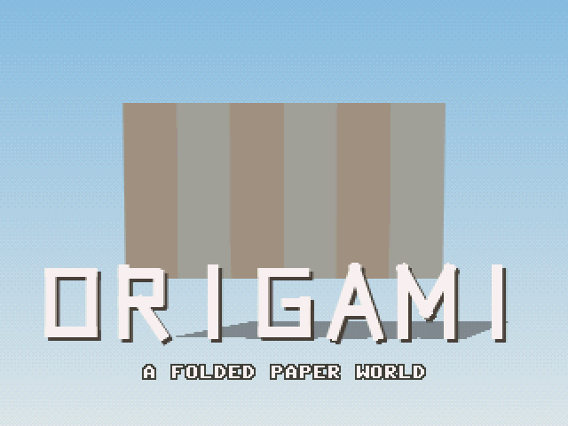
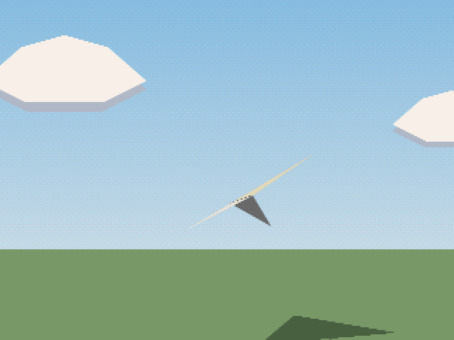
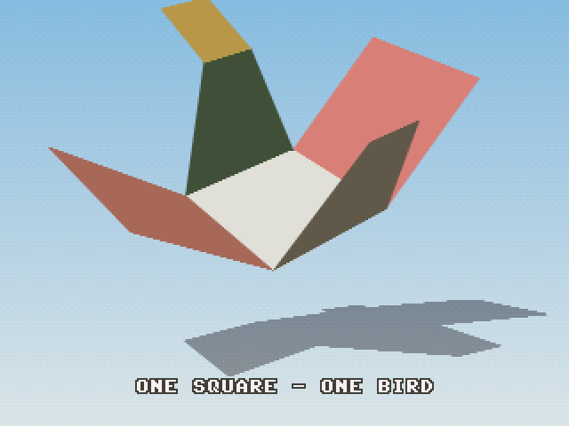
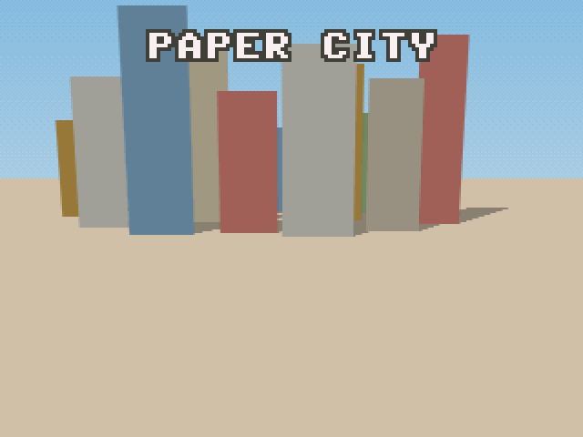
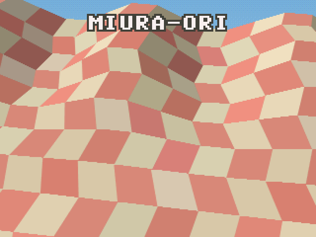
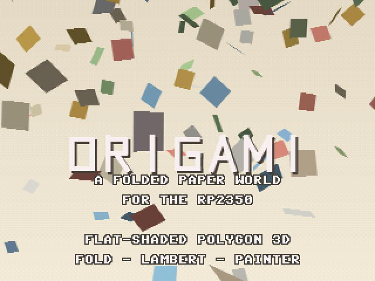

# 14_Origami (ORIGAMI)

An original demoscene production for the **Raspberry Pi Pico 2 (RP2350)**, targeting Waveshare
RP2350-Plus + Pimoroni VGA Demo Base. A warm, hand-made **folded-paper world** — the deliberate
opposite of [13 SINGULARITY](../13_Singularity)'s cosmic intensity.

This is *not* a port — all of the code in [origami/](origami/) is new. Its headline technique is a
real-time **flat-shaded filled-polygon 3D engine** ([origami/effects/poly3d.c](origami/effects/poly3d.c)):
crease **folding**, perspective projection, back-face cull, **painter's-algorithm** depth sorting,
**per-face Lambert** shading, and an **antialiased** convex span fill — all in 320×240 RGB565
truecolor. No prior demo in this repo did solid-polygon rasterisation (the others were wireframe,
env-map, raymarch, or per-pixel/LUT). Running in truecolor means polygon edges are coverage-
antialiased and drop shadows are true alpha-darkening of the ground — and it costs no extra SRAM,
because `vga.c` already sizes its framebuffer arena for the largest mode.

**Author: Claude Opus 4.8.**

## Demo video

Full 2:15 production at 60 fps with the soundtrack:
📺 **[media/origami.mp4](media/origami.mp4)**

## Prebuilt firmware

[origami_vga_rp2350.uf2](origami_vga_rp2350.uf2). Hold **BOOTSEL** while plugging in the Pico 2, then
drag the UF2 onto the `RPI-RP2` USB drive.

### Scene gallery

| Title | Paper-plane flight | Crane fold |
|:---:|:---:|:---:|
|  |  |  |

| Pop-up paper city | Miura-ori wave | Confetti credits |
|:---:|:---:|:---:|
|  |  |  |

## Demo arc

≈2:15, beat-synced to *"Marimba Seedbox"* (Suno 4.5, prompted by Claude; 117.5 BPM, 4/4). Boundaries
are snapped to the track's librosa beat/onset/segment analysis (see
[origami/tools/analyze_music.py](origami/tools/analyze_music.py)).

| Time | Scene | Technique |
|---|---|---|
| 0:00–0:10 | **Title** | "ORIGAMI" — a 6-panel accordion sheet unfolds (animated creases), title stamps on |
| 0:10–0:26 | **Paper-plane flight** | A folded dart banks through cut-paper clouds; soft drop shadow on a paper ground |
| 0:26–0:54 | **Crane fold / unfold** | A flat square folds into an origami crane (staged dihedral creases), turns, unfolds |
| 0:54–1:17 | **Pop-up paper city** | Facades hinge upright from a page, staggered, casting soft shadows; slow orbit |
| 1:17–1:53 | **Miura-ori wave** | An 18×11 Miura field ripples in a fold wave; facets flip light/shadow, pulsing on the beat |
| 1:53–2:15 | **Confetti credits** | 150 tumbling paper quads rain over a warm endcard while the credits scroll |

## How it works

See [IMPLEMENTATION.md](IMPLEMENTATION.md) for the full technical write-up: the `poly3d` engine
(folding math, transform/cull/shade/sort/fill), the 8bpp paper palette layout, the per-frame budget,
and the soundtrack pipeline.

## Build

**Device (RP2350):**
```powershell
$env:PICO_SDK_PATH    = "C:\path\to\pico-sdk"
$env:PICO_EXTRAS_PATH = "C:\path\to\pico-extras"
cd origami
cmake -B build_rp2350 -G "MinGW Makefiles" -DPICO_BOARD=pico2 -DPICO_PLATFORM=rp2350-arm-s
cmake --build build_rp2350 -j        # -> build_rp2350/origami.uf2
```

**Desktop preview (SDL2, MSYS2 UCRT64):**
```bash
cd origami/host && make && ./origami.exe   # SPACE next scene, LEFT prev, R restart, S screenshot
```

## Footprint

Flash `.text` 1.28 MB / 4 MB (≈ 80 KB code + 1.20 MB `music.qoa`); SRAM (BSS) 434 KB / 520 KB.
Holds a steady 60 fps at 320×240 truecolor — even the dense Miura field (≈200 antialiased facets +
a full-screen sky gradient) stays well inside the frame budget.
