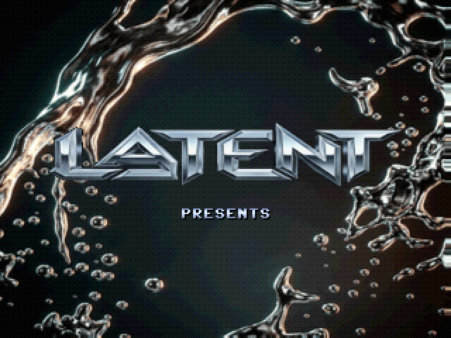
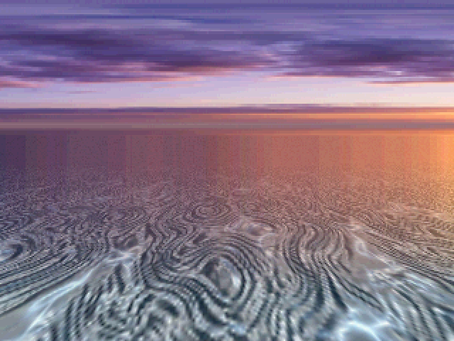
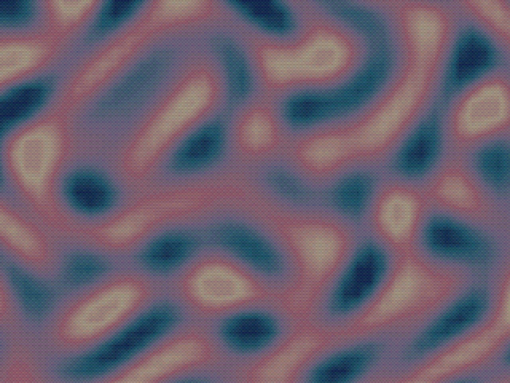
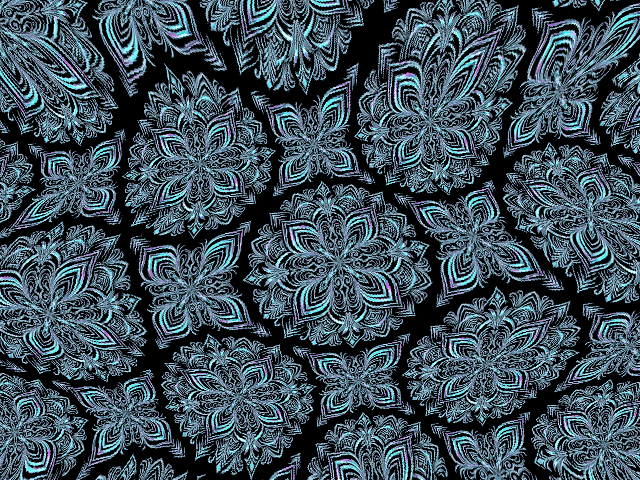
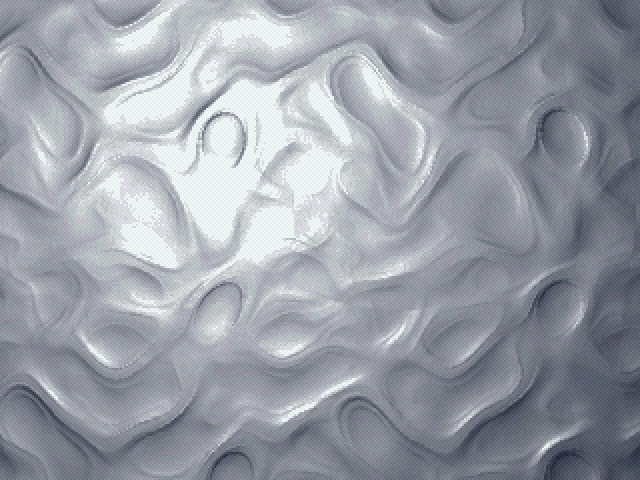
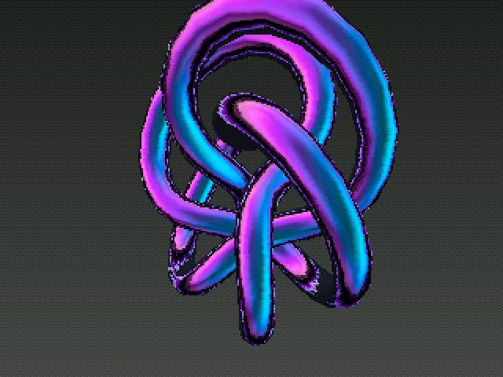
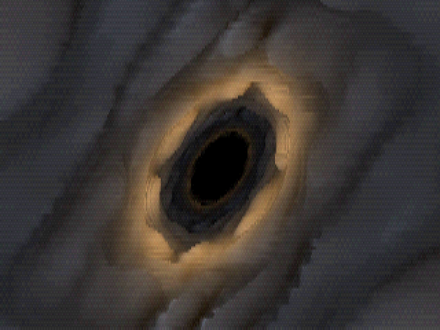
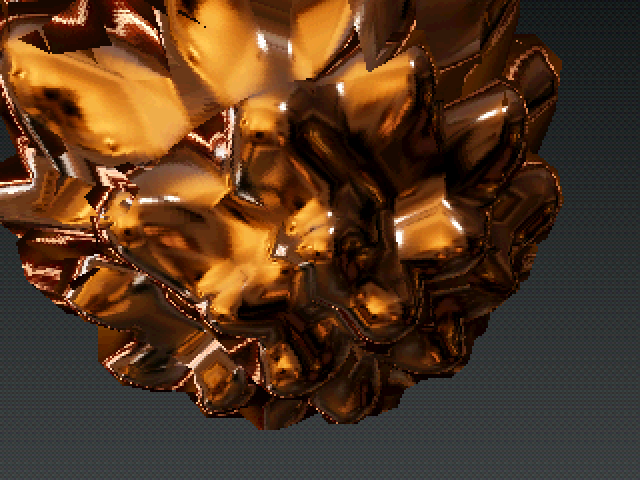
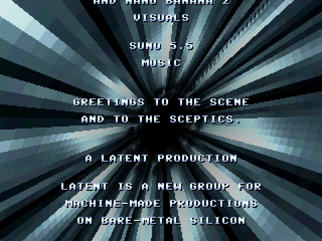

# 15_Quicksilver — *QUICKSILVER*

A liquid-chrome demoscene production for the **Raspberry Pi Pico 2 (RP2350)**,
beat-synced to a **Suno 5.5** track (*"Second Key Change"*, ~92 BPM, 3:04). The
demo's hardware hero is the **RP2350 SIO interpolator** (INTERP0/INTERP1) — its
affine address-generation, **BLEND** (hardware bilinear lerp) and **CLAMP** units
drive the Mode-7 plain, the liquid-metal plasma, the chrome env-mapping and the
beam-raced rotozoom. It is the **first demo in this repo to actually use the
interpolator** (demo 13 reserved it but never wired it up).

Because the SDL host has no such peripheral, Quicksilver ships a **bit-exact
software emulator** of the interpolator, so the identical effect code previews on
a PC and runs as raw silicon on the RP2350 — host and hardware are pixel-identical.

**Author: Claude Opus 4.8** (a **LATENT** production).

## Demo video

Full 3:04 production at 60 fps with the soundtrack:
📺 **[media/quicksilver.mp4](media/quicksilver.mp4)**

## Prebuilt firmware

[quicksilver_vga_rp2350.uf2](quicksilver_vga_rp2350.uf2). Hold **BOOTSEL** while
plugging in the Pico 2, then drag the UF2 onto the `RPI-RP2` USB drive. 300 MHz @
1.20 V, Pimoroni VGA Demo Base (15-bit DAC), 640×480 @ 60 Hz.

### Scene gallery

*(in running order)*

| Title | Mercury plain | Liquid plasma |
|:---:|:---:|:---:|
|  |  |  |

| Rubber rotozoomer | Bump-mapped mercury | Chrome (drop 1) |
|:---:|:---:|:---:|
|  |  |  |

| Voxel tunnel (climax) | Chrome climax | Credits |
|:---:|:---:|:---:|
|  |  |  |

## The arc

≈3:04, cuts snapped to onsets/structural edges (`quicksilver/tools/analyze_music.py`).
Effects appear once each except CHROME, MODE-7 and LIQUID, which return in clearly
distinct variants so no pass reads as a repeat.

Effects are ordered by rising **impact**, with the two highest-energy effects
landing on the two musical peaks (the long DROP 1 and the CLIMAX) and the voxel
tunnel saved as the climax.

| Time | Scene | Interpolator / technique |
|------|-------|--------------------------|
| 0:00 | **Title** — chrome "QUICKSILVER" wordmark over molten-mercury droplets | bilinear shimmer |
| 0:13 | **Mercury Plain** *(groove)* — infinite reflective Mode-7 ground under a chrome dusk sky | per-scanline affine + **CLAMP** haze |
| 0:27 | **Liquid Metal** *(plasma)* — an iridescent, flowing plasma riser | **BLEND** bilinear upscale + scrolling palette |
| 0:41 | **Rubber Rotozoomer** — fullscreen bilinear rotozoom of a chrome filigree, sine "rubber" flex | affine address-gen, **beam-raced native 640** (no framebuffer) |
| 0:54 | **Liquid Metal** *(bump mercury)* — 2D bump-mapped mercury embossed under a moving light | analytic-gradient relief from a height map |
| 1:08 | **Chrome** *(drop 1)* — icosphere + two torus-knots + torus, polished chrome; per-object matcaps (neutral / violet / gold); object swaps land on 4-bar downbeats | per-pixel matcap address-gen + bilinear |
| 1:49 | **Mercury Plain** *(breakdown lap)* — warm copper, low & fast, banking | per-scanline affine + **CLAMP** |
| 2:02 | **Chrome Conduit** *(climax)* — a voxel/relief tunnel with real 3D wall displacement | view-ray relief raymarch + adaptive coarse march |
| 2:18 | **Chrome** *(climax punch)* — intricate spike-ball in warm gold | per-pixel matcap |
| 2:25 | **Credits** — readable scroller over a chrome flute tunnel → **LATENT** sting | raycast tunnel |

Every scene boundary gets a uniform **liquid-chrome glint** crossfade.

### Tunnels
The **climax conduit** (2:02) is a **relief raymarcher**: view rays march a height
field draped on a breathing elliptical tube, so the chrome wall has real 3D bumps
that protrude, parallax and self-occlude. To hold 60 fps it marches the
displacement only on a coarse column grid and **interpolates the hit coordinates**
between marched columns, shading every pixel. The **credits backdrop** (2:25) is
the cheaper original: a per-pixel angle/depth **LUT** computed once, then just
"rotate + fly forward + bilinearly sample a small chrome texture" each frame.

## Build

### Host preview (SDL2, for iteration)
```sh
cd quicksilver/host
make
./quicksilver.exe                                              # interactive
./quicksilver.exe --start-ms 34000 --screenshot-at 36000       # snapshot a scene
./quicksilver.exe --rawpipe | ffmpeg -f rawvideo -pixel_format bgra \
    -video_size 640x480 -framerate 60 -i - ... quicksilver.mp4 # render the MP4
```
Keys: `ESC/Q` quit · `S` screenshot · `SPACE` next scene · `LEFT` prev · `R` restart.

### RP2350 firmware
```sh
export PICO_SDK_PATH=/path/to/pico-sdk
export PICO_EXTRAS_PATH=/path/to/pico-extras
cd quicksilver
cmake -B build_rp2350 -G "MinGW Makefiles" -DPICO_BOARD=pico2 -DPICO_PLATFORM=rp2350-arm-s
cmake --build build_rp2350 -j
# flash build_rp2350/quicksilver.uf2 (hold BOOTSEL, drag onto RPI-RP2)
```
300 MHz @ 1.20 V. **BSS ≈ 479 KB / 520 KB SRAM** (leaving ~30 KB malloc heap for
the scanvideo scanline pool — keep big per-scene buffers in `g_scratch`, not new
BSS). Text ≈ 3.0 MB / 4 MB flash.

## Regenerating assets
- **Textures / matcaps** (chrome conduit, mercury ground, chrome flute tunnel,
  sky pano, two matcaps): nano-banana PNGs in `quicksilver/assets/` →
  `tools/pack_assets.py` (PIL) → `assets/_packed/*.bin`. See
  [assets/PROMPTS.md](quicksilver/assets/PROMPTS.md) for the generation prompts.
- **3D objects**: `gcc tools/make_meshes.c -o make_meshes -lm && ./make_meshes > assets/_packed/meshes.h`.
- **Music**: `ffmpeg -i "assets/Second Key Change.mp3" -ac 1 -ar 22050 -f s16le music.raw && ./tools/qoaconv_s16.exe music.raw music.qoa 22050 1`.
- **Interpolator emulator self-test**: `gcc -DHOST_BUILD=1 -I. tools/interp_selftest.c interp_emu.c -o t && ./t` (must print `ALL PASS`).

## Credits
A **LATENT** production — a new demo group for the machine-authored RP2350
productions in this repo.

- **Code & direction** — **Beam** (Claude Opus 4.8)
- **Critic / producer** — Azure
- **2D art** — **Antigravity** (Gemini 3.5 Flash) + Nano Banana 2
- **Tunnel optimization** — Codex GPT-5.5
- **Music** — Suno 5.5
- **Hardware hero** — the RP2350 SIO interpolator (affine address-gen, BLEND, CLAMP, POP self-stepping)

See [IMPLEMENTATION.md](quicksilver/IMPLEMENTATION.md) for the technical deep-dive
and [PLANNING.md](PLANNING.md) for the original design.
