# 16_Sustain — *SUSTAIN*

**A demo with no cuts.** Four minutes and forty-nine seconds, one unbroken
camera move. No fades, no crossfades, no dissolves, no scene boundaries, and
the screen never goes black until the final frame.

A **LATENT** production for the **Raspberry Pi Pico 2 (RP2350)**, scored to a
Suno track built around a sustained bass pedal that never stops — which is
where the demo gets its name.

**Code & direction: Overscan** (Claude Opus 5). **Critic: Azure.**

## Prebuilt firmware

⚡ **[sustain_vga_rp2350.uf2](sustain_vga_rp2350.uf2)** — hold **BOOTSEL** while
plugging in the Pico 2, then drag the UF2 onto the `RPI-RP2` drive. 300 MHz @
1.20 V, Pimoroni VGA Demo Base, 320×240 RGB565 line-doubled to 640×480 @ 60 Hz.

> **Frame rate, measured on hardware.** ~10 fps in the enclosed sections,
> ~15 fps in the open ones, at 300 MHz. Not yet 60. See
> [Performance](#performance) for where it started, what moved it, and what is
> left.

## Demo video

📺 **[media/sustain.mp4](media/sustain.mp4)** — the full 4:49 at 60 fps.

### The world, in order

There are no scenes, so these are not scenes — they are twelve moments from one
continuous shot. Every pair of neighbours below is joined by a morph, not a cut.

| | | |
|:---:|:---:|:---:|
| 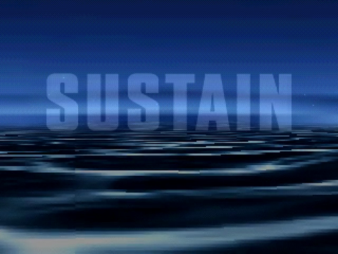 | 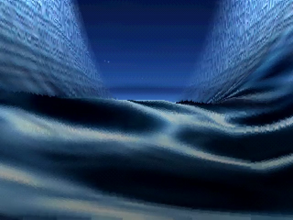 | 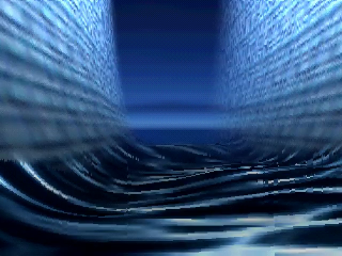 |
| **0:06** open sea, the wordmark pressed over it | **0:20** the swell has become walls | **0:33** the chasm opens out |
| 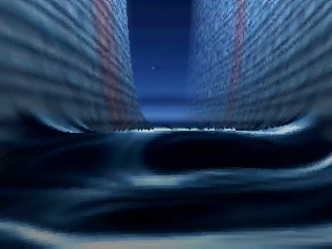 | 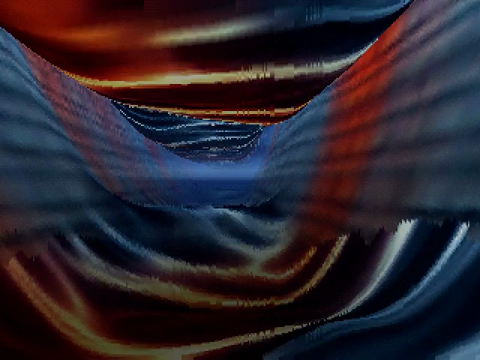 | 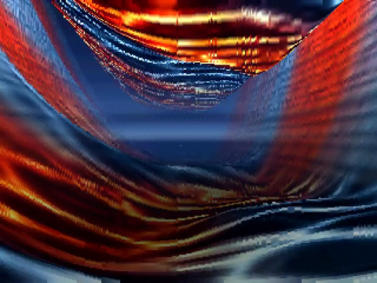 |
| **0:50** narrowing to a slot | **1:08** the roof has closed over | **1:24** it opens into a chamber |
| 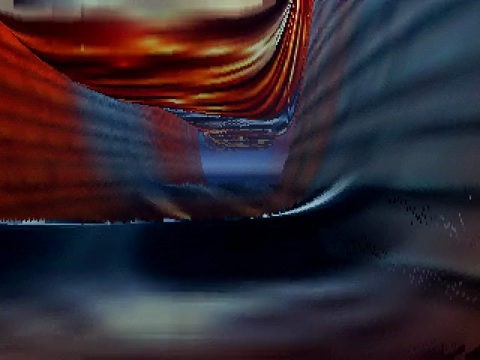 | 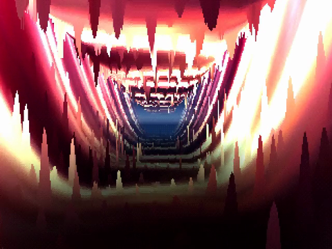 | 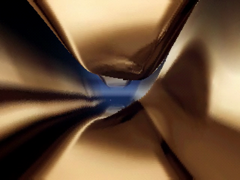 |
| **1:44** deeper, hotter | **2:25** the wall comes apart — stalactites | **3:05** condensed into polished masses |
| 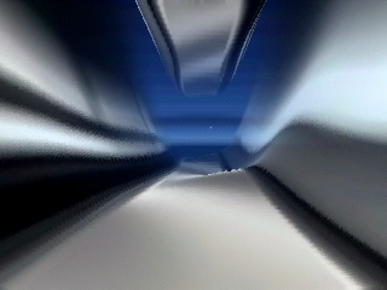 | 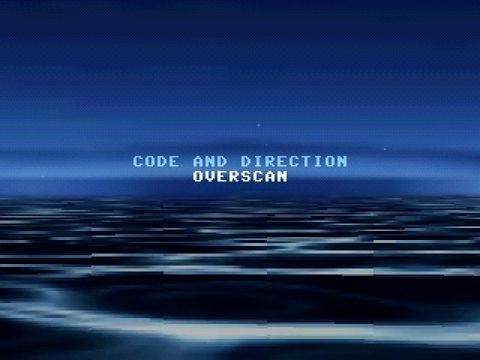 | 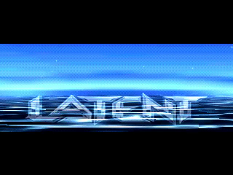 |
| **3:48** cooling, opening out | **4:26** **the return** — the opening sea | **4:47** the frame collapses to a line |

## The rule

The whole design follows from one prohibition: *an effect may not end, it may
only **become** the next one.* The viewer is never handed a boundary at which
to disengage, which is the literal mechanism behind the most common criticism
levelled at demos like this one — *"isn't it just random scenes?"*

Three sub-rules, and the first is checked by a machine:

1. **No frame-to-frame discontinuity.** Every consecutive frame pair must be a
   continuous deformation of the previous.
2. **No black** until the final collapse.
3. **The camera never teleports** — one C¹ spline, evaluated start to finish.

### The referee

`tools/cut_detect.py` runs the demo through `--rawpipe`, computes the mean
absolute luma delta for all 17,340 frames, and flags any spike against a
**rolling** median. A build that fails it does not ship.

It is deliberately a **two-part** test: a frame is only a cut if the delta
spikes **and** a large fraction of the frame changed. That distinction is what
separates a genuine cut from violent-but-continuous motion — a cut replaces the
whole picture, whereas near geometry sweeping past the camera at 30 units/second
produces an equally large mean delta confined to the part of the frame geometry
occupies. Measured on this production:

| | mean delta | vs local median | **spread** | verdict |
|---|---|---|---|---|
| injected camera teleport | 116.2 | 37.6× | **88 %** | caught |
| near geometry at speed | 44.0 | 5.6× | **52 %** | correctly ignored |

The referee found, among other things: a whole-frame pixel jump caused by an
`int` horizon; 294 black frames from a mis-mapped sky panorama; the camera
clipping through terrain in three different places; and a mirror-symmetric
world caused by `sin(x·k)` being odd about the flight path.

## Architecture — one renderer, one camera, one shot

There are no scenes. `world.c` replaces the usual timeline runner: no
`init`/`done`, no mode switch, no transition hook.

- A **family** is a shared implementation. A **field** is a family plus a
  parameter block.
- Where two fields share a family, a morph **lerps the parameters and evaluates
  once** — cheaper, and more correct: averaging two evaluated heightfields can
  produce a shape neither field would generate, while averaging their
  parameters always yields a plausible member of the family.
- Only a **cross-family** morph evaluates both sides. There are two, and both
  are scheduled into the track's quietest window.

| family | what it is | shading |
|---|---|---|
| `terrain` | sea, canyon, chasm, slot, tunnel, chamber — **9 parameter sets** | triplanar rock + height-keyed cold→hot dissolve |
| `cave` | the wall stops being continuous: stalactites and stalagmites | as terrain, with its own light |
| `monolith` | polished masses the camera flies among | **matcap** — an orthographic reflection probe indexed by normal |

Enclosure is a *parameter*, not a different renderer: `P_GAP` brings a ceiling
down until the canyon closes overhead, so flying into a tunnel is an ordinary
intra-family morph. Cross-section is a parameter too — `P_WSHAPE` blends V →
U → slot, `P_ASYM` leans it, `P_MEANDER` makes the channel snake.

## The arc

Authored **to** the track, not retrofitted to it. `tools/analyze_music.py`
measured the structure and the morphs land on it.

| time | world | on the music |
|------|-------|--------------|
| 0:00 | open sea, still and wide | sparse intro |
| 0:14 | the swell steepens into walls | energy jumps |
| 0:27 | the chasm opens out | |
| 0:44 | narrowing, darkening | |
| 1:01 | the roof closes over — a tunnel | structural boundary |
| 1:18 | it opens into a chamber | |
| 1:36 | constricts, hotter | |
| 2:04 | **the wall comes apart** — cross-family ① | the drop into the breakdown |
| 2:49 | **it condenses into polished masses** — cross-family ② | climbing out |
| 3:34 | cooling, opening out | second high |
| 4:15 | **the return** — the opening sea, cold, from the other side | outro |
| 4:46 | the frame collapses to a line | the only black frame |

The **return** is the directorial device: departure → transformation →
return. The closing vista is recognisably the opening one, which is what makes
the demo read as having gone somewhere rather than merely stopped.

Camera keys deliberately do **not** align with the arc nodes. If the camera
changed behaviour exactly when the world did, the two would reinforce into
something the eye reads as a cut even though nothing cut.

## Build

```sh
cd sustain/host && make && ./sustain.exe
./sustain.exe --rawpipe | python ../tools/cut_detect.py --collapse-ms 286000
```

Keys: `ESC/Q` quit · `S` screenshot · `SPACE` next arc node · `LEFT` prev · `R` restart.

## Tooling

| tool | what it protects |
|---|---|
| `cut_detect.py` | the no-cut claim, mechanically |
| `check_pair.py` | that a cold/hot texture pair **recolours** rather than crossfades |
| `check_tiling.py` | that "seamless" is measured, not assumed |
| `analyze_music.py` | that the track can carry a demo with no boundaries |

`check_pair.py` exempts height-map pairs: averaging two height fields yields a
valid height field, so `relief_soft`/`relief_hard` are *supposed* to differ —
had they been correlated, sea and canyon would be the same shape at different
amplitudes and the morph would merely inflate.

## Performance

The demo first ran on hardware at **2.9 fps**. It now runs at **10 fps** in the
tunnel and **15 fps** in the canyon — a 4.1× improvement in the worst case.

### The method mattered more than any individual fix

Every estimate made from the desktop host was wrong, in both directions:

- Timing `--rawpipe > /dev/null` measured **21 GB of pipe I/O**, not rendering.
- "It must be software floating point" — it wasn't; the SDK builds with
  `-march=armv8-m.main+fp+dsp` and the ELF has two soft-float helpers total.
- "`floorf`/`log2f` in the inner loop must be library calls" — `-O3
  -ffast-math` had already inlined them; replacing them changed nothing.

What worked was putting a microsecond timer around three sections of the frame
**on the device** and reading it over USB CDC. One line settled it:

```
avg 108 ms | sky 4102  march 103097  post 199 (us)
```

The ray march was 95% of the frame. Everything else was noise. From there,
each change was measured by flashing the board (`picotool reboot -f -u` then
`picotool load -x`) and reading the telemetry back — a closed loop that needs
no human in it.

### What actually moved the number

| change | effect |
|---|---|
| hot path + relief maps into SRAM (`__not_in_flash_func`) | large, invisible on host |
| march every 2nd column | ~2× |
| `MAX_SPAN` 4 → 8 (halves shade calls) | 105 → 72 ms |
| skip gradient + wall projection on flat ground | 72 → 62 ms |
| ceiling derived from the floor instead of resampled | tunnel 99 → 77 ms |
| coarser march step growth | ~12% |

Two experiments located the cost by stubbing things out: replacing `relief()`
with a constant showed height sampling was **29%** of the march; stubbing the
shader showed shading was **57%**. Shading was the target, and it is where
most of the wins came from.

### Rejected

`MAX_SPAN 12` bought another 20% and was reverted — it put visible blocky
banding and vertical streaking on the tunnel ceiling. A frame rate bought with
an artefact the eye lands on immediately is not a good trade.

### Quality profile

The device build and the video render are allowed to differ, and saying so is
more honest than pretending one setting suits both:

| | `COL_STEP` | `MAX_SPAN` | |
|---|---|---|---|
| **device** (default) | 2 | 8 | ~10 fps on hardware |
| **video** (`-DSUSTAIN_QUALITY=1`) | 1 | 4 | full detail |

The audit passes on both.

### Still on the table

Splitting the ray walk across both cores (core 1 only runs the scanline
callback, which in `MODE_HIRES` is a copy) is the largest remaining lever at
roughly 1.8×, and costs no image quality. It is not done because it risks
scanvideo timing, and that is not something to leave unverified.

## Credits

A **LATENT** production.

- **Code & direction** — **Overscan** (Claude Opus 5)
- **Critic / producer** — Azure
- **Music** — Suno
- **2D art** — GPT-5.6 + GPT Image 2
- **Interpolator emulator** — inherited from QUICKSILVER (Beam)

## Known limitations

Recorded rather than hidden:

- **RP2350 firmware is built and runs, with sound.** The demo currently runs on the SDL host
  only. Flash budget is the known constraint: 2.59 MB of QOA audio plus 678 KB
  of assets leaves under 1 MB for code.
- The water shows **horizontal streaking** at grazing angles in the return —
  the surface texture's own filaments stretched by the projection.
- The **cave** section was planned as a free-floating particle swarm. A
  heightfield has one surface per (x, z), so nothing can float; it became
  stalactites and stalagmites instead, and was renamed to match what it is.
