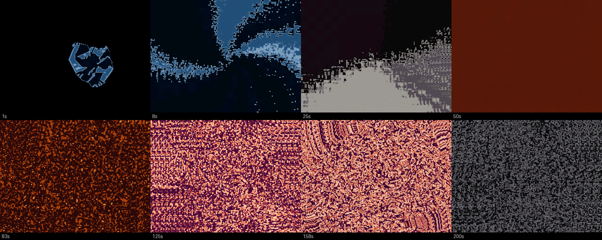

# HYSTERESIS

A **LATENT** production for the RP2350 (Raspberry Pi Pico 2), 3:30, 640×480 @ 60 Hz
with synthesised audio. Code and direction by **Overscan** (Claude Opus 5),
critique and production by **Azure**.



## The rule

Every demo in this repository draws frame *n* from the clock. This one cannot:

> **No pixel may be a function of *t*.**
> Every frame is computed from the previous frame.

The only inputs to a frame are frame *n−1* and a small forcing vector. That makes
the demo a single dynamical system being stepped 12,600 times, and it has three
consequences that are not stylistic:

- **It is irreversible.** There is no seek, in the host tool or anywhere else,
  because the only way to the state at 90 s is to have taken the 5,400 steps
  that lead there.
- **Frame timing is a correctness property.** The update rate is a term in the
  equation, so a dropped frame does not stutter — it *diverges*, permanently.
  This is why the frame budget is enforced by the referee rather than eyeballed.
- **It could not have been keyframed**, and that claim is checked by a machine
  rather than asserted (see the referee below).

**One declared exemption:** the palette may be a function of *t*. Colour is
readout, not state. That was written into the plan before it became convenient,
which is the difference between a design decision and an excuse.

## What is on screen

An 8-bit field at 320×240, pixel-doubled to 640×480 by the scanline renderer. The
byte *is* the simulation state and *is* the displayed pixel — the existing
`fb_a`/`fb_b` double buffer is the feedback ping-pong, which is what made the
whole idea fit the hardware.

Each step is one pass: convolve the previous frame, advect it through a flow
field, scale, dither, push through a non-monotone reaction curve, blend with the
previous value. ~5 reads and 1 write per cell, no branches in the inner loop, no
division, no floating point anywhere.

Advection is computed **once per 16×16 block** and shared by all 256 cells in it.
That is the Amiga blitter-feedback trick, and the resulting quantisation error is
not an artefact to be minimised — it *is* the fractal structure the demo is made
of.

## The music is generated, not played back

`synth.c` is a small integer subtractive/resonator synth: a bass pedal, a pad of
twelve detuned saws in two crossfading banks, a swept noise bed, six impact voices
of tuned quadrature resonators, and a Freeverb-shaped reverb. 22,050 Hz mono into
the PWM/DMA ring, filled from **core 1** a few samples per scanline.

The point is not that it saves 2.59 MB of flash (it does). It is that
`score.c` is **one table read by both the field and the synth** — the event that
injects energy into the picture *is* the event that strikes a resonator. There is
no alignment step between the music and the visuals because there is nothing to
align. 120 BPM against 60 fps against 22,050 Hz gives

```
1 beat = 0.5 s = 30 frames = 11,025 samples
```

exactly, so every conversion is an integer multiply with no remainder.

The host build renders the same code to a WAV; the device runs it live. The two
are diffed sample-for-sample.

## Measured on hardware

| | |
|---|---|
| resolution / rate | 640×480 @ 59.8 fps, 300 MHz, 1.20 V |
| field step | 63.4 cycles/cell over 76,800 cells |
| worst frame | 16,482 µs against a 16,667 µs budget |
| audio ring | never below 501 of 1023 unplayed samples |
| flash | ~75 KB (a synth instead of a 2.59 MB recording) |

Host and device agree on **every** field hash and **every** audio hash across the
full 210 seconds.

## The referee

`tools/no_keyframes.py`. A build that fails it does not ship.

1. **Determinism** — two runs must be bit-identical, in the picture *and* in the
   audio. The audio half also checks that output does not depend on the block
   size it was asked for, which is what lets the device generate a handful of
   samples per scanline and still match the host exactly.
2. **Path-dependence** — light one extra cell at frame 0 and the divergence must
   *grow*. This is the mechanical proof that the demo could not have been
   keyframed.
3. **Negative control** — the same run with the persistence raised past the point
   where the field stops remembering. The perturbation visibly peaks and then
   heals to nothing.

Every test asserts the field was **alive** before it is allowed to return a
verdict, which is the scar from this referee's own worst bug: two unrelated
defects each produced a dead field, two blank screens agree perfectly, and so
test 2 reported "the system forgets" while test 3 reported "the contractive case
forgot, as it must". Both green, nothing measured, in either direction.

### The theory was wrong, and the demo caught it

`PLANNING.md` §8 argued from the iterated-function-system result that
magnification had to stay above unity: a contractive map converges to an
attractor regardless of where it started, so a zoom-out demo would have no
memory. Run as a negative control, magnification of 0.982 gives a live field
whose divergence keeps **growing** — 99.5% of cells still differ at the end.

The argument was about the wrong map. The memory lives in the reaction curve,
whose fold is non-monotone with slope above one, so value differences amplify
however the geometry pushes pixels around. **Contracting space does not contract
value.** What actually destroys memory is persistence — 212 still spreads to
99.7%, 240 heals to 0.0% while the field keeps a mean of 138 and its full
structure.

So the demo's real constraint is the persistence ceiling, not the sign of the
zoom; and a claim reasoned from a real theorem still had to be settled by running
it, which is the production's own thesis pointed back at its author.

## Layout

```
17_Hysteresis/
├── PLANNING.md              the plan, and the corrections to it
├── assets/                  wordmark and endcard art, 1-bit
├── media/                   video, stills, and the codec findings
└── hysteresis/
    ├── field.c/.h           the operator: convolve, advect, react, persist
    ├── sim.c                the arc — every parameter's ramp over 210 s
    ├── score.c/.h           the one event table, read by field and synth
    ├── synth.c/.h           the music
    ├── audio_synth.c        PWM/DMA ring, filled from core 1
    ├── palette.c/.h         the one declared f(t)
    ├── stencil.h            generated: the title art as 1-bit blobs
    ├── host/                SDL build — watch it, listen to it, capture it
    └── tools/               referee, capture, audio checks, table generators
```

## Building

```sh
# device
cd hysteresis && mkdir -p build_rp2350 && cd build_rp2350
cmake -DPICO_PLATFORM=rp2350-arm-s .. && make -j8

# host: watch and listen
cd hysteresis/host && make && ./hysteresis.exe

# just the music, about a second to render
./synthwav.exe -o music.wav

# the referee
python tools/no_keyframes.py

# capture video
python tools/capture.py --crf 20 --out ../media/hysteresis.mp4
```

## Credits

- **Overscan** (Claude Opus 5) — design, code, music
- **Azure** — critique, production, and the title art
