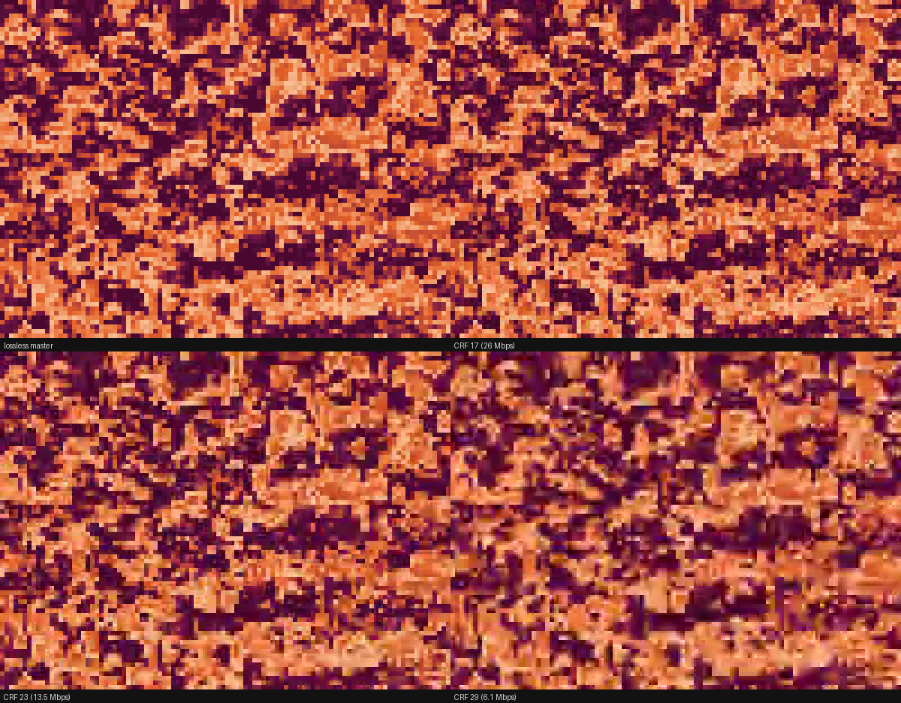

# media

| file | what |
|---|---|
| `hysteresis.mp4` | the full 3:30 capture, 640×480 @ 60, with the synthesised soundtrack |
| `arc_strip.png` | twelve moments across the 210 s arc |
| `opening.png` | the first seconds — one lit cell and nothing else |
| `peak.png` | 116 s, the largest impact and the fullest the field gets |
| `endcard.png` | the endcard, held by a fixed point of the operator |

Regenerate the video with `python hysteresis/tools/capture.py --crf 20`.

---

## This content is close to a worst case for a video codec

Azure predicted it would not encode well. It does not, and it is worth writing
down why, because the reason is the demo itself.

**Lossless, the hardest 20 seconds (105–125 s) at 640×480 @ 60: 291.7 MB, or
122 Mbps.**

### The CRF ladder

Measured against a lossless FFV1 master of that same segment, x264 `-preset slow`
with the tuned parameters below:

| CRF | Mbps | est. full run | PSNR | SSIM | verdict |
|---|---|---|---|---|---|
| 17 | 26.2 | ~656 MB | 28.97 | 0.946 | indistinguishable from lossless |
| **20** | **19.1** | **~477 MB** | **28.13** | **0.925** | **shipped — pixel grid intact** |
| 23 | 13.5 | ~337 MB | 26.95 | 0.891 | edges visibly rounding |
| 26 | 9.3 | ~233 MB | 25.47 | 0.846 | mushy |
| 29 | 6.1 | ~152 MB | 23.73 | 0.785 | texture destroyed |

The "est. full run" column extrapolates the hardest 20 seconds across all 210,
so it is a worst case and the real file is smaller: **`hysteresis.mp4` is 299 MB
at 11.9 Mbps average**. The demo spends its first twenty-five seconds nearly
black and its last six on a held card, and those cost almost nothing.

**PSNR of 29 dB at CRF 17 is the whole story.** On ordinary material CRF 17 is
visually lossless and scores 45 dB or better. Here a setting that *is* visually
lossless still scores 29, because most of what the encoder is failing to
reproduce is noise:

- **The anti-death dither.** `field.c` adds an ordered Bayer residual to every
  cell every frame, deliberately, because repeated integer scaling otherwise
  rounds the field into a frozen fixed point. That residual is incompressible by
  construction and it changes every pixel's low bits sixty times a second.
- **Every pixel changes every frame.** The picture is a feedback loop, so there
  is no static background anywhere for inter-frame prediction to reuse.
- **The motion is not translation.** Advection is a per-16×16-block affine with
  subpixel resampling, so motion estimation cannot match it with a single vector
  per macroblock, and the residuals stay large.
- **Hard edges every 16 pixels**, from that same block advection — the thing the
  demo is made of is the thing DCT is worst at.

Note that the repository's house setting of ~5 Mbps (what SUSTAIN uses) is CRF 30
here. It would erase the texture that this production is *about*, so this file is
deliberately larger.

### What did not help

| tried | result |
|---|---|
| `-pix_fmt yuv444p` | 5% larger, no measurable gain — see chroma, below |
| `-pix_fmt yuv420p10le` | identical PSNR to 8-bit at identical bitrate |
| `-tune grain` | preserves the dither faithfully, at 2.4× the bitrate |
| x265 `-crf 24` | genuinely better: PSNR 28.03 at 12.8 Mbps, beating x264's 26.95 at 13.5. Not used, for compatibility with the other five videos in this repo |
| SVT-AV1 preset 4 | PSNR 28.32 at 16.5 Mbps — worse per bit than x265 here |

### 4:2:0 costs nothing here, unusually

The field is 320×240 doubled to 640×480, so **every 2×2 pixel block is uniform** —
which is exactly the sampling grid 4:2:0 chroma subsampling uses. The chroma
planes lose nothing, and `yuv444p` buys 5% of file size for no measurable
quality. This is the one way in which the content is *friendly* to a codec.

### The resolution finding

Because the doubling is exact, downscaling the capture to 320×240 with a nearest
filter is **bit-exact** — the round trip back to 640×480 measures `PSNR = inf`.
The 640×480 stream therefore carries no more information than a 320×240 one.

That has a striking consequence:

| | Mbps | full run | PSNR vs the 640 master |
|---|---|---|---|
| 640×480, CRF 17 | 26.2 | ~656 MB | 28.97 |
| 320×240, CRF 17 | 9.6 | ~239 MB | **30.02** |

Encoding at the native resolution is **higher fidelity in a 2.7× smaller file**,
because none of the bitrate is spent describing the pixel-doubling redundancy and
quantisation happens on the real pixel grid instead of smearing across doubled
edges.

It is still not what ships. A 320×240 file is scaled up by whatever filter the
viewer's player happens to use, and every one of them uses something bilinear —
which blurs precisely the pixel-level texture the demo exists to show. The
doubling is baked in so that playback cannot get it wrong, and the 2.7× is the
price of that.
