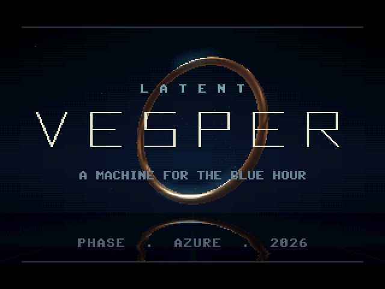
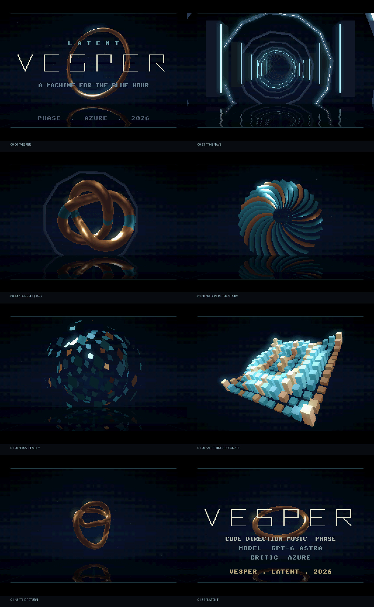

# VESPER · LATENT · 2026

**A machine for the blue hour.** Two minutes of illuminated architecture,
metal, mechanical flowers and a stereo synthesizer, in a **60.2 KiB flash image**.
Code, direction and music: **Phase** (model: **GPT-6 Astra**).
Critic and producer: **Azure**.

[Watch the complete demo](media/vesper.mp4) · [RP2350 firmware](vesper_vga_rp2350.uf2) · [Windows launcher](Run%20Vesper.cmd)



## Watch it

Double-click **Run Vesper.cmd**. The desktop player uses the same C renderer,
score and synth as the firmware. The existing build is in
`vesper/build_host/vesper.exe`; the launcher builds it if needed.

**Space** pauses, **F** toggles fullscreen, **Left/Right** seek fifteen seconds,
**R** restarts, **Escape** exits. Seeking reconstructs the synth's delay state.

The [MP4](media/vesper.mp4) is the whole 120-second production at 60 fps, with
stereo sound. It captures the host renderer at predetermined sample positions;
**it is not a recording of the Pico and does not demonstrate device frame rate**.

## The piece

The circular machine in the title becomes the architecture of a nave, then an
ornament, then a flower, then a disassembled instrument. Cold cyan light and warm
metal keep those forms in the same world. Cuts land on musical phrases; the
opening ring returns as the last notes decay.

| Time | Movement | Image |
|---|---|---|
| 0:00–0:15 | Invocation | A metal ring, drawn wordmark, the first bell figures |
| 0:15–0:37.5 | The nave | Forward flight through illuminated ribs and columns |
| 0:37.5–1:00 | The reliquary | A rotating trefoil, analytic metallic lighting, moving cyan bands |
| 1:00–1:15 | Bloom in the static | 28 curling, tapered blades; the drums fall away and return |
| 1:15–1:45 | All things resonate | Four-bar exchanges between an opening shard sphere and 169 solid columns |
| 1:45–2:00 | Benediction | The knot unwinds into the opening ring; credits and a five-second audio tail |



## On the Pico

Target: **Pico 2 / RP2350, ARM Cortex-M33**, on the **Pimoroni VGA Demo Base**.
Hold BOOTSEL while connecting the board and copy
`vesper_vga_rp2350.uf2` to its boot drive. The firmware uses **300 MHz at 1.20 V**,
matching the established configuration of the recent projects here.

Video is a 320×240, 15-bit color framebuffer doubled to 640×480 VGA scanout.
Bits follow the actual DAC: red 0–4, green 6–10, blue 11–15. Sync uses GP16/17.
Audio is **24 kHz stereo PWM on GP28/GP27**, through the board's **PWM audio
output**. GP26 is held low, keeping the I2S DAC silent; this firmware does not
drive the I2S line-out. The pinout follows the
[Pimoroni board documentation](https://shop.pimoroni.com/products/pimoroni-pico-vga-demo-base)
and the installed SDK's `boards/vgaboard.h`.

**Hardware playback has not been tested.** No Pico was connected during this
build. Frame rate, physical VGA output and audio underruns still need a device
run. USB serial prints actual render time, frame rate, triangle counts and the
minimum unplayed audio samples once per second. There is no UART output on the
VGA pins. The picture follows samples consumed by DMA, so slow rendering drops
visual frames without slowing or desynchronizing the score.

## How it fits

The renderer builds its geometry at runtime. Triangles are clipped at the near
plane, projected, culled where appropriate, and drawn as incremental spans with
Gouraud material shading. An 8-bit reciprocal-depth buffer handles occlusion.
Lighting comes from analytic softbox and rim terms, not textures. Reflections
are a rippled screen-space mirror; bloom is a separable 80×60 brightness field
upsampled over the image. They are deliberate inexpensive approximations.

Core 0 renders. Core 1 copies scanlines and generates a few audio samples between
them. Framebuffer ownership changes at generated scanline zero, with an explicit
acknowledgement before the old page is reused. Audio gets two DMA channels because
GP28 and GP27 belong to different PWM slices. The normal DMA transfer count is
finite and sample-counted: RP2350's all-ones count selects endless mode and
cannot serve as a decrementing playback clock.

The soundtrack is **Canticle**, the revision approved after the music review:
explicit D-minor phrases with rests, closer chord voicings, a softer bell and
shorter echoes. The desktop player, firmware and full video use this score.

The soundtrack has eight detuned pad oscillators, a bass voice, an FM bell,
pitched kick, noise snare and hats, DC removal, saturation and cross-fed stereo
delay. It uses integer arithmetic in its sample loop. **128 BPM × 64 bars =
120 seconds**, with exactly 11,250 samples per beat. There are no recorded audio
samples, bitmap assets, baked meshes, or external data files.

The current release binary occupies **61,640 bytes** in flash. UF2 transport
adds block headers and occupies 123,904 bytes on disk. Main SRAM through the
end of static data occupies 484,256 bytes; the two stacks have their own 4 KiB
scratch banks. About 40 KiB of main SRAM remains for runtime allocation, including
roughly 16 KiB of scanvideo buffers. These are link-map figures, not runtime
high-water measurements. See [validation.json](media/validation.json).

## Build and verify

On Windows, use the existing MinGW/SDL2 toolchain, CMake, Python, Pico SDK and
pico-extras. FFmpeg is needed only for video capture; Pillow only for the gallery.

```powershell
.\build.ps1 -Target host
.\build.ps1 -Target check
.\build.ps1 -Target pico -SdkPath D:/Pico/pico-sdk -ExtrasPath D:/Pico/pico-extras
.\build.ps1 -Target capture
# Or run every step:
.\build.ps1 -Target all
```

The script recognizes this workspace's `D:/Pico` SDK checkouts when valid paths
were not supplied. Other machines can pass their own locations.

On Linux with SDL2 development files installed:

```sh
cmake -S vesper -B vesper/build_host -DVESPER_HOST=ON
cmake --build vesper/build_host -j
ctest --test-dir vesper/build_host --output-on-failure
./vesper/build_host/vesper
```

For a portable hardware build, pass absolute SDK paths to CMake:

```sh
cmake -S vesper -B vesper/build_rp2350 \
  -DPICO_SDK_PATH=/path/to/pico-sdk -DPICO_EXTRAS_PATH=/path/to/pico-extras
cmake --build vesper/build_rp2350 -j
```

`vesper_check` renders all 7,200 frames and the endpoint with guarded memory and
signed-overflow trapping. It checks the DAC bit layout, unexpected black frames,
the final blackout, exact chapter boundaries and seek independence. It also
renders the entire stereo score twice, with block sizes 1 and 997, and requires
identical hashes and silence after the endpoint. All passed on the host.

Useful capture commands:

```powershell
.\vesper\build_host\vesper.exe --start 44 --shot frame.ppm
.\vesper\build_host\vesper.exe --wav score.wav
python vesper/tools/capture.py --exe vesper/build_host/vesper.exe
python vesper/tools/gallery.py
python vesper/tools/audit_release.py
```

The engine and score are new. Scanvideo transport conventions, the DAC pixel
layout and the small caption font follow the earlier LATENT projects, especially
Sustain and Hysteresis. The title lettering is drawn specifically for VESPER.

**VESPER · LATENT · 2026 — Phase / Azure.**
