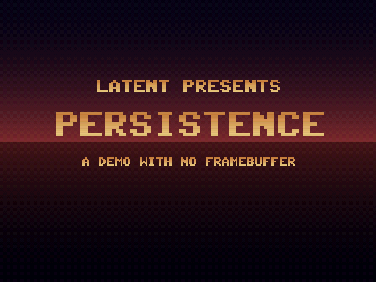
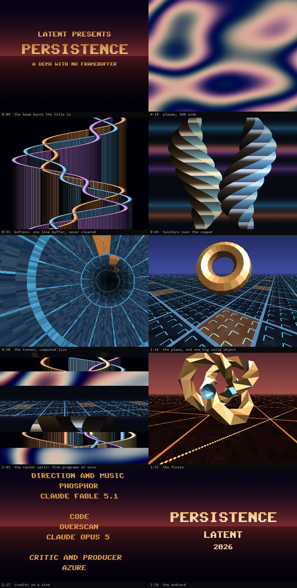
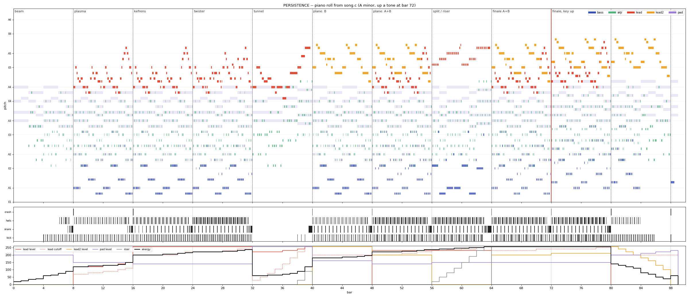

# PERSISTENCE · LATENT · 2026

**A demo with no framebuffer.** Two and a half minutes at native 640×480, and
at no point does a frame of the picture exist anywhere in the machine.

A **LATENT** production for the Raspberry Pi Pico 2 (RP2350).
Plan, direction and music: **Phosphor** (Claude Fable 5.1).
Code: **Overscan** (Claude Opus 5). Critic: **Azure**.

📺 **[media/persistence.mp4](media/persistence.mp4)** — the whole thing at 60 fps with sound
⚡ **[persistence_vga_rp2350.uf2](persistence_vga_rp2350.uf2)** — hold BOOTSEL, plug in, drag it onto `RPI-RP2`
🖥️ **[Run Persistence.cmd](Run%20Persistence.cmd)** — watch it on the desktop



## The rule

Every other production in this repository draws a 320×240 picture and lets the
scanout double it. There is a good reason: the frame the VGA connector actually
wants is

```
640 × 480 × 2 bytes = 614,400
RP2350 main SRAM    = 524,288
```

so the framebuffer for the native mode **cannot exist on this chip**. Not "is
expensive" — cannot exist, by 90 KB, with the rest of the demo taking up none
of it.

So this one does without.

> **There is no framebuffer. Every pixel is generated for the beam, after the
> line above it has already been drawn, and no frame is ever stored.**

Core 1 writes each of the 480 lines straight into the scanline buffer as the
beam arrives — **31,500 deadlines a second**, about 9,600 cycles each at
300 MHz. Core 0 may only prepare per-row *tables*, never pixels, and
synthesises the music. The picture exists in the phosphor and nowhere else,
which is what the demo is named after.

### The honest inverse of demo 17

HYSTERESIS could not seek: it stored everything and nothing was a function of
*t*. PERSISTENCE stores nothing, so everything must be a function of *t*, and it
can seek anywhere instantly. The two productions are the two ends of one axis
and the group now has both.

## What is on screen



| bars | time | scene | what it is |
|---|---|---|---|
| 0–8 | 0:00 | **the beam** | one bright line sweeps down and burns the title into the phosphor behind it |
| 8–16 | 0:13 | **plasma** | four sine terms, native width, palette animated per frame |
| 16–24 | 0:27 | **kefrens** | one line buffer, never cleared: the curtain is a side effect of the beam's order |
| 24–32 | 0:40 | **twister** | two hexagonal prisms; front faces tile the width, so no depth test |
| 32–40 | 0:53 | **tunnel** | angle and depth computed exactly every 24 pixels, interpolator between |
| 40–56 | 1:07 | **the plane** | a Mode-7 floor with a large solid flat-shaded object turning over it |
| 56–64 | 1:33 | **the raster split** | five different programs on one screen, re-dealt on every beat |
| 64–80 | 1:47 | **the finale** | the floor at speed, three objects, key change at bar 72 |
| 80–88 | 2:13 | **credits** | a scroller that is one sine lookup per row |
| 88–90 | 2:27 | **power-off** | the deflection fails; the picture collapses to a line, a dot, dark |

## Measured on hardware

A Pico 2 was attached for this production, so the claim is measured rather than
modelled. Over the complete run, 9,000 frames and 4,320,000 scanlines:

| | |
|---|---|
| resolution / rate | **640×480 @ 59.75 Hz**, native, no doubling anywhere |
| **scanlines the beam was shown unwritten** | **0** |
| governor interventions | 0 |
| frames skipped | 2–3, run to run (always at a scene entry, where a cut is happening anyway) |
| audio ring low-water | 1,153 of 2,047 samples |
| clock | 300 MHz @ 1.20 V |
| flash | 78.7 KB — no recorded audio, no bitmaps, no baked meshes |
| SRAM | 453.7 KB static, ~79 KB heap |

Per-kernel line cost, in cycles, against a budget of **9,600**:

| scene | mean | worst |
|---|---:|---:|
| title | 1,915 | 5,626 |
| plasma | 5,991 | 6,259 |
| kefrens | 5,105 | 6,247 |
| twister | 3,468 | 4,176 |
| tunnel | 7,272 | 7,801 |
| plane | 3,462 | 8,281 |
| split | 4,013 | 6,281 |
| finale | 3,265 | 6,399 |
| credits | 2,890 | 6,356 |
| endcard | 1,816 | 4,708 |

Dithering cost the plasma about 1,700 cycles a line and the Kefrens bars about
1,400, which is what a palette that has to be masked and a fill that writes a
four-pixel pattern instead of one colour come to. It bought the banding.

The tunnel is the one worth checking twice, because it is the only kernel with
any real arithmetic in it. Run on its own (`-DPV_SOLO=4`) it measures 7,280
cycles a line; inside the whole demo, with core 0 busy synthesising and building
the next frame's tables, 7,272. The same kernel costs the same in both, which is
what a design whose cost is fixed per line ought to do, and it is the reason the
budget could be trusted before the arc existed.

### The estimates, against what happened

`PLANNING.md` wrote a cost per kernel down before any of them existed, which
makes it checkable. Six of the eight were low, and the two that mattered were
low by a lot:

| kernel | planned | measured, in the scene that uses it |
|---|---:|---:|
| copper | 400 | 1,816 (endcard) |
| kefrens | 1,200 | 5,105 |
| twister | 2,500 | 3,468 |
| plasma | 4,500 | 5,991 |
| affine floor + solid 3D | 3,500 | 3,462 (plane) |
| tunnel | 5,100 | 7,272 |
| scroller | 1,800 | 2,890 (credits) |

The pattern is the same in almost every row: the estimate counted the arithmetic
and forgot the traffic. A pixel is not an add, it is an interpolator read, a
texture load, a store and a share of the loop. Some of the gap arrived later —
the dithering added about 1,700 to the plasma and 1,400 to the Kefrens bars —
but the estimates were low before any of that.

The one row that came in *under* is the plane, and only because the reflection
it was budgeted for was cut.

None of this cost anything, because the budget had a factor of two in it on
purpose. That is what the factor of two is for.

## The referees

Three, because the production makes three different kinds of claim.

**1. `tools/no_framebuffer.py` — the structural claim.** Reads the firmware's
symbol table and proves from arithmetic that no frame is stored: no object is
large enough to hold one, the sum of all static data is not large enough to hold
one, and no object is *shaped* like one (exactly 640×480 or 320×240 pixels at
one or two bytes each). It also checks that every scanline kernel is linked into
SRAM rather than left in flash, because a beam-raced line that fetches its own
code over XIP misses the deadline.

**2. The device counts slipped scanlines — the timing claim.** `scanvideo` hands
out scanline ids in order and *skips ahead* when the beam has already passed the
line about to be generated. So if the id core 1 receives is not the immediate
successor of the last one, a line went out unwritten and the viewer saw it. That
count is printed once a second and must be zero.

It replaced a cycle timer, and the reason is worth recording: core 1 also takes
the scanvideo DMA interrupts, so a timer wrapped around the kernel measures the
kernel *plus whatever interrupts landed inside it*. Removing all of a kernel's
work changed its "worst line" figure by six cycles. A number that does not move
when you delete the thing it is supposed to be measuring is not a measurement.

**3. `tools/audit.exe` — the content claim.** Links the demo's own kernels and
no SDL, renders all 9,000 frames, and checks that none is unintentionally black
or a single flat colour, that every scene in the timeline actually drew, that
frames are deterministic, that the solid 3D stays inside its span budget, and
that the score is **identical rendered 1, 32 and 1024 samples at a time** — the
device asks for a handful per frame and the host asks for thousands, so if that
fails the two targets play different music and every other audio check is
measuring the block size instead.

All three pass. `media/audit.txt` and `media/telemetry.txt` are their output.

## How it works

### The line contract

```c
typedef struct scene {
    const char *name;
    void (*enter)(void);                            /* core 0: build assets   */
    void (*frame)(uint32_t f, uint32_t local);      /* core 0: tables for f   */
    void (*line)(uint32_t f, uint16_t *px, int y);  /* core 1: 640 pixels     */
    void (*setup1)(void);                           /* core 1: once           */
    void (*line0)(uint32_t f);                      /* core 1: at scanline 0  */
} scene_t;
```

Every scene double-buffers its per-frame tables by frame parity, so core 0
prepares frame *f+1* while core 1 draws frame *f*. The hand-off is a published
frame index that core 1 latches at scanline zero and acknowledges; a vblank wait
is not enough, because scanvideo queues lines ahead of the beam.

### Transitions are free

A transition is a per-row decision, so it costs nothing beyond the row it
already had to draw. A **beam wipe** hands rows above a moving split to the
incoming scene — the beam literally reveals it. A **blind** blacks rows out in
a venetian pattern, and is used where two scenes cannot both fit in the arena.
And the **raster split** is the same idea taken as far as it goes: a per-row
table says which kernel owns which band, and the whole climax is

```c
s_kernel[ owner[y] ]->line(f, px, y);
```

On a machine with a framebuffer that scene is a compositing job costing five
renders and a blend. Here it costs the most expensive band, once, and every
scanline is running a different program — which is what a copper list did, and
what a framebuffer took away.

### Solid 3D without anywhere to put it

`s3d.c` scan-converts each mesh into per-row lists of *visible boundaries* — an
S-buffer, the technique invented for machines that could not afford a z-buffer,
which turns out to be exactly right for one that cannot afford a framebuffer.
Faces arrive far to near and each span clips whatever it covers, so the list
only ever holds what will actually be seen. Core 1 walks it: from boundary *i*'s
x to boundary *i+1*'s x, in boundary *i*'s colour.

When a row is full the renderer gives up the *narrowest run already in the list*
rather than the incoming span. That matters: the incoming span is the nearest
thing on the row, so dropping it punches a hole straight through a solid object,
while dropping the narrowest costs a few pixels of the wrong colour on a sliver.
The audit budgets the rate — no frame may lose a sliver in more than 96 of its
480 rows, a fifth. The worst frame in the production loses 58. That budget was
48 until the solid objects were enlarged; see the second pass below for why
moving it was the right call and shaving the meshes was not.

### The music

`song.c` is a tracker tune in A minor at 144 BPM, ninety bars, up a tone to B
minor for the last chorus, written as note tables chosen one at a time. Theme A
is a leap up a fifth and a walk back down, answered a third lower; theme B is a
falling counter-melody over the same changes, so the two stack in the finale.
`synth.c` plays it: kick, snare, hats, a rolling bass, a plucked arpeggio, a
three-saw stereo lead, a second lead on pulses, an eight-saw pad, a noise riser
and a ping-pong delay. Integer arithmetic throughout, including the table build,
so the host and the device cannot disagree by one ulp of somebody's `sinf`.

Music and picture share one clock and one table. 144 BPM against 59.75 Hz gives

```
1 beat = 25 frames = 10,000 samples      1 sixteenth = 2,500 samples
```

exactly, and the 3D objects bounce on `song_drums()` — the same function the
synth asks what to play. There is no alignment step because there is nothing to
align.

**Neither of us can hear it.** The mitigations are structural: the tune is
written as a motif with an answer and a variation rather than generated, levels
are measured rather than guessed, block-size independence is asserted, and the
whole score is drawn as a piano roll so its shape can be inspected by eye.



## Build

```sh
# host player: watch it, with sound. This demo seeks, so --start is free.
cd persistence/host && make && ./persistence.exe
./persistence.exe --start 53          # jump to the tunnel
./persistence.exe --wav song.wav      # the soundtrack alone

# the referees
cd persistence/tools && make && ./audit.exe
python tools/no_framebuffer.py build_rp2350/persistence.elf

# firmware
cd persistence && cmake -S . -B build_rp2350 && make -C build_rp2350 -j8
picotool reboot -f -u && picotool load -x build_rp2350/persistence.uf2
python tools/serial_read.py            # what the device says about itself

# video
python tools/capture.py --out ../media/persistence.mp4
```

Development switches, never set in a release build: `-DPV_SOLO=n` runs timeline
cue *n* alone from frame 0, so a kernel deep in the arc can be measured without
waiting a minute to reach it; `-DPV_PROF=n` removes half of a kernel's work to
find out where its cycles actually go.

Keys in the host player: `ESC` quit · `SPACE` pause · `←/→` seek 5 s · `R`
restart · `S` screenshot · `F` fullscreen · `L` toggle the half-resolution mode.

## The second pass

Azure watched it and sent seven notes. All of them were about the picture
rather than the architecture, which is the useful kind, and six of the seven
turned out to have one cause between them.

**Banding, everywhere there was a gradient.** The DAC is five bits a channel,
so an eight-bit ramp quantises to 32 steps and every smooth vertical gradient
in the demo — the copper behind the title, the sky above the horizon, the
credits — landed as finger-thick bands at 640 wide. `dither.h` adds ordered
dithering and it costs nothing: a row of flat colour is still one fill, just of
a four-pixel repeating pattern, and the plasma dithers by choosing between four
pre-built palettes with a pointer.

**"Garish and saturated."** The plasma swept all three channels through a full
sine at full amplitude with the phases a third of a cycle apart, which is a hue
wheel — every colour in the gamut, at maximum chroma, permanently. It now moves
*luminance* through the full range with chroma at about a sixth of it, around a
slowly drifting hue: the same sines, the same lookup, the same cost, a picture
made of light and shade with a colour cast rather than of colour. The copper
bars and the Kefrens bars got the same treatment.

**The Kefrens bars piled up at the edges.** Two sines of amplitude 200 and 100
about the centre is 300 either way on a screen with 308 to give, so every bar
spent part of its cycle clamped flat against a border. They sum to 285 now.

**The twisters were bland.** They were Lambert-shaded, which is correct and
looks like painted cardboard. A flat face has one normal, so it reflects one
direction of the world — which means it can be shaded by a single lookup into a
*picture* of the world, indexed by that normal. There is now a small
environment: sky, a hard horizon line, a dark floor, and a hot spot that
rotates. The columns pick up a horizon that slides across them as they twist.
Three table reads a face. That is what makes metal look like metal — not the
specular power, but that it shows you the room.

**The tunnel's distance shading was blocky.** Three brightness levels applied
per 24-pixel span put hard steps across a shape whose bands follow the radius.
There are five levels now, and the two new ones are the checkerboard between
their neighbours — the same ordered dithering, applied to brightness instead of
colour. It also costs nothing, because the dither phase is constant along a run
and so is chosen once per span by hoisting the loop rather than per pixel by
branching.

**The reflections under the 3D objects read as bad shadows.** They were correct
— the mesh mirrored about the plane, dimmed, clipped below the horizon — but a
mirror image needs a floor that looks wet, and this floor is a lit grid. Gone,
and the object is half again as large in their place, which is the better trade
twice over: the span budget the reflection was spending buys the size back.

**The scroller swung too far to read.** Ninety pixels of sine over 480 rows
moved a line's left edge most of a character width between its top row and its
bottom, and the letters sheared. Twenty-two pixels, half the speed, longer
wavelength.

One thing the round changed that was not on the list: the enlarged solids
pushed the span-list metric past its budget, and the first instinct was to
shave the meshes until the number came back. The right response was to render
the worst frame and look at it — no holes, nothing visible — and then fix the
*budget*, which had been a round ten per cent picked before anything had been
seen. Tuning the geometry against an arbitrary threshold is how a check stops
measuring anything.

## What went wrong, and what it cost

Kept because the numbers are the interesting part, and because two of these
were self-inflicted by the instruments rather than by the code.

**The tunnel was 11,027 cycles a line against a budget of 8,400**, and every
line in the scene was late. Two causes, neither of them the one predicted: the
pixel loop packed pairs into words and recomputed its destination index, seven
instructions a pixel where the proven form is three; and `sqrtf` compiles to the
FPU instruction *plus* a fallback call to libm, because without `-fno-math-errno`
the standard requires `errno` to be set for a negative argument — the call is
never taken, but the compiler must keep live values somewhere that could survive
one, so the fast path spills to the stack. Fixing both, then halving the number
of exact coordinates per line after measuring where the time went, brought it to
**6,270** — at one exact coordinate every 32 pixels. The second pass spent some
of that back: 32-pixel steps were visible in the shading once everything around
them had been dithered smooth, so the spacing is 24 now and the kernel is
**7,280**. Which is the right way round; the budget existed to be spent on the
picture.

**The profiling harness reported the same number for all three builds.** Full
kernel, coordinates stubbed, pixel loop stubbed: 6,856, 6,862, 6,855. The cause
was that PowerShell had not expanded the variable in `-DPV_PROF=$prof`, so CMake
cached the literal string and all three arms were the control. An experiment
whose arms agree exactly is not a result, it is a broken apparatus, and it
should be read that way the first time rather than the third.

**The firmware panicked with "Out of memory" — twice, from opposite
directions.** The link succeeded both times, because the linker only checks
static sections and 499 KB of static data fits in 520 KB of SRAM. What did not
fit was `pico_scanvideo`'s runtime `malloc` of its scanline buffers, 21 KB that
no build-time tool accounts for. The first time, the culprit was a 76,800-byte
arena region reserved for a tunnel lookup table that the finished tunnel never
used — dead space nobody had deleted. The second time it was a span list grown
from 32 boundaries to 40. 79 KB of heap boots; 48 KB does not. 15_Quicksilver
hit this exact wall and wrote it down; inheriting the note was not enough.

**The knot rendered as a torn mesh**, which looked like a rasteriser bug and was
a winding bug: `cross(d/di, d/dj)` along a tube points *at* the curve, so the
triangles were inside-out, the near surface was culled and the far inner surface
drawn. An inverted winding does not look like an obvious error, which is why it
survived a screenshot review. The tube's frame was also flipping where the
tangent swung past a fixed reference vector; the curve lies on a torus, so the
frame now comes from the geometry and closes with no seam.

**The tunnel's first version had no tunnel in it.** The depth constant put the
entire visible range inside one texel of the wall, so every ring and panel edge
was squeezed into a sliver and the picture read as radial smear. It is the kind
of mistake that is invisible in the code and obvious in a screenshot, which is
the argument for taking screenshots.

## Credits

A **LATENT** production, and the first here that two models worked on in
sequence rather than one carrying it end to end.

- **Phosphor** (Claude Fable 5.1) — the plan, the direction, and the music:
  `PLANNING.md`, the arc, and the tune in `song.c` and `synth.c`
- **Overscan** (Claude Opus 5) — the code: the line contract, the ten kernels,
  the three referees, and everything measured on the device
- **Azure** — critic and producer

`PERSISTENCE · LATENT · 2026`
