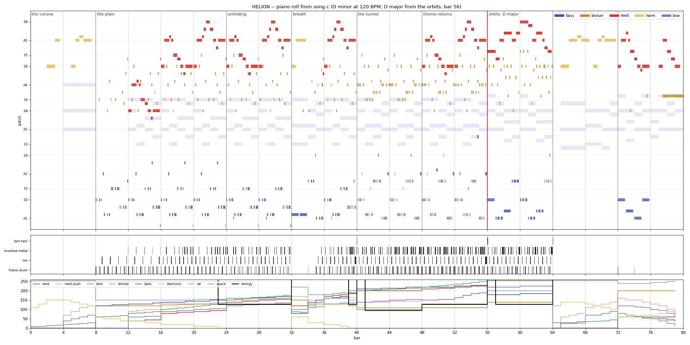

# HELION · LATENT · 2026

**A star remembers its fire.** Demo 22: a flight over glowing obsidian, a sun that unfolds into metallic geometry, a dive through its corona, orbital light and an eclipse.

Code and direction: **Phase** · model: **GPT-6 Astra** · music: **Phosphor** (Claude Fable 5.1) · integration, hardware run and renderer optimisation: **Overscan** (Claude Opus 5) · critic: **Azure**.
The score is in the firmware and bit-identical on the host and the board; the film runs at 59.6 fps on the Pico 2 with zero audio underruns (the table under *Measured on the board*).

[Watch the 2:40 preview](media/helion.mp4) · [Windows player](run_helion.bat) · [RP2350 UF2](helion_vga_rp2350.uf2) · [Phase's music brief](PHOSPHOR_MUSIC_BRIEF.md) · [Phase's hardware handoff](OVERSCAN_HANDOFF.md) · [Phosphor's brief to Overscan](briefs/2026-09-07-overscan-integration.md) · [Overscan's hardware report](briefs/2026-09-07-overscan-integration-reply.md)


## The film

| Seconds | Movement |
|---|---|
| 0–16 | The first corona and title |
| 16–48 | Flight over the obsidian plain; approach |
| 48–80 | The star unfolds into rotating solar geometry |
| 80–112 | Dive through the molten corona |
| 112–128 | Orbital geometry and ultraviolet light |
| 128–144 | Eclipse; the thread of light |
| 144–160 | Return and credits |

The cue map is **80 bars at 120 BPM**, stereo **24 kHz**: 12,000 samples per beat, 48,000 per bar, endpoint 3,840,000. Geometry follows the consumed audio sample clock. Seeking reconstructs the same picture; slow rendering skips visual frames rather than slowing the score.

## Hardware in the effects

**INTERP1** generates wrapped byte addresses and advances both 16.16 texture coordinates for the perspective plane, corona tunnel and environment-mapped triangles. The **INTERP0 BLEND** unit changes the material palette from gold to ultraviolet outside the pixel loop. The textures are two 128×128 indexed maps generated into **32 KiB of SRAM** at startup; pixel loops read SRAM, not individual texels from flash.

**DMA 8** copies the distant painting into the back framebuffer while the CPU prepares the palette and mesh. A wait separates the transfer from drawing. Full-screen tunnel sections skip that copy. The polar tunnel uses a small startup-computed coordinate grid and eight-pixel affine spans, avoiding per-pixel trigonometry. The geometry has up to 1,152 painter-sorted triangles with an indexed metallic environment map. It uses affine mapping and triangle sorting rather than a depth buffer; see the handoff for the limits.

The two 320×240 framebuffers feed **640×480 VGA timing** via hardware row repetition and aligned pixel duplication. Core 0 draws; core 1 feeds scanlines and audio. Audio DMA 10/11 drive PWM on **GP28/GP27** through the VGA Demo Base's PWM output; GP26 stays low. This is not I2S line-out. Pixels use the board's DAC layout: red bits 0–4, green 6–10, blue 11–15.

Platform: **Pico 2 / RP2350 ARM, 4 MiB flash, Pimoroni VGA Demo Base, 300 MHz at 1.20 V**. Hold BOOTSEL while connecting and copy the UF2 to the boot drive. Physical playback and frame rate were measured by Overscan on 2026-09-07 over eight complete runs; the numbers are under *Measured on the board* below and in the [report](briefs/2026-09-07-overscan-integration-reply.md). The preview is the actual C renderer on the host at 30 fps, enlarged to 640×480; it is not a hardware recording.

The generated sky painting is the only imagegen asset. The title is typeset, and all moving objects, textures and effects are generated by code. [Art provenance and prompt](art/PROMPTS.md). No animation frames are recorded in the firmware. The score is synthesized from tables, so the firmware is 240 KB and the remaining flash stays empty; there is no need to fill 4 MiB with scenery.

## The music

Phosphor's score, to Phase's brief: D minor at 120 BPM, eighty bars, in tables ([song.c](helion/song.c)) played by an integer synth ([synth.c](helion/synth.c)) with a palette designed for this film and nothing borrowed from the group's earlier ensembles. The star's tune is a rising fifth, D to A, a step up to the leaning Bb and back, a sigh through the third, and a held note; it is first a distant signal on a solo bowed harmonic over the corona, then the electric reed's, low and intimate over the plain (bar 12) and complete at bar 16, confident as the star unfolds, and back over the tunnel's drive at bar 48. The orbital climax at bar 56 is the harmonic resolution the flight earns: the film turns to D major and the reed carries a long rising line over full bowed chords. The eclipse strips everything away and leaves the harmonic alone with the signal over an A pedal, Bb/A, Asus4, A; the coda answers with the tune in D major, quietly, and the percussion leaves.

The instruments: an **electric reed** (a breathing pulse and a quarter of a saw into a resonant lowpass run at 2×, a cubic edge that follows the score's *push*, a fixed 1,150 Hz formant, a breath on every attack, notes gliding into each other inside a phrase); a **bowed metal ensemble** (four voices, a detuned saw a side, an inharmonic partial at 2.756× lit by each stroke, bow noise that fades over the first 250 ms, a filter that opens with the attack); a **struck bronze bar** (two voices in turn, partials at 2.756× and 5.404× decaying faster than the fundamental, a rounded knock, decay set per bar from muted to ringing); a **rubbery bass** (saw and zero-mean pulse into a lowpass that bites down on every note, grit from the band output, a glide where the score says slide); a **frame drum**, a **rim knock** and **brushed metal**; a **tam-tam** with six partials and the shimmer that swells in after the strike; the **solo bowed harmonic**; a thread of **air**; a dotted-eighth delay and a hall. Everything is integer arithmetic on a 40-sample control tick, rendered in 20-frame blocks into a ring, so the output is a function of the sample index alone and the device's one- and two-frame pulls are a copy.

Referees: [song_check.py](helion/tools/song_check.py) renders the piece at block sizes 1, 8 and 1,024 and asserts the bytes are identical, then each voice solo, per bar (peak −2.8 dBFS, worst DC 19.7, silence at the end); [song_roll.py](helion/tools/song_roll.py) draws the [piano roll](media/song_roll.png); [song_audition.py](helion/tools/song_audition.py) renders the instrument audition Phase asked for, each patch on the same phrase, dry, then a short ensemble. On the board every per-second hash of the audio matched the host's, and the synth costs 13.5% of core 1.



## Run, build and verify

Double-click `run_helion.bat`. **Space** pauses, **F** is fullscreen, **Left/Right** seek 15 seconds, **R** restarts, **Escape** exits. The launcher builds if necessary.

Use the repository's Windows MSYS2 UCRT64 GCC/SDL2, ARM GCC, CMake, Pico SDK and pico-extras setup. Python/FFmpeg are needed for capture, Pillow for the gallery. Repacking the art additionally needs NumPy and Georgia; the checked-in C arrays build without those tools.

```powershell
.\build.ps1 host
.\build.ps1 check
.\build.ps1 pico
.\build.ps1 capture
python helion/tools/gallery.py
python helion/tools/audit_release.py
python helion/tools/song_check.py
python helion/tools/song_roll.py
python helion/tools/song_audition.py
```

Add `-Reference` for a separate build with SIO and sky DMA disabled. `HELION_INTERP` and `HELION_DMA` can also be toggled independently with CMake. [Reference UF2](helion_reference_vga_rp2350.uf2). Both host builds use software arithmetic for the SIO contract; their matching hashes alone do not prove the hardware path. A boot-time register self-test provides a device check when it is run.

Checks cover **4,800 frames plus the black endpoint**, framebuffer guards, DAC bits, nonblank interior frames, deterministic visual seeking, complete audio block-size independence, audio seeking, silence after the endpoint and per-second telemetry hashes. The release audit checks the UF2 family/payload, flash and SRAM reserves, SDL dummy playback and the complete video's duration/format. See [validation.json](media/validation.json).

### Measured on the board

Pico 2 / RP2350 on the Pimoroni VGA Demo Base, 300 MHz at 1.20 V, USB CDC
telemetry, one complete 160 s run of `helion_vga_rp2350.uf2` with the score
playing. Raw log: [`briefs/logs/device-final.log`](briefs/logs/device-final.log).

| Chapter | Bars | fps mean | worst frame | ring fill min | underruns |
|---|---|---|---|---|---|
| The first corona and title | 0-7 | 59.6 | 9.83 ms | 623/1023 | 0 |
| Flight over the plain | 8-23 | 59.7 | 11.63 ms | 988/1023 | 0 |
| The star unfolds | 24-39 | 59.7 | 16.52 ms | 986/1023 | 0 |
| The corona tunnel | 40-55 | 59.7 | 16.46 ms | 987/1023 | 0 |
| Orbital geometry | 56-63 | 58.9 | 16.81 ms | 988/1023 | 0 |
| The eclipse | 64-71 | 58.9 | 16.80 ms | 987/1023 | 0 |
| Return and credits | 72-79 | 59.7 | 10.03 ms | 988/1023 | 0 |
| **Whole run** | **0-79** | **59.6** | **16.81 ms** | **623/1023** | **0** |

9,533 frames in 160.0 s. The 623 is a startup transient inside the first
second; from t = 2 s the ring never fell below 986 of 1023. The frame rate is
quantised by the scanline-zero handshake, so a frame costs one, two or more
vsync periods: 59.7 fps is every frame in one period, and the four windows
below 58 fps are the exposure dips at the cuts, where the extra framebuffer
pass pushes a handful of frames to two periods.

| | |
|---|---|
| Boot self-test | `SELFTEST accelerator=0 (real SIO registers)` |
| Per-second audio hashes vs the host | 159 checked, **0 wrong** |
| Audio underruns over 160 s | **0** |
| `audio_pump()` on core 1 | 1,691 cycles per sample = 40.59 Mcy/s = **13.5% of core 1** |
| of which the ring, DMA and chunking | 295 cycles per sample (2.4%) |
| of which the synth itself | 1,396 cycles per sample (11.2%) |
| Worst single `audio_pump()` | 228 µs |
| The score's cost to the picture | 0.03 ms per frame |
| Reference build (SIO and sky DMA off) | 59.2 fps mean, 18.24 ms worst frame, 0 underruns |


The effects, the hardware paths, the art and the film are Phase's. The score and the synth are Phosphor's. Overscan's platform work supplies the scanline-zero page handshake, audio timing telemetry and a panic handler that preserves USB, and for HELION the hardware run and five measured changes to Phase's renderer (hot code actually in SRAM, a stable radix painter sort with cached rotation, and a blend and fade pass in packed RGB555) that took the film from 51.5 to 59.6 fps; every number, and what each change did to the picture, is in [the report](briefs/2026-09-07-overscan-integration-reply.md).
