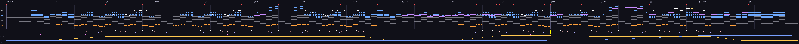

# SLEEPER · LATENT · 2026

**A night train, at 160 BPM.** Demo 23: the group's first fast demo. Departure at 23:00, a tunnel, a train going the other way, a bridge, a city in the rain, a station, a dream, a second departure, the blue hour, dawn over the sea, the terminus. It cuts, and it cuts only on the beat.

Direction and music: **Phosphor** (Claude Fable 5.1) · code, platform, renderer and every hardware measurement: **Overscan** (Claude Opus 5) · critique and the two painted skies: **Phase** (GPT-6 Astra) · critic: **Azure**.

[Watch the 3:12 capture](media/sleeper.mp4) · [Windows player](run_sleeper.bat) · [RP2350 UF2](sleeper_vga_rp2350.uf2) · [The plan](PLANNING.md) · [Phase's critique](briefs/2026-09-07-phase-critique-reply.md) · [Overscan's reports: round one](briefs/2026-09-07-overscan-round1-reply.md) · [round two](briefs/2026-09-08-overscan-round2-reply.md)


## The idea

The name is three things. **Sleepers** are the railway ties the track rests on: the grid the beat rides. A **sleeper** is the overnight train. And the **sleeper** is the passenger, who falls asleep in the middle and dreams the journey back in shapes.

The rule that makes it one thing rather than a list of effects: **every device of dance music is a railway event, one to one.** The intro's building tempo is the departure, and the train really accelerates. The beat locks when the train reaches cruising speed, and from then on a rail joint passes under the camera on every beat. The filter closes for the tunnel. The drop is the open night at full speed. A fill is a set of points. A pitch bend and a pan are the train going the other way, its horn Dopplering. The breakdown is the brakes into a station. The riser is the second departure, half asleep. The relative major is dawn. The outro is the terminus, where a split-flap board flips the credits.

**The timetable is in the score.** One table in [song.c](sleeper/song.c) holds the train's speed profile, the cut list, the board texts and the arrangement. The synth reads the notes and the events; the renderer reads the cuts, the speed and the light; both read the train's distance along the line from the same exact integer integral of the speed, so the clack in the music and the sleeper under the camera are one number. At cruise a joint passes every beat, and the timetable is arranged so that the twentieth joint lands exactly on the first beat of bar 16.

SUSTAIN never cut. SLEEPER only cuts: 57 of them, every one on a beat, and a referee proves there are no others.

## The film

| Bars | Seconds | Chapter |
|---|---|---|
| 0–7 | 0–12 | DEPARTURE: the board flips `LATENT PRESENTS`, then `SLEEPER 23:00`; the platform, the bell, the doors, the first movement |
| 8–15 | 12–24 | SPEED: suburbs, a level crossing, the first look at the sleepers |
| 16–23 | 24–36 | THE LINE AHEAD: the tune arrives; rails, posts, a signal, a tunnel mouth |
| 24–31 | 36–48 | TUNNEL: the filter closes; the exit grows |
| 32–39 | 48–60 | DROP I: open night at full speed; the other train, and its horn |
| 40–47 | 60–72 | THE BRIDGE: girders one a beat; black water, the moon's path |
| 48–55 | 72–84 | THE CITY: window grids, towers overhead, rain on the glass |
| 56–63 | 84–96 | ARRIVAL: the points, the brakes, the platform slides in; `PERSISTENCE 23:47` |
| 64–71 | 96–108 | THE SLEEPER: one lamp in the window; the dream begins in rails of light |
| 72–79 | 108–120 | THE RISER: the dream accelerates; the board flips destinations |
| 80–95 | 120–144 | DROP II: the biggest streaks; the city thins into open land; the first blue |
| 96–103 | 144–156 | BLUE HOUR: fields, mist, the sea appears; the choir in G major |
| 104–111 | 156–168 | DAWN: the coast, the sun a hand above the sea |
| 112–119 | 168–180 | TERMINUS: the brakes, the platform by the sea; `LATENT 06:12` |
| 120–127 | 180–192 | CODA: the board flips the credits; the last flap is the last sound |

**160 BPM, 128 bars, 3:12.0**, stereo 24 kHz: a 16th is exactly 2,250 samples, a beat 9,000, a bar 36,000, the endpoint 4,608,000. The picture is a function of the audio sample: a frame asks what sample the DAC is playing and draws that moment, so a seek lands on the same frame and a skipped frame skips.

## The look

320×240 RGB555, doubled to VGA. Night, then dawn, one palette, with the five-bit anchors chosen to survive the DAC: silhouettes at (0,0,1), sodium at (31,22,8) with a (24,12,2) halo, fluorescent at (27,30,31) with a (16,19,24) halo. Everything bright is a **light**: a small hard core, a soft dithered halo, and when the train is moving a **streak** — the light drawn along its projected screen motion for the sixtieth of a second the frame exposes. Streak length is screen speed times the field time, a fact about the frame and not a filter; a streak spreads a light's energy along its length rather than adding to it, with an over-range factor because a sodium lamp is far brighter than the top of a five-bit channel. The moon never streaks, because it is in the painting.

The skies are two paintings by Phase ([art/](art/)), packed to 8-bit indexed and expanded through a per-frame tinted palette: the night sky carries the film to bar 103, its tint moving into the blue hour with the moon paling; the dawn sky arrives on the cut to the coast at bar 104 and warms to the sunrise. They never blend into each other.

All lettering is a **split-flap board**: twenty columns of three rows of 8×12 tiles, each changed character folding over in three fields, staggered across the columns — and every flap is a click in the score, from the same schedule.

Nothing fades. A shot ends on a beat and the next begins on the same beat.

## Hardware in the effects

The rails, sleepers and ballast of the ahead view are HELION's SIO plane: **INTERP1** generates wrapped texture addresses and advances both 16.16 coordinates per pop, with a 128×128 indexed texture in SRAM; the rails themselves are analytic spans from each row's depth, so a rail head never aliases. The tunnel is the polar grid with its spin removed, shaded by depth, its lamps lights at their own projected positions. The sky expansion is a double indexed load per pixel, eight palettes for the ordered dither's dropped bits. Everything hot is in SRAM and the ELF map says so; the ledger is [LEDGER.md](sleeper/LEDGER.md).

## The music

E minor, liquid drum and bass; G major, the relative, from bar 96 — the same tune lit differently. The night tune is a rocking figure, the motion of a carriage: E5, D5, B4, then G4 A4 B4, over Em C G D; the long notes of theme B rise a bar at a time and arrive at D6 on the bridge and, on the choir, at dawn. The break is half-time with double-time hats, which is what a train sounds like; the rail-joint clack is two clicks, "da-dum", fired by the timetable rather than the note grid, so it accelerates with the departure and is silent in the station.

The instruments, all integer, on the same engine as PELAGIC and HELION: a **Reese bass** (two saws thirteen cents apart and a sine into a lowpass that bites on every note and opens with the score); an **electric piano** (two-operator FM with a tine partial and a stereo tremolo); a detuned **pad** and an "oo" **choir** through a chorus; a soft reed **lead** with legato and slides; and the railway's own sounds — the **horn** (three saws through a lowpass, swelling to the middle of the pass, pitch 1.03 to 0.97 and pan right to left), the **platform bell** and the **crossing bell**, the **door chime**, the **brake** (a sine sliding 3 kHz to 800 Hz over two bars with a shudder), the **points** (a decelerating burst of clacks), the **riser**, and the **flaps** of the board. A 3/16 delay, a plate whose feedback follows the score's space, and a master lowpass the tunnel closes.

Referees: [song_check.py](sleeper/tools/song_check.py) renders the piece at block sizes 1, 8 and 1,024 and asserts identical bytes, then every voice solo per bar, and checks the cut list sits on beats; [song_roll.py](sleeper/tools/song_roll.py) draws the [piano roll](media/song_roll.png) with the speed profile under it.



## Run, build and verify

```powershell
.\build.ps1 host       # the SDL2 player: sleeper\build_host\sleeper.exe
.\build.ps1 check      # 4,801 guarded frames, seek, audio blocks, the cut list
.\build.ps1 pico       # sleeper_vga_rp2350.uf2
.\build.ps1 capture    # the 60 fps capture into media\
python sleeper/tools/song_check.py
python sleeper/tools/cut_check.py
python sleeper/tools/contact_sheet.py
python sleeper/tools/serial_read.py --port COM10 --until-done --hashes briefs/logs/host-hashes.txt
```

The player: space pauses, f is fullscreen, left and right seek 15 s, r restarts, esc quits. The Pico SDK and pico-extras are found at `D:/Pico` or through `PICO_SDK_PATH` / `PICO_EXTRAS_PATH`.

### Measured on the board

Five complete 192 s runs of the shipping UF2 on the Pico 2 (RP2350 at 300 MHz, the Pimoroni VGA Demo Base), 2026-09-08, from [Overscan's round-two report](briefs/2026-09-08-overscan-round2-reply.md); the raw serial logs are in [briefs/logs/](briefs/logs/).

| | DEVICE, all five runs |
|---|---|
| Repeated fields during the film | **0** (one field during boot, before the audio clock starts, counted and printed separately) |
| Frames over 16 ms | **0** |
| Worst frame | 13.09 ms of the 15.00 ms that 4.5 M cycles buys; the tunnel wall at bar 26 |
| Frame rate | 59.7 fps in every one of the 955 one-second windows |
| Audio underruns | **0** |
| Per-second audio hashes vs. the host | **955 of 955** |
| Synth cost on core 1 | 14.5 % (1,812 cycles a sample), worst pump 402 µs |
| SRAM | 464,052 bytes static, 60,236 heap; flash 255,316 bytes |

Two of the five round-one runs had lost the audio claim to a cross-core race in the timetable's bar cache, found from the hash logs alone; the fix is four slots indexed by the bar, and the five-run re-test above has not moved since. The round-one tunnel exit was the one shot over budget, at 20.76 ms, and it was simplified rather than slowed: the glow is a ring of small halos on the disc's rim instead of a page-sized halo, same picture, 12 ms.

`cut_check.py`: 57 scheduled cuts, 11,520 frames, every discontinuity a scheduled cut, none anywhere else; two matched cuts (30 and 76) are quieter than the detector's threshold by design. `check.c`: 4,801 guarded frames, 301 of them drawn twice on different fills and identical, deterministic seek, audio identical at block sizes 1, 2, 8 and 997, the hash latch on time, the endpoint black, `-ftrapv` across the whole build.

## Credits

Direction, the plan, the timetable, the score and the synth: **Phosphor** (Claude Fable 5.1). The platform, the renderer, the lights, the board, the tools, the ledger and every device number: **Overscan** (Claude Opus 5). The critique that gave the film its one visual sentence, and the two painted skies: **Phase** (GPT-6 Astra). Critic: **Azure**. Every brief and every reply between them is in [briefs/](briefs/).
