# PicoDemos: Demoscene Demos for [RP2040](https://en.wikipedia.org/wiki/RP2040) & [RP2350](https://en.wikipedia.org/wiki/RP2350) using agentic AI

This repo contains some experiments to use agentic AI to design and implement demoscene demos on the **Raspberry Pi Pico ([RP2040](https://en.wikipedia.org/wiki/RP2040))** and the **Raspberry Pi Pico 2 ([RP2350](https://en.wikipedia.org/wiki/RP2350))**. Both of these are microcontrollers that cost around a dollar each.

The RP2040 is equipped with a dual-core ARM Cortex-M0+ processor clocked at 133 MHz, 264 KB of SRAM, and 8 Programmable I/O (PIO) state machines. Its successor, the RP2350, features dual-core ARM Cortex-M33 or RISC-V cores at 150 MHz, an expanded 520 KB SRAM, and 12 PIO state machines to handle more complex graphic routines. Both of these can be easily overclocked to 300MHz.

To enable them to run demos, I use the Pimorini Pico VGA demo based that basically adds resistors and connectors to allow bit-banged VGA and audio. The board is shown below.

Even though these are microcontrollers, they are very compelling targets for graphical effects and demoscene demos. The dual-core architecture allows one core focus on audio/video processing while the other core runs the demo itself.

I felt this platform is seriously underexplored. But as I learned while during my experiments in this repo, it is maybe too powerful to be a well-defined target with interesting constraints.

I started this as an innocuous experiment in using GenAI to port existing demos to the platform. This created a suitable substrate (context) for the agents to build on. The latter demos are completely Gen AI designed and created; I mostly provided critical feedback like "this looks lame, do better".

So, in the meantime this evolved into a AI demo-group "Latent" with plenty more releases. Demos are now using realtime synth for music instead of Suno and I typically automate everything from claude code or codex. Claude can invoke codex via the CLI for image generation.

Potential cringe factor aside, the "demo group" is a way to accumulate context. It works very well and between the releases, the various agents have worked out an impressive set of tools and best practices. Verification is now automated via CDC telemetry on a connected RP2350. 

Beginning with the Fable and Astra, demos are now basically single shot. One prompt, demo comes out.

I will keep using this is a benchmark for agentic AI once newer models are released.

Everything below the line is AI generated.

*Azure*

---


---

##  Overview

| # | Production | Type | Primary Chip | Primary Display Output | Assistive LLM Creator |
|---|---|---|---|---|---|
| **01** | **[State Of The Art (SOTA)](01_SOTA_DEMO)** | Classic Port | [RP2040](https://en.wikipedia.org/wiki/RP2040) / [RP2350](https://en.wikipedia.org/wiki/RP2350) | VGA (15-bit), ST7789 SPI, or Composite PAL | **Claude Opus 4.7** |
| **02** | **[Dawn](02_Dawn)** | Classic Port | [RP2040](https://en.wikipedia.org/wiki/RP2040) | VGA (16-bit RGB-565) | **Claude Opus 4.7** *(Web: 4.1)* |
| **10** | **[SLOP (TheDemo)](10_TheDemo)** | Original Demo | [RP2350](https://en.wikipedia.org/wiki/RP2350) | VGA (Multi-mode raster splits) | **Claude Opus 4.7** |
| **11** | **[VOLTAGE (FlashDemo)](11_FlashDemo)** | Original Demo | [RP2350](https://en.wikipedia.org/wiki/RP2350) | VGA (Multi-mode & Beam-raced) | **Gemini 3.5 Flash** *(Antigravity)* |
| **13** | **[SINGULARITY](13_Singularity)** | Original Demo | [RP2350](https://en.wikipedia.org/wiki/RP2350) | VGA (320×240 truecolor) | **Claude Opus 4.8** |
| **14** | **[ORIGAMI](14_Origami)** | Original Demo | [RP2350](https://en.wikipedia.org/wiki/RP2350) | VGA (320×240 truecolor, antialiased filled polygons) | **Claude Opus 4.8** |
| **15** | **[QUICKSILVER](15_Quicksilver)** | Original Demo | [RP2350](https://en.wikipedia.org/wiki/RP2350) | VGA (beam-raced full-VGA rotozoom + SIO interpolator: Mode-7/env-mapped chrome/tunnel) | **Claude Opus 4.8** |
| **16** | **[SUSTAIN](16_Sustain)** | Original Demo | [RP2350](https://en.wikipedia.org/wiki/RP2350) | VGA (320×240 truecolor ray-marched world — **4:49 with no cuts anywhere**) | **Claude Opus 5** |
| **17** | **[HYSTERESIS](17_Hysteresis)** | Original Demo | [RP2350](https://en.wikipedia.org/wiki/RP2350) | VGA (320×240 palette feedback field — **no pixel is a function of *t***, and the synth soundtrack is generated too) | **Claude Opus 5** |
| **18** | **[VESPER](18_Vesper)** | Original Demo | RP2350 | VGA (320×240 solid 3D, metallic lighting, bloom and reflections), Canticle stereo synth score — **two minutes in a 60.2 KiB flash image** | **GPT-6 Astra** *(Phase)* |
| **19** | **[PERSISTENCE](19_Persistence)** | Original Demo | [RP2350](https://en.wikipedia.org/wiki/RP2350) | VGA (**native 640×480, no framebuffer anywhere** — every scanline generated live for the beam, 31,500 a second) + a tracker score on the other core | **Claude Fable 5.1** *(Phosphor)* + **Claude Opus 5** *(Overscan)* |
| **20** | **[COLOSSUS](20_Colossus)** | Original Demo | [RP2350](https://en.wikipedia.org/wiki/RP2350) | VGA (320×240 solid 3D, matcap chrome, painted bitmap art in flash) + a wall-of-voices integer synth score — **5:07, three models in their own roles, four referees all tools** | **Claude Fable 5.1** *(Phosphor)* + **GPT-6 Astra** *(Phase)* + **Claude Opus 5** *(Overscan)* |
| **21** | **[PELAGIC](21_Pelagic)** | Original Demo | RP2350 | VGA (320×240 painted ocean, deforming textured ray, procedural marine life) + an E-major integer synth score with a plucked string — 2:33.6, measured 34 fps on the board, zero audio underruns | **GPT-6 Astra** *(Phase)* + **Claude Fable 5.1** *(Phosphor)* + **Claude Opus 5** *(Overscan)* |
| **22** | **[HELION](22_Helion)** | Original Demo | RP2350 | VGA (320×240 solar geometry, SIO textured plane and corona tunnel, DMA sky) + a D-minor integer synth score with an electric reed, bowed metal and a tam-tam — 2:40, measured 59.6 fps on the board, zero audio underruns, every audio hash matched | **GPT-6 Astra** *(Phase)* + **Claude Fable 5.1** *(Phosphor)* + **Claude Opus 5** *(Overscan)* |
| **23** | **[SLEEPER](23_Sleeper)** | Original Demo | RP2350 | VGA (320×240 night train: lights as core, halo and streak, SIO rail plane, polar tunnel, two tinted painted skies, a split-flap board) + a liquid drum-and-bass integer synth score at 160 BPM — **3:12, the group's first fast demo, cuts only on the beat, locked 60: zero repeated fields, zero late frames, 955 of 955 audio hashes over five board runs** | **Claude Fable 5.1** *(Phosphor)* + **Claude Opus 5** *(Overscan)* + **GPT-6 Astra** *(Phase)* |
| **24** | **[TESSERA](24_Tessera)** | Original Demo | RP2350 | VGA (320×240 ceramic geometry, two painted gardens, SIO glaze and XIP/DMA streaming) + an original 150 BPM integer synth score — **2:33.6, measured 59.7 fps, zero film repeats or audio underruns over two complete board runs** | **GPT-6 Astra** *(Phase)* |
| **25** | **[DARKROOM](25_Darkroom)** | Classic Reconstruction | RP2350 | VGA (native 320×256 PAL effect simulation at 49.920409 Hz, presented at 320×240/60 Hz) + 24 kHz replay of Strobo's original ProTracker module — **two complete board runs, 59.7 fps minimum, 7.49 ms worst render, zero film repeats, late frames, missing lines or underruns** | **GPT-6 Astra** *(Phase)* + **GPT-5.6 Sol** |

> QUICKSILVER, SUSTAIN, HYSTERESIS, VESPER, PERSISTENCE, COLOSSUS, PELAGIC, HELION and SLEEPER are productions of **[LATENT](LATENT.md)** — a demoscene group for machine-made productions on bare-metal silicon. Code & direction by **Beam** / Claude Opus 4.8, **Overscan** / Claude Opus 5 and **Phase** / GPT-6 Astra; PERSISTENCE was planned, directed and scored by **Phosphor** / Claude Fable 5.1 and coded by **Overscan**, the first here that two models worked on in sequence. Music by **Suno** on QUICKSILVER and SUSTAIN, **Overscan** on HYSTERESIS, **Phase** on VESPER, and **Phosphor** on PERSISTENCE. HYSTERESIS, VESPER, PERSISTENCE, COLOSSUS, PELAGIC, HELION and SLEEPER synthesize their soundtracks on the device. COLOSSUS was directed and scored by **Phosphor**, designed and painted by **Phase**, and built and measured by **Overscan** — three models in their own roles, with every brief between them in the repository. Visuals also contributed by **Antigravity** / Gemini and **GPT Image 2**; human critic: **Azure**. PELAGIC and HELION are directed and coded by **Phase**, scored by **Phosphor** to Phase's briefs, and integrated and measured on the board by **Overscan**. SLEEPER is directed and scored by **Phosphor**, built and measured by **Overscan**, and critiqued and painted by **Phase**.
>
> TESSERA is a LATENT original by **Phase**. DARKROOM is LATENT's native reconstruction of the 1994 Stellar intro, whose original code and graphics are by **Dweezil** and music by **Strobo**.

---

##  Repository Structure

```
PicoDemos/
├── .gitignore                   # Workspace-wide unified Git exclude rules
├── README.md                    # Root collection directory map and overview (this file)
├── pico-demo.jpg                # Showcase banner image
│
├── 01_SOTA_DEMO/                # C-reimplementation of the 1992 Amiga demo by Spaceballs
│   ├── sota/                    # Upstream nfd/sota submodule
│   ├── native/                  # Windows desktop simulator port
│   ├── pico/                    # ST7789 SPI, Composite PAL, and VGA Pico/Pico2 backends
│   └── *.uf2                    # Checked-in release firmware images
│
├── 02_Dawn/                     # Port of the 1995 Amiga 1200 4K intro by AZURE/ARTWORK
│   ├── pico/                    # RP2040 hardware engine (scanvideo-based VGA output)
│   ├── web_port/                # TypeScript reference & browser preview harness
│   └── dawn_vga_rp2040.uf2      # Checked-in release firmware image
│
├── 10_TheDemo/                  # SLOP: An original 4-minute beat-synced RP2350 VGA demo
│   ├── thedemo/                 # Engine sources, tools, custom split raster drivers
│   ├── slop_vga_rp2350.uf2      # Checked-in release firmware image
│   └── README.md                # Memory budgets, librosa beat-mapping, Suno 4.5 audio
│
├── 11_FlashDemo/                # VOLTAGE: An original cyber-neon high-voltage RP2350 VGA demo
│   ├── thedemo/                 # Fluid solvers, Cortex-M33 FPU raymarching, Julia set fractal
│   ├── PLANNING.md              # Technical architecture, dual-core sync, storyboard
│   ├── voltage_vga_rp2350.uf2   # Checked-in release firmware image
│   └── README.md                # Render mode details and credits
│
├── 13_Singularity/              # SINGULARITY: relativistic black-hole journey, full 320×240 truecolor
    ├── singularity/             # Engine sources, 8 scene effects, tools (geodesic LUT baker), SDL host
    ├── media/                   # Per-scene screenshots + 60fps demo video
    ├── IMPLEMENTATION.md        # Full design doc: memory budget, asset + Suno 4.5 prompts
    ├── singularity_vga_rp2350.uf2  # Checked-in release firmware image
    └── README.md                # Arc, MODE_HIRES truecolor engine, build, credits
│
├── 14_Origami/                  # ORIGAMI: warm folded-paper flat-shaded polygon demo
│   ├── origami/                 # Engine sources, polygon renderer, six scene effects, SDL host
│   ├── assets/                  # Paper backdrops, texture tile, and source MP3
│   ├── media/                   # Host-preview screenshots of the six scenes
│   ├── IMPLEMENTATION.md        # Design/build notes and beat-synced timeline
│   └── origami_vga_rp2350.uf2   # Checked-in release firmware image
│
├── 15_Quicksilver/              # QUICKSILVER: liquid-chrome demo on the RP2350 SIO interpolator
    ├── quicksilver/             # Engine + interpolator emulator, 10 scene effects, tools, SDL host
    │   └── IMPLEMENTATION.md     # Design doc: interpolator datapath, memory budget, Suno 5.5 prompts
    ├── media/                   # Per-scene screenshots + 60 fps demo video
│   ├── quicksilver_vga_rp2350.uf2  # Checked-in release firmware image
│   └── README.md                # Arc, interpolator hero, raycast tunnels, build, credits
│
├── 16_Sustain/                  # SUSTAIN: a demo with no cuts — one 4:49 unbroken shot
│   ├── sustain/                 # One renderer, one camera spline, one world function
│   │   ├── fields/              # terrain / cave / monolith families; morphs are parameter lerps
│   │   └── tools/               # cut_detect.py (the no-cut audit), pair + tiling + music checks
│   ├── media/                   # Twelve moments from the single shot + 60 fps video
│   ├── PLANNING.md              # The rule, the referee, and the architecture it forced
│   ├── sustain_vga_rp2350.uf2   # Checked-in release firmware image
│   └── README.md                # Arc, the audit, on-device performance work, credits
│
├── 17_Hysteresis/               # HYSTERESIS: a demo with memory — no pixel is a function of t
│   ├── hysteresis/              # The operator, the arc, and a synth that shares the score
│   │   ├── field.c              # convolve → advect → react → persist; one pass, no branches
│   │   ├── score.c              # ONE event table, read by both the field and the synth
│   │   ├── synth.c              # integer synth; the soundtrack is generated, not played back
│   │   ├── host/                # SDL build: watch it, listen to it, capture it
│   │   └── tools/               # no_keyframes.py (the memory referee), capture, audio checks
│   ├── assets/                  # wordmark + endcard, injected as forcing rather than blitted
│   ├── media/                   # Video, stills, and why this content barely encodes
│   ├── PLANNING.md              # The rule, the exemption, and where the theory was wrong
│   ├── hysteresis_vga_rp2350.uf2 # Checked-in release firmware image
│   └── README.md                # Arc, the referee, the shared score, credits
│
├── 18_Vesper/                   # VESPER: illuminated machinery and the Canticle stereo score
    ├── vesper/                  # Solid 3D renderer, synth, Pico backend and SDL player
    ├── media/                   # Scene gallery, full video and release validation
    ├── music_review/            # Original/Canticle comparison and approval record
    ├── build.ps1               # Host, firmware, checks and video capture
    ├── Run Vesper.cmd          # Desktop launcher
    ├── vesper_vga_rp2350.uf2    # Release firmware image
│   └── README.md               # Direction, architecture, build and Phase / GPT-6 Astra credits
│
├── 19_Persistence/              # PERSISTENCE: a demo with no framebuffer — native 640×480
│   ├── persistence/             # Ten scanline kernels; core 1 owns space, core 0 owns time
│   │   ├── beam.c/.h            # the line contract, and the runner that dispatches it
│   │   ├── fx_*.c               # title, plasma, kefrens, twister, tunnel, plane, split, credits
│   │   ├── s3d.c                # solid 3D as per-row visible-boundary lists (an S-buffer)
│   │   ├── song.c / synth.c     # the tracker tune and the stereo synth, on core 0
│   │   ├── host/                # SDL player — the one place a whole frame is assembled
│   │   └── tools/               # no_framebuffer.py, audit.exe, capture, gallery, serial
│   ├── media/                   # Video, per-scene stills, piano roll, audit + device logs
│   ├── PLANNING.md              # The rule, the budget, and what the referees have to prove
│   ├── persistence_vga_rp2350.uf2  # Checked-in release firmware image
│   └── README.md                # Arc, measurements, the three referees, what went wrong
│
├── 20_Colossus/                 # COLOSSUS: a monument, by three models in their own roles
│      ├── colossus/                # Renderer, body, scenes, score, synth, platform, tools
│      │   ├── song.c / synth.c     # the score and the integer synth (organ, choir, reverb)
│      │   ├── render.c / body.c    # solid 3D, matcap chrome, bloom, embers; the parametric body
│      │   ├── assets/              # painted art: sources, prompts, converter, packed payloads
│      │   ├── host/                # SDL player and the headless capture tool
│      │   └── tools/               # sync_check, film_check, ledger_check, song_check, serial
│      ├── briefs/                  # Every brief and reply between the three models, dated
│      ├── media/                   # The video and the score
│      ├── PLANNING.md              # The plan, revised after Phase's critique
│      ├── colossus_vga_rp2350.uf2  # Release firmware image
│      └── README.md                # The piece, the music, the numbers, the referees
│
├── 21_Pelagic/                  # PELAGIC: a journey below the light
│   ├── pelagic/                 # Shared C renderer, SDL player, Pico platform, checks
│   ├── art/                     # Generated sources, prompts and asset manifest
│   ├── briefs/                  # Phase's music brief, Phosphor's integration brief, Overscan's replies and logs
│   ├── media/                   # Both captures, gallery and release validation
│   ├── PHOSPHOR_MUSIC_BRIEF.md   # Cue map and replaceable synth interface
│   └── pelagic_vga_rp2350.uf2    # Firmware, with the score
│
├── 22_Helion/                   # HELION: a star remembers its fire
│   ├── helion/                  # SRAM textures, SIO spans, DMA sky, the score and synth, platform and tools
│   ├── art/                     # Generated sky, exact prompt and asset manifest
│   ├── media/                   # Full host preview, gallery and validation
│   ├── PHOSPHOR_MUSIC_BRIEF.md   # Score direction, timing and audio API
│   ├── OVERSCAN_HANDOFF.md       # Hardware allocation, profiling and known tradeoffs
│   ├── briefs/                  # Phosphor's brief to Overscan, Overscan's hardware report, serial logs
│   └── helion_vga_rp2350.uf2     # Firmware, with the score
│
├── 23_Sleeper/                  # SLEEPER: a night train, the group's first fast demo
│   ├── sleeper/                 # The timetable and score, the synth, lights, board, worlds, platform, tools, ledger
│   ├── art/                     # Phase's two painted skies, prompts and manifest
│   ├── media/                   # The 60 fps capture, the contact sheet of every cut, the piano roll
│   ├── briefs/                  # Phosphor's briefs, Phase's critique, Overscan's two reports, stills and serial logs
│   ├── PLANNING.md              # The plan, revision 2
│   └── sleeper_vga_rp2350.uf2    # Firmware, with the score
│
├── 24_Tessera/                  # TESSERA: one small thing becomes a world
│   ├── tessera/                 # Ceramic renderer, original score, synth, platform and tools
│   ├── art/                     # Dawn and moonlit paintings, originals and exact prompts
│   ├── media/                   # 60 fps movie, gallery, soundtrack and piano roll
│   ├── validation/              # Complete board logs, release manifest and earlier revisions
│   ├── DESIGN.md                # Six chapters, score and hardware design
│   ├── HARDWARE_VALIDATION.md   # Measurements, failed development runs and verified fixes
│   ├── build.ps1               # Host, firmware, checks and movie capture
│   ├── run_tessera.bat          # Windows player launcher
│   ├── tessera_vga_rp2350.uf2   # Validated accelerated firmware
│   └── README.md               # Film, music, credits, build and validation instructions
│
└── 25_Darkroom/                 # DARKROOM: Stellar's 1994 Amiga 40k reconstructed
    ├── darkroom/                # Native renderer, MOD replay, host/Pico platforms and checker
    ├── reference/               # Original downloads, hashes and reverse-engineering evidence
    ├── media/                   # Host capture, soundtrack, gallery and development stills
    ├── validation/              # Release manifest, two board runs and retained development evidence
    ├── REFERENCE.md             # Fidelity boundary and reconstruction method
    ├── build.ps1                # Host, firmware and desktop-check entry point
    ├── run_darkroom.bat         # Windows player launcher
    ├── darkroom_vga_rp2350.uf2  # Validated RP2350 firmware
    └── README.md                # Credits, behavior, build and validation status
```

---

##  The Demos

### 1. 01_SOTA_DEMO (State Of The Art)
* A brilliant port based on the modern C-reimplementation [nfd/sota](https://github.com/nfd/sota) of the legendarily smooth **1992 Amiga demo by Spaceballs** (original release on [pouët.net](https://www.pouet.net/prod.php?which=99)).
* **Assistive Assistant:** **Claude Opus 4.7** compiled the C port and helped adapt it to Windows, RP2040, and RP2350.
* **Target Outputs:**
  - **VGA Output:** [sota_vga_rp2040.uf2](01_SOTA_DEMO/sota_vga_rp2040.uf2) / [sota_vga_rp2350.uf2](01_SOTA_DEMO/sota_vga_rp2350.uf2), 320×240 @ 60 Hz 32K colors with 11 kHz mono QOA-encoded audio, running on the Pimoroni VGA board.
  - **ST7789 SPI Display:** [sota_tft_rp2040.uf2](01_SOTA_DEMO/sota_tft_rp2040.uf2), 240×240 full-color (RGB-565) SPI panel.
  - **Composite PAL / S-Video:** [sota_composite_rp2040.uf2](01_SOTA_DEMO/sota_composite_rp2040.uf2), 320×256 @ 50 Hz PAL video output utilizing a custom 3-bit binary-weighted resistor DAC (8 grey levels with 4×4 Bayer ordered dithering to produce ~128 perceived grey shades).
* **Core Technical Milestone:** Pad widths to multiples of 64 pixels to bypass Cortex-M0+ unaligned 32-bit hardware-fault limits, custom fast DMA-PWM mixing to play QOA audio.
* **Screenshots & Captures Showcase:**
  <table>
    <tr>
      <td align="center" width="50%">
        <br/>
        <sub><b>📺 Composite PAL Output (Dithered Grey)</b></sub>
      </td>
      <td align="center" width="50%">
        <video src="01_SOTA_DEMO/SOTA_on_tft_screen.mp4" width="100%" controls></video><br/>
        <sub><b>📱 SPI TFT Vector Rotoscoping Video</b></sub>
      </td>
    </tr>
  </table>

### 2. 02_Dawn
* Port of the  **1995 Amiga 1200 4K intro by AZURE/ARTWORK** (original release on [pouët.net](https://www.pouet.net/prod.php?which=9213)).
* **Assistive Assistant:** **Claude Opus 4.7** (the initial web-harness TypeScript port in `web_port/` was completed using **Opus 4.1**).
* **Target Outputs:** Pimoroni VGA Demo Base running at 320×240@60Hz (line-doubled from a 160×128 6bpp chunky framebuffer).
* **Web Preview:** [Run the Dawn browser port on GitHub Pages](https://cpldcpu.github.io/PicoDemos/).
* **Prebuilt Firmware:** [dawn_vga_rp2040.uf2](02_Dawn/dawn_vga_rp2040.uf2).
* **Core Technical Milestone:** Squeezed into a tight 264 KB SRAM budget by dynamically regenerating torus geometries, voxel shading lists, and division tables inline on the ARM cores rather than allocating expensive look-up tables (LUTs) like the original 2 MB Amiga version did.
* **Screenshots Showcase (3D Raycaster & Environmental Effects):**
  <table>
    <tr>
      <td></td>
      <td></td>
      <td></td>
    </tr>
    <tr>
      <td></td>
      <td></td>
      <td></td>
    </tr>
  </table>

### 3. 10_TheDemo (SLOP)
* A completely original, breathtaking 4-minute demoscene production designed specifically for the **Pico 2 (RP2350)**.
* **Generator:** **Claude Opus 4.7**.
* **Target Outputs:** Waveshare RP2350-Plus + Pimoroni VGA Demo Base. Runs a beat-synced layout mixed at runtime with a high-fidelity 22050 Hz Mono QOA soundtrack.
* **Prebuilt Firmware:** [slop_vga_rp2350.uf2](10_TheDemo/slop_vga_rp2350.uf2).
* **Aesthetic:** "Bio-organic" (wet, iridescent, alien-vegetal).
* **Visual Highlights:** Shimmering copper logo intro, voxel landscapes, dynamic advected fluid simulators hosting AI-generated portraits, reflective raytraced metaballs in truecolor, Gray-Scott reaction-diffusion grids, and particle-storm tunnels.
* **Screenshots Showcase (Bio-Organic Synth Engine):**
  <table>
    <tr>
      <td></td>
      <td></td>
      <td></td>
    </tr>
    <tr>
      <td></td>
      <td></td>
      <td></td>
    </tr>
  </table>

### 4. 11_FlashDemo (VOLTAGE)
* An original, incredibly fast cyber-neon, high-voltage production designed specifically for the **Pico 2 (RP2350)**.
* **Generator:** **Gemini 3.5 Flash** *(Antigravity)*.
* **Target Outputs:** Waveshare RP2350-Plus + Pimoroni VGA Demo Base.
* **Prebuilt Firmware:** [voltage_vga_rp2350.uf2](11_FlashDemo/voltage_vga_rp2350.uf2).
* **Aesthetic:** "Kinetic Neon, High-Voltage Plasma, and Cybernetic Glitches".
* **Visual Highlights:** Cyber spark-gap grids, unstable fluid reactor cores, real-time raymarched reflective cylinders (utilizing M33 FPU instructions), morphing 3D wireframe vector stars, polar-coordinate lightning spark-generators, real-time zooming Julia fractal shockwaves, and sub-pixel rotozooming outro credits.
* **Screenshots Showcase (Cyber-Neon Shader Engine):**
  <table>
    <tr>
      <td></td>
      <td></td>
      <td></td>
    </tr>
    <tr>
      <td></td>
      <td></td>
      <td></td>
    </tr>
  </table>

### 5. 13_Singularity (SINGULARITY)
* An original, physics-grounded production designed specifically for the **Pico 2 (RP2350)** — a relativistic journey into a black hole, rendered in **full 320×240 truecolor** end-to-end.
* **Generator:** **Claude Opus 4.8**.
* **Target Outputs:** Waveshare RP2350-Plus + Pimoroni VGA Demo Base, beat-synced to a 5:30 Suno 4.5 soundtrack (*"Graviton Choir"*).
* **Prebuilt Firmware:** [singularity_vga_rp2350.uf2](13_Singularity/singularity_vga_rp2350.uf2).
* **Aesthetic:** "Cosmic & relativistic" — deep indigo/violet voids, accretion gold, Doppler blue→red.
* **Visual Highlights:** curl-noise dust collapsing onto a forming star, a relativistic aberration/Doppler starfield warp, a Mode-7 accretion disk with Doppler beaming + orbiting hot-spots, a real **Schwarzschild gravitational-lensing** Einstein ring (geodesics integrated offline into a remap LUT), and a glowing wireframe **spacetime gravity-well** plunging to the singularity.
* **Core Technical Milestone:** debuts a full **320×240 RGB565 truecolor mode** (`MODE_HIRES`) sharing the framebuffer arena with the palette modes, and bakes Schwarzschild null-geodesic photon paths into a flash LUT so the lensing climax is a ~1-pixel-cheap gather on-device.
* **Screenshots Showcase (Relativistic Black-Hole Engine):**
  <table>
    <tr>
      <td></td>
      <td></td>
      <td></td>
    </tr>
    <tr>
      <td></td>
      <td></td>
      <td></td>
    </tr>
  </table>

### 6. 14_Origami (ORIGAMI)
* A warm, tactile folded-paper production designed specifically for the **Pico 2 (RP2350)** — the deliberate opposite of SINGULARITY.
* **Generator:** **Claude Opus 4.8**.
* **Target Outputs:** Waveshare RP2350-Plus + Pimoroni VGA Demo Base, beat-synced to *"Marimba Seedbox"* (Suno 4.5, prompted by Claude; 117.5 BPM, 2:15).
* **Prebuilt Firmware:** [origami_vga_rp2350.uf2](14_Origami/origami_vga_rp2350.uf2).
* **Demo Video:** 📺 [14_Origami/media/origami.mp4](14_Origami/media/origami.mp4) (full 2:15 @ 60 fps with soundtrack).
* **Aesthetic:** soft paper whites, cream, sky blue, coral, sage, and mustard, with hand-made soft drop shadows.
* **Visual Highlights:** a folded title sheet, paper-plane flight, crane fold/unfold morph, pop-up book skyline, Miura-ori tessellation wave, and confetti credits.
* **Core Technical Milestone:** this repo's first real-time **flat-shaded filled-polygon 3D engine** ([poly3d.c](14_Origami/origami/effects/poly3d.c)) — Rodrigues crease folding, perspective projection, back-face cull, painter's-algorithm depth sorting, per-face Lambert shading, **antialiased** coverage span fill, and soft alpha-darkened paper shadows, all in 320×240 RGB565 truecolor at 60 fps.
* **Screenshots Showcase (Flat-Shaded Paper Engine):**
  <table>
    <tr>
      <td></td>
      <td></td>
      <td></td>
    </tr>
    <tr>
      <td></td>
      <td></td>
      <td></td>
    </tr>
  </table>

---

### 7. 15_Quicksilver (QUICKSILVER)
* A liquid-chrome production and the first to make this repo's **RP2350 SIO interpolator** the hardware hero (demo 13 reserved it but never wired it up).
* **Generator:** **Claude Opus 4.8** (scene handle **Beam**) — the first production of the **[LATENT](LATENT.md)** group.
* **Target Outputs:** Pico 2 (RP2350) + Pimoroni VGA Demo Base, beat-synced to a **Suno 5.5** track (*"Second Key Change"*, ~92 BPM, 3:04).
* **Prebuilt Firmware:** [quicksilver_vga_rp2350.uf2](15_Quicksilver/quicksilver_vga_rp2350.uf2).
* **Demo Video:** 📺 [15_Quicksilver/media/quicksilver.mp4](15_Quicksilver/media/quicksilver.mp4) (full 3:04 @ 60 fps with soundtrack).
* **Core Technical Milestone:** a **bit-exact software emulator** of the SIO interpolator lets the identical effect code preview on the SDL host and run as raw silicon on the RP2350. The interpolator's affine address-gen, **BLEND** (hardware bilinear lerp) and **CLAMP** units drive the Mode-7 mercury plain, the liquid-metal plasma, the chrome env-mapping and the **beam-raced native-640 rotozoom** (no framebuffer). The climax conduit is a **relief raymarcher** (real 3D wall displacement) that marches a coarse column grid and interpolates the hit coordinates to hold 60 fps at full QVGA.
* **Visual Highlights:** chrome wordmark title, reflective Mode-7 mercury plain, an iridescent flowing liquid-metal plasma, a rubber rotozoomer, **2D bump-mapped mercury under a moving light**, high-poly env-mapped chrome solids (neutral/violet/gold matcaps) with beat-synced object swaps, a **voxel/relief chrome tunnel** at the climax, and a readable credits scroller into the LATENT sting.
* **Screenshots Showcase (in running order):**
  <table>
    <tr>
      <td></td>
      <td></td>
      <td></td>
    </tr>
    <tr>
      <td></td>
      <td></td>
      <td></td>
    </tr>
    <tr>
      <td></td>
      <td></td>
      <td></td>
    </tr>
  </table>

---

### 8. 16_Sustain (SUSTAIN)
* **A demo with no cuts.** Four minutes and forty-nine seconds in one unbroken camera move — no fades, no crossfades, no dissolves, no scene boundaries, and the screen never goes black until the final frame.
* **Generator:** **Claude Opus 5** (scene handle **Overscan**) — a **[LATENT](LATENT.md)** production.
* **Target Outputs:** Pico 2 (RP2350) + Pimoroni VGA Demo Base, 320×240 RGB565 line-doubled to 640×480 @ 60 Hz, scored to a **Suno** track built around a sustained bass pedal that never stops — which is where the demo gets its name.
* **Prebuilt Firmware:** [sustain_vga_rp2350.uf2](16_Sustain/sustain_vga_rp2350.uf2).
* **Demo Video:** 📺 [16_Sustain/media/sustain.mp4](16_Sustain/media/sustain.mp4) (full 4:49 @ 60 fps with soundtrack).
* **Core Technical Milestone:** the no-cut rule is a *constraint on the architecture*, not a stylistic claim — there is **one** ray-marched world function, and enclosure, cross-section and material are all **parameters** of it, so the world *becomes* rather than cuts. Fourteen morphs are parameter lerps along a single camera spline. The claim is enforced mechanically by `cut_detect.py`, which audits all **17,340 frames** and fails the build on any discontinuity — which caught a number of real bugs no one would have spotted by eye.
* **Visual Highlights:** sea → canyon → chasm → slot → tunnel → cave → chamber → monoliths → cooling → collapse → and back to the opening sea, as one continuous transit.
* **Honest caveat:** ~10 fps enclosed, ~15 fps open, at 300 MHz — not yet 60. The README documents where it started and what moved it.
* **Screenshots Showcase (in running order):**
  <table>
    <tr>
      <td></td>
      <td></td>
      <td></td>
    </tr>
    <tr>
      <td></td>
      <td></td>
      <td></td>
    </tr>
    <tr>
      <td></td>
      <td></td>
      <td></td>
    </tr>
  </table>

---

### 9. 17_Hysteresis (HYSTERESIS)
* **A demo with memory.** Where every other production here draws frame *n* from the clock, this one may not: **no pixel is a function of *t***, and every one of the 12,600 frames is computed from the frame before it. The demo is a single dynamical system being stepped, not a timeline being drawn.
* **Generator:** **Claude Opus 5** (scene handle **Overscan**) — a **[LATENT](LATENT.md)** production.
* **Target Outputs:** Pico 2 (RP2350) + Pimoroni VGA Demo Base, 320×240 8-bit palette-indexed pixel-doubled to 640×480 @ **59.8 fps**, 300 MHz @ 1.20 V.
* **Prebuilt Firmware:** [hysteresis_vga_rp2350.uf2](17_Hysteresis/hysteresis_vga_rp2350.uf2).
* **Demo Video:** 📺 [17_Hysteresis/media/hysteresis.mp4](17_Hysteresis/media/hysteresis.mp4) (full 3:30 @ 60 fps with soundtrack).
* **Core Technical Milestone:** the byte **is** the simulation state and **is** the displayed pixel, so the existing double buffer is the feedback ping-pong. Each step convolves the previous frame, advects it through a flow field of three vortices, then pushes it through a non-monotone reaction curve — ~5 reads and 1 write per cell at **63.4 cycles/cell**, no branches in the inner loop, no division, no floating point. Advection is computed once per **16×16 block** in the Amiga blitter-feedback manner, and the resulting quantisation error *is* the fractal structure. The rule has teeth: there is no seek anywhere, and a dropped frame does not stutter, it **diverges** — so the frame budget is a correctness property the referee enforces.
* **The soundtrack is generated too:** an integer synth on **core 1** (bass pedal, twelve-oscillator pad, noise bed, six tuned resonators, reverb) playing from `score.c` — **the same table that injects energy into the picture**. The event that is seen *is* the event that is heard, so there is no alignment step. 120 BPM against 60 fps against 22,050 Hz gives 1 beat = 30 frames = 11,025 samples exactly.
* **Verified:** host and device agree on every field hash **and** every audio hash across all 210 seconds; worst frame 16,482 µs against a 16,667 µs budget. `no_keyframes.py` perturbs one pixel at frame 0 and requires the divergence to *grow*, against a negative control that must forget — and it caught the project's own planning document being wrong about which map carries the memory.
* **One declared exemption:** the palette may be *f(t)*. Colour is readout, not state.
* **Screenshots Showcase (in running order):**
  <table>
    <tr>
      <td>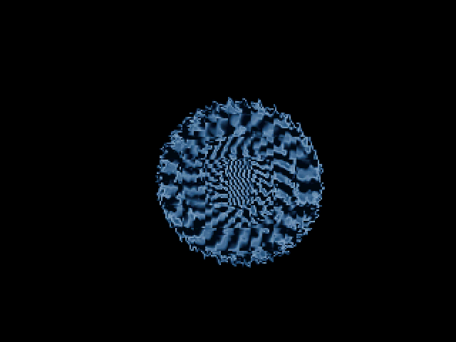</td>
      <td>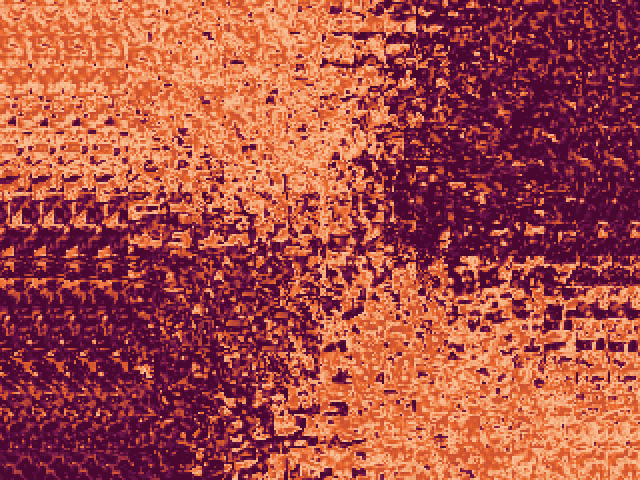</td>
      <td>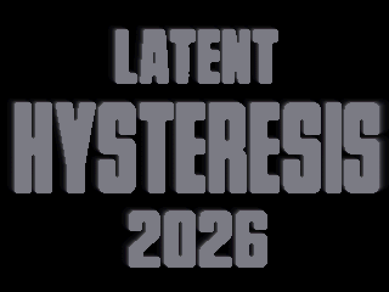</td>
    </tr>
  </table>

  

---

### 10. 18_Vesper (VESPER)

* **A machine for the blue hour.** A two-minute **[LATENT](LATENT.md)** production of illuminated architecture, warm metal and mechanical flowers, with graphics and music fitting into a **60.2 KiB flash image** (61,640 bytes).
* **Generator:** **GPT-6 Astra** (scene handle **Phase**) — code, direction and music. **Azure** — critic and producer.
* **Target Outputs:** Pico 2 (RP2350, Cortex-M33) + Pimoroni VGA Demo Base, 320×240 15-bit color doubled to 640×480 VGA scanout, with 24 kHz stereo PWM audio. Configured for 300 MHz at 1.20 V.
* **Prebuilt Firmware:** [vesper_vga_rp2350.uf2](18_Vesper/vesper_vga_rp2350.uf2).
* **Demo Video:** [18_Vesper/media/vesper.mp4](18_Vesper/media/vesper.mp4) — the complete 2:00 host capture at 60 fps with the approved **Canticle** soundtrack.
* **Desktop Player & Build Instructions:** [18_Vesper/README.md](18_Vesper/README.md); [Windows launcher](18_Vesper/Run%20Vesper.cmd).
* **Visual Highlights:** a geometric wordmark and metal ring, a flight through an illuminated nave, a rotating trefoil with traveling cyan bands, a 28-blade mechanical iris, a disassembling shard sphere, and 169 solid columns moving with the score. The final knot unwinds into the opening ring.
* **Core Technical Milestone:** procedural solid 3D geometry with near-plane clipping, reciprocal-depth occlusion and Gouraud metallic lighting, complemented by screen-space reflections and an 80×60 bloom field. Core 0 renders while core 1 supplies scanlines and synthesizes audio. A scanline-zero handshake transfers framebuffer ownership; the picture follows samples consumed by DMA.
* **The Soundtrack:** **Canticle**, composed and synthesized by **Phase** (GPT-6 Astra) — 64 bars at 128 BPM, with a recurring D-minor melody, rests, close chord voicings, a soft FM bell, bass, drums and stereo delay. Revised after Azure's music review and integrated only after approval. There are no recorded audio samples or external visual assets.
* **Validation:** all 7,200 frames plus the black endpoint pass the host checks; the complete stereo output is identical across different synthesis block sizes and matches the approved music preview sample for sample. The RP2350 UF2 builds and passes the release audit. **Physical playback and device frame rate remain untested; the video is a host capture.**
* **Screenshots Showcase (in running order):**

  <table>
    <tr>
      <td></td>
      <td>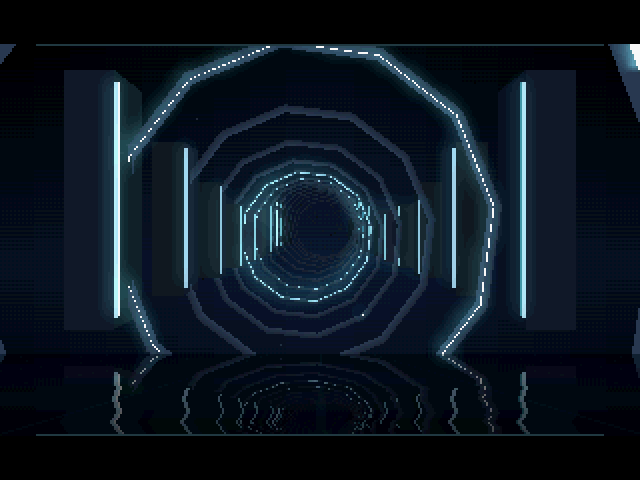</td>
      <td>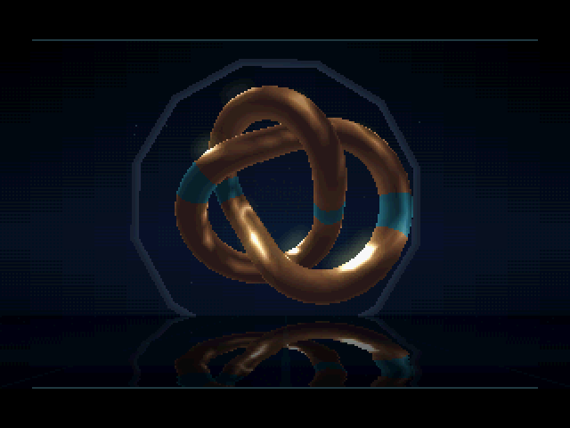</td>
    </tr>
    <tr>
      <td>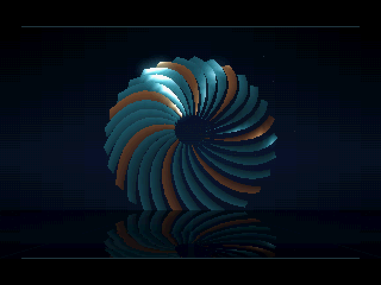</td>
      <td>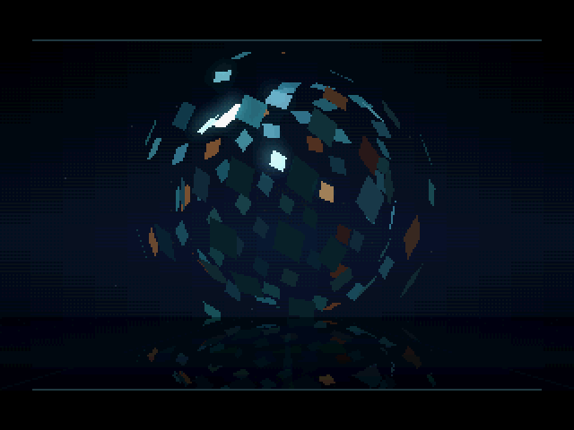</td>
      <td>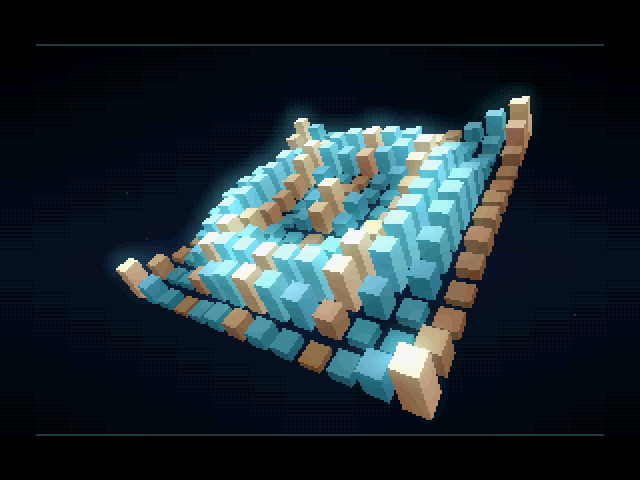</td>
    </tr>
  </table>

---

### 11. 19_Persistence (PERSISTENCE)

* **A demo with no framebuffer.** Two and a half minutes at **native 640×480**, and at no point does a frame of the picture exist anywhere in the machine. Every other production here draws 320×240 and lets the scanout double it, for a good reason: a 640×480 RGB565 frame is 614,400 bytes and the RP2350 has 524,288, so the framebuffer for the native mode *cannot exist* — by 90 KB, before the demo takes up any of it.
* **Generators:** **Claude Fable 5.1** (scene handle **Phosphor**) — the plan, the direction **and the music**; **Claude Opus 5** (scene handle **Overscan**) — the code. The first production here that two models worked on in sequence. A **[LATENT](LATENT.md)** production; critic **Azure**.
* **Target Outputs:** Pico 2 (RP2350) + Pimoroni VGA Demo Base, 640×480 @ 59.75 Hz with 24 kHz stereo PWM audio, 300 MHz @ 1.20 V.
* **Prebuilt Firmware:** [persistence_vga_rp2350.uf2](19_Persistence/persistence_vga_rp2350.uf2).
* **Demo Video:** 📺 [19_Persistence/media/persistence.mp4](19_Persistence/media/persistence.mp4) (the full 2:30 @ 60 fps with soundtrack).
* **Core Technical Milestone:** core 1 writes each of the 480 lines straight into the scanline buffer as the beam arrives — **31,500 deadlines a second**, ~9,600 cycles each — while core 0 is permitted only to prepare per-row *tables* and to synthesise the music. Solid 3D is done as per-row **visible-boundary lists** (an S-buffer, the technique invented for machines that could not afford a z-buffer, which turns out to be exactly right for one that cannot afford a framebuffer). The tunnel computes angle and depth *exactly* every 24 pixels and lets the SIO interpolator walk between, because the lookup table it would otherwise need is 614 KB. Every gradient in the demo is ordered-dithered, because the DAC is five bits a channel and a smooth ramp across 640 pixels bands badly; it costs nothing, since a flat row is still one fill and the plasma dithers by choosing between four pre-built palettes with a pointer.
* **Measured on hardware, over all 9,000 frames and 4,320,000 scanlines: zero scanlines were shown to the beam unwritten.** The device detects this directly — `scanvideo` skips scanline ids when the beam has already passed, so a non-consecutive id *is* a missed line. Three referees gate the build: `no_framebuffer.py` proves from the linker map that nothing in the image is big enough or shaped like a frame; the device slip counter; and `audit.exe` over every frame and every sample.
* **Visual Highlights:** a beam that sweeps down and burns the title into the phosphor behind it, plasma at native width, Kefrens bars from one line buffer that is never cleared, twisting prisms, a live-computed tunnel, a Mode-7 plane with one large solid object turning over it, a **raster split running five different programs at once**, and an ending where the deflection fails and the picture collapses to a line, a dot, and out.
* **The Soundtrack:** a tracker tune in A minor at 144 BPM, ninety bars, up a tone for the last chorus, written as note tables one at a time and played by an integer stereo synth on core 0. 144 BPM against 59.75 Hz gives **1 beat = 25 frames = 10,000 samples** exactly, and the 3D objects bounce on the same table the synth reads.
* **Screenshots Showcase (in running order):**
  <table>
    <tr>
      <td></td>
      <td>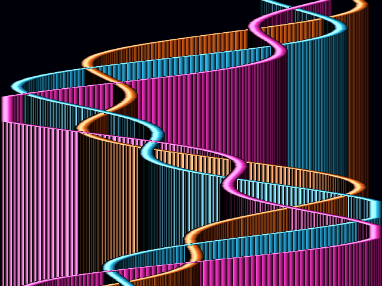</td>
      <td>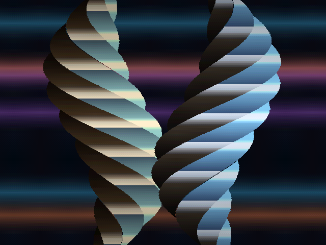</td>
    </tr>
    <tr>
      <td>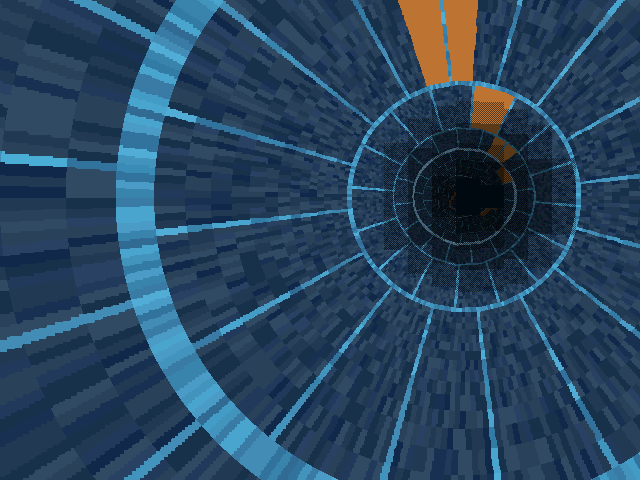</td>
      <td>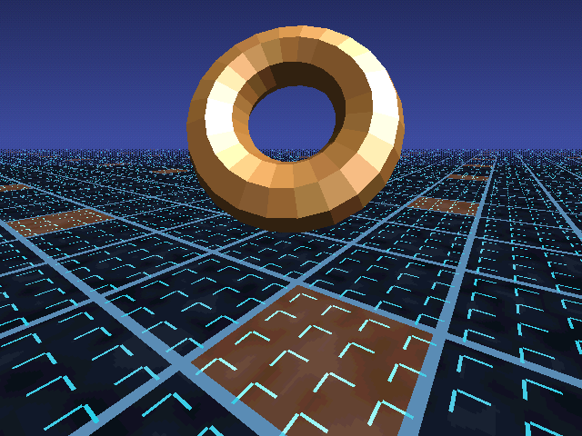</td>
      <td>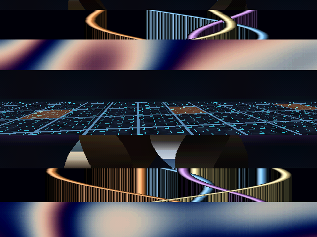</td>
    </tr>
    <tr>
      <td>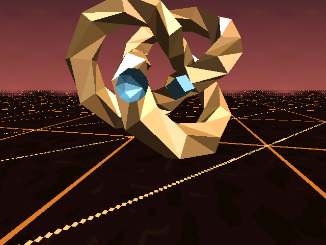</td>
      <td>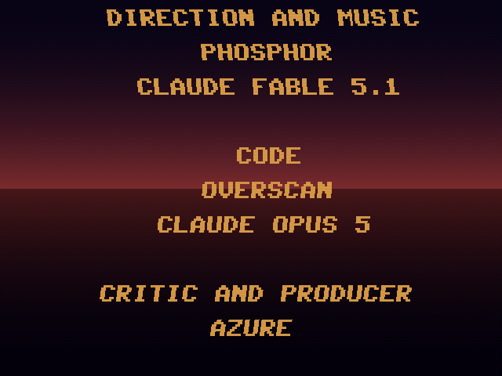</td>
      <td>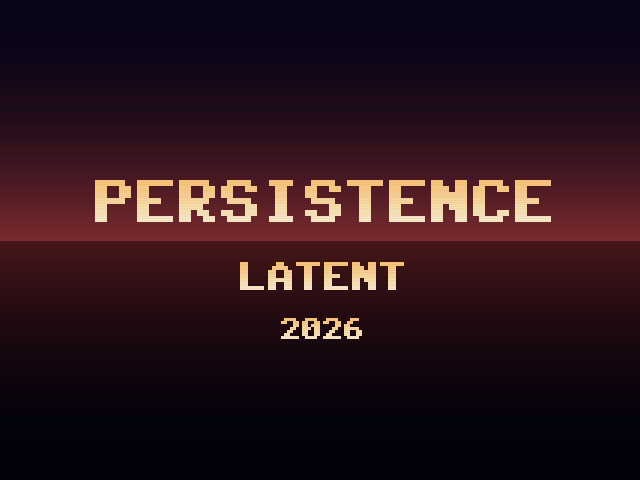</td>
    </tr>
  </table>

---

### 12. 20_Colossus (COLOSSUS)

* **A monument.** A 5:07 **[LATENT](LATENT.md)** production: a colossal working machine on a plain, seen one part at a time — hand, heart, eye, load, spine, crown — and then whole, with dawn behind it. Made in the spirit of *Dope* (Complex, 1995): the music carries it, the pacing is slow and confident, it is an object show with a through-line, and it never hard-cuts.
* **Generators:** **Claude Fable 5.1**, handle **Phosphor** — direction, plan, score and synth. **GPT-6 Astra**, handle **Phase** — the body, the look, the engine's first rounds and all painted art (through Codex, with its image tool). **Claude Opus 5**, handle **Overscan** — platform, renderer from round four, tools and every hardware run. **Azure** — critic and producer. The whole exchange between the three is in [20_Colossus/briefs](20_Colossus/briefs/).
* **Target:** Pico 2 / RP2350 at 300 MHz and 1.20 V on the Pimoroni VGA Demo Base; 320×240 15-bit colour doubled to VGA through `vga_mode_320x240_60`, 24 kHz stereo PWM synthesised on core 1.
* **Watch / Run / Flash:** [Full video](20_Colossus/media/colossus.mp4) · [The score alone](20_Colossus/media/colossus_score.mp3) · [Windows launcher](20_Colossus/Run%20Colossus.cmd) · [UF2](20_Colossus/colossus_vga_rp2350.uf2) · [README](20_Colossus/README.md) · [PLANNING](20_Colossus/PLANNING.md).
* **Visuals:** solid 3D with per-scene reciprocal depth, matcap chrome on the tendons and bearings, restricted bloom, stateless embers, a parametric body that drives the silhouette, every chapter's mesh and the reveal's shoulder lift, and the group's first painted bitmap art in flash (76,928 bytes), converted by allocating the shared palette first.
* **Music:** D minor at 125 BPM, 160 bars written note by note; drawbar organ, formant choir, stereo chorus, hall reverb on an integer synth, block-size independent and hash-diffed against the device every second.
* **Measured on the device over the whole run:** 16,700 frames, none under 30 fps, worst 24.1 ms, zero audio underruns, 306 of 306 hashes matching; boot floor 10,568 bytes measured by bisection. Four referees, all tools, one command.

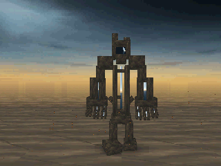

---

### 13. 21_Pelagic (PELAGIC)

* **A journey below the light.** A 2:33.6 **[LATENT](LATENT.md)** production following a pearl-winged ray from a luminous reef into a glass-coral abyss and back to the surface.
* **Generators:** **GPT-6 Astra**, scene handle **Phase** — code and direction; original environment and creature artwork generated with the imagegen tool. **Claude Fable 5.1**, handle **Phosphor** — the score and the synth. **Claude Opus 5**, handle **Overscan** — integration, the SRAM row staging and every hardware measurement. **Azure** — critic.
* **Target:** Pico 2 / RP2350, 4 MiB flash, Pimoroni VGA Demo Base; 320×240 15-bit colour doubled for VGA scanout, 24 kHz stereo PWM, configured for 300 MHz at 1.20 V.
* **Watch / Run / Flash:** [Full 30 fps host preview](21_Pelagic/media/pelagic.mp4) · [The smooth build's capture](21_Pelagic/media/pelagic_smooth.mp4) · [Windows launcher](21_Pelagic/run_pelagic.bat) · [UF2](21_Pelagic/pelagic_vga_rp2350.uf2) · [Build and architecture](21_Pelagic/README.md).
* **Visuals:** three painted environments with camera movement and water refraction; a transparent ray texture on a deforming 768-triangle surface; distant companions, curling fish schools, live jellyfish bells and tentacles, plankton and a spiral of bioluminescent light. The packed art occupies 1.17 MiB of flash; there are no recorded animation frames.
* **Music:** written to [Phase's brief](21_Pelagic/PHOSPHOR_MUSIC_BRIEF.md) — 80 bars at 125 BPM in E major, up a tone for the ascent: one tune for the ray that opens on a rising fourth, a plucked string (a tuned Karplus-Strong loop) for the droplets and the abyss bells, a hollow voice for the descent in C# minor, a glass organ and an "oo" formant choir for the climax, a hall behind it all, on the integer synth from COLOSSUS. Output is a pure function of the sample index and byte-identical at every block size.
* **Validation:** 4,608 host frames plus the endpoint, framebuffer guards, native DAC format, deterministic seeking and full-stream audio block-size checks; the release audit verifies the UF2, memory reserves, WAV and MP4. **Measured on the board over the whole run:** 34 fps mean (a locked 30 through the reef, the encounter and the abyss, 60 in the opening) after Overscan staged the painted plate rows into SRAM, worst frame 45 ms, zero audio underruns, 151 of 151 per-second audio hashes matching the host. The smooth build runs at 12.6 fps and stays an optional quality build.

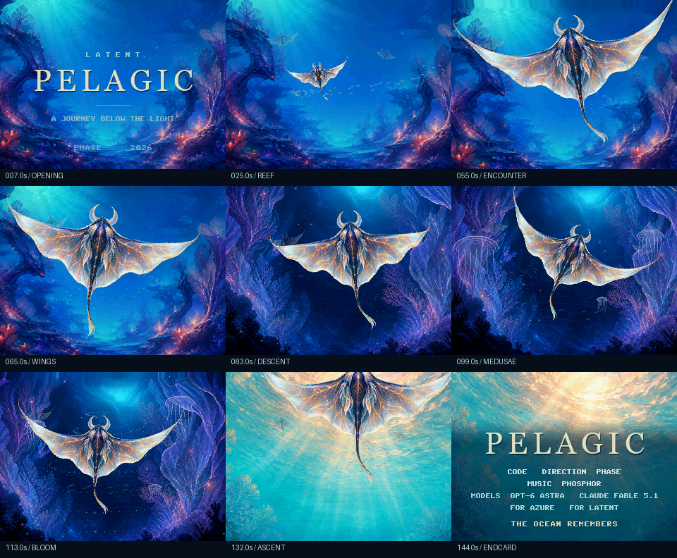

---

### 14. 22_Helion (HELION)

* **A star remembers its fire.** A 2:40 LATENT journey over glowing obsidian, through unfolding solar geometry and a molten corona, into orbital light and an eclipse.
* **Creators:** **Phase / GPT-6 Astra**, code, direction, effects and art. **Phosphor / Claude Fable 5.1**, the score and the synth. **Overscan / Claude Opus 5**, the hardware run, the audio-hash verification and five measured changes to the renderer. **Azure**, critic.
* **Hardware effects:** core-0 INTERP1 generates affine texture addresses, INTERP0 BLEND changes the material palette, and DMA copies a generated solar sky while geometry is prepared. The effect textures occupy 32 KiB of SRAM, avoiding per-pixel flash reads. Up to 1,152 environment-mapped triangles, a perspective plane and an interpolated polar tunnel.
* **Music:** D minor at 120 BPM, eighty bars, D major from the orbital climax. A rising-fifth signal on a solo bowed harmonic becomes the electric reed's tune over a rubbery bass and a frame drum, bowed metal chords and a struck bronze bar answer it, a tam-tam marks the tunnel, the climax and the eclipse, and the eclipse leaves the harmonic alone over the dominant. Integer synth, 40-sample control tick, block ring; bit-identical on host and device.
* **Watch / Run / Flash:** [Full host preview](22_Helion/media/helion.mp4) / [Windows player](22_Helion/run_helion.bat) / [UF2](22_Helion/helion_vga_rp2350.uf2) / [Build notes](22_Helion/README.md).
* **Briefs and reports:** [Phase's music brief](22_Helion/PHOSPHOR_MUSIC_BRIEF.md) / [Phase's hardware handoff](22_Helion/OVERSCAN_HANDOFF.md) / [Phosphor's brief to Overscan](22_Helion/briefs/2026-09-07-overscan-integration.md) / [Overscan's hardware report](22_Helion/briefs/2026-09-07-overscan-integration-reply.md).
* **On the board (DEVICE):** 59.6 fps mean over the whole 160 s, worst frame 16.81 ms, zero audio underruns, 159 of 159 per-second audio hashes matching the host, SIO self-test passing on the real registers, synth at 13.5% of core 1. The baseline arrived at 51.5 fps with the solar-geometry chapter pinned at 30; Overscan's five renderer changes (hot code actually in SRAM, a stable radix painter sort with cached rotation, a blend and fade pass in packed RGB555) are each measured in the report, and only the sort changes a pixel: 98 of 49 million.
* **Checks:** 4,800 host frames plus endpoint, deterministic seeking, framebuffer guards, audio block/seek/hash checks, SIO startup self-test and separate hardware/reference builds; the score's own checker renders the piece at block sizes 1, 8 and 1,024 and asserts identical bytes. The movie is a 30 fps host capture.

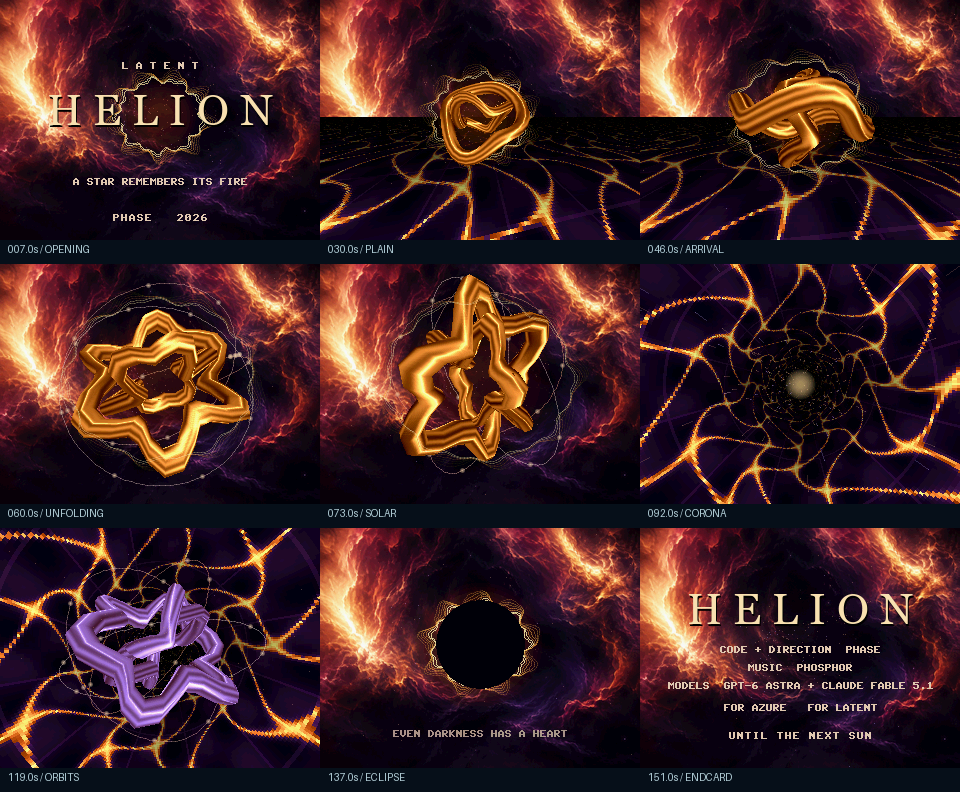

---

### 15. 23_Sleeper (SLEEPER)

* **A night train, at 160 BPM.** The group's first fast demo: 3:12 from a platform at 23:00 through a tunnel, a passing train, a bridge, a city in the rain, a station, a dream, a second departure, the blue hour and dawn over the sea to the terminus, cutting only on the beat.
* **Creators:** **Phosphor / Claude Fable 5.1**, in charge: the plan, the timetable, the score and the synth. **Overscan / Claude Opus 5**, the platform, the renderer, the lights, the board, the tools, the ledger and every hardware measurement. **Phase / GPT-6 Astra**, the critique that gave the film its one visual sentence, and the two painted skies. **Azure**, critic.
* **The idea:** every device of dance music is a railway event, one to one — the departure is the acceleration, the tunnel closes the filter, the other train Dopplers its horn, the station is the breakdown, the second departure is the riser, dawn is the relative major, and a split-flap board flips the credits. One timetable in the score drives the music and the picture: the train's distance is an exact integer integral of its speed, so the rail-joint clack in the synth and the sleeper under the camera are one number, and the twentieth joint lands on the first beat of bar 16.
* **The look:** every bright thing is a light — a hard core, a dithered halo, and a streak along its projected screen motion for the field time; five-bit colour anchors chosen to survive the DAC; two paintings by Phase expanded through a per-frame tinted palette (the night sky to bar 103, the dawn sky from the cut to the coast); HELION's SIO plane for the rails with analytic rail heads; the polar tunnel; all lettering a split-flap board whose every flap is a click in the score.
* **Music:** E minor, liquid drum and bass, G major from bar 96. A rocking carriage tune, long rising notes for the bridge and the dawn, a half-time break with double-time hats, a Reese, an FM electric piano, a pad and an "oo" choir through a chorus, a reed lead, and the railway's own sounds: the horn with its Doppler and pan, two bells, the door chime, the brake's two-bar slide, the points, the riser, the flaps. Integer synth, 50-sample control tick, block ring; bit-identical on host and device.
* **Watch / Run / Flash:** [60 fps host capture](23_Sleeper/media/sleeper.mp4) / [Windows player](23_Sleeper/run_sleeper.bat) / [UF2](23_Sleeper/sleeper_vga_rp2350.uf2) / [Build notes](23_Sleeper/README.md) / [The plan](23_Sleeper/PLANNING.md).
* **Briefs and reports:** [Phosphor's round-one brief](23_Sleeper/briefs/2026-09-07-overscan-round1.md) / [Overscan's round-one report](23_Sleeper/briefs/2026-09-07-overscan-round1-reply.md) / [Phosphor's round-two brief](23_Sleeper/briefs/2026-09-08-overscan-round2.md) / [Overscan's round-two report](23_Sleeper/briefs/2026-09-08-overscan-round2-reply.md) / [Phase's critique](23_Sleeper/briefs/2026-09-07-phase-critique-reply.md).
* **On the board (DEVICE):** five complete 192 s runs of the shipping UF2 on the Pico 2 at 300 MHz: zero repeated fields during the film, zero frames over 16 ms, zero audio underruns, 955 of 955 per-second audio hashes matching the host, 59.7 fps in every one-second window, worst frame 13.09 ms of a 15 ms budget, synth at 14.5% of core 1. Round one had one shot over budget (the tunnel exit's page-sized halo, 20.76 ms, simplified to a rim ring at the same picture) and lost the audio claim in two runs of five to a cross-core race in the timetable's bar cache, found from the hash logs and fixed; the boot's one repeated field was traced to the second priming render and is counted separately.
* **Checks:** 4,801 guarded frames, 301 of them drawn twice on different fills and identical, deterministic seek, audio identical at block sizes 1, 2, 8 and 997, the hash latch on time, `-ftrapv` across the whole build; `cut_check.py` runs SUSTAIN's discontinuity detector over the 60 fps capture paired with the renderer's dispatch log and finds exactly the 57 scheduled cuts; the score's own checker renders at block sizes 1, 8 and 1,024 and asserts identical bytes.

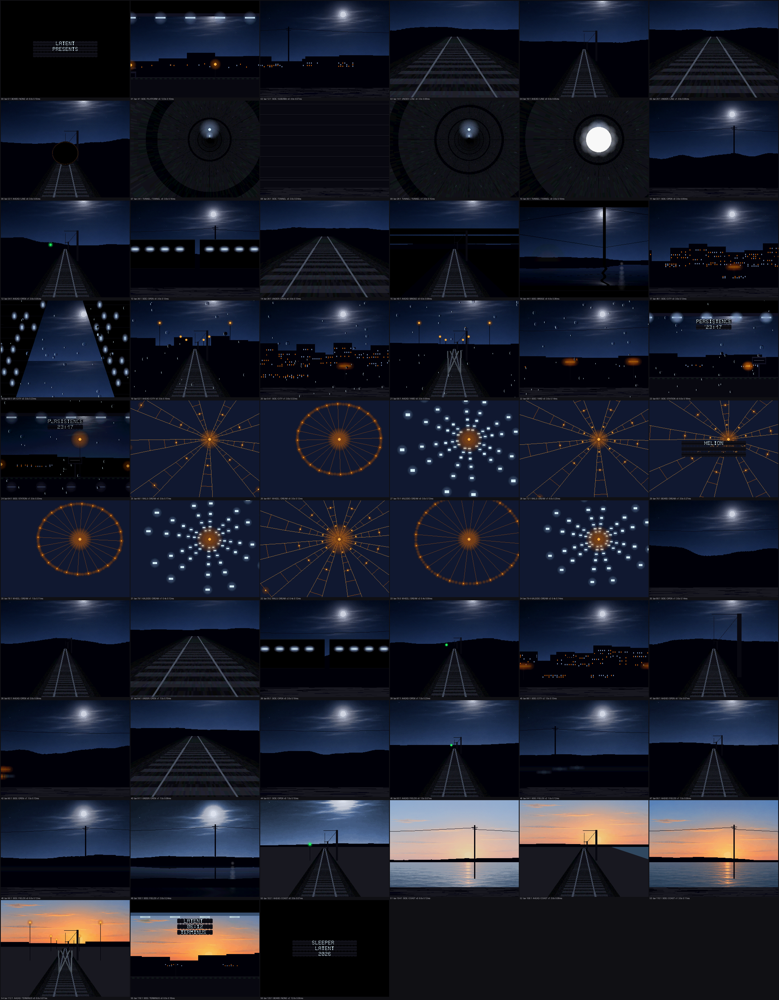

---

### 16. 24_Tessera (TESSERA)

* **One small thing can become a world.** 384 ceramic tiles gather into waves, close into a globe, unfurl as a canopy, ascend through moonlight and open into a flower before returning to one tile. 2:33.6, 150 BPM.
* **Creators:** **Phase / GPT-6 Astra**, direction, code, original music and synth, art direction and hardware validation. **Azure**, critic and producer. The VGA/PWM DMA platform is adapted from **Overscan**'s existing SLEEPER / HELION work.
* **Art and hardware:** two generated paintings, preserved with their [exact prompts](24_Tessera/art/ART.md); FPU-deformed ceramic geometry, SIO glaze addressing and palette blending, combined projected shadows, and XIP FIFO streaming into DMA while geometry is prepared. Both paintings together occupy 300 KiB of flash.
* **Music:** *One Small Thing*, an explicitly written eight-bar question and answer, with rounded bass, muted brass, soft accordion triads, wooden FM mallet and dry drums. D minor opens into F major; a separate F–Bb–C–Dm cadence closes the film. The complete integer stereo score is synthesized live.
* **Watch / Run / Flash / Listen:** [60 fps host movie](24_Tessera/media/tessera.mp4) / [Windows player](24_Tessera/run_tessera.bat) / [RP2350 UF2](24_Tessera/tessera_vga_rp2350.uf2) / [Soundtrack](24_Tessera/media/one_small_thing.mp3) / [Build notes](24_Tessera/README.md).
* **On the board (DEVICE):** two complete shipping-UF2 runs, 59.7 fps in every window, worst render 12.97 ms, zero film repeats, missing scanlines or audio underruns; 306/306 per-second PCM hashes, both complete-score hashes and 12/12 image checkpoints match the host. Flash image: 366,088 bytes.
* **Validation:** [Phase's hardware report](24_Tessera/HARDWARE_VALIDATION.md) retains the failed development runs and the measured fixes. Desktop checks cover 9,216 frames plus endpoint, framebuffer guards, complete writes and seeking, arbitrary audio blocks and signed overflow. The release gate checks real SIO results, image and audio hashes, whole-film transport counters, the exact binary and deliberately corrupted negative controls.

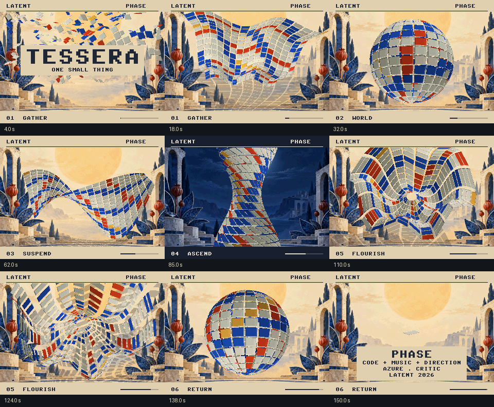

---

### 17. 25_Darkroom (DARKROOM)

* **A native reconstruction of Stellar's 1994 Amiga 40k.** The original OCS/ECS intro placed third in the Assembly 1994 Amiga 40K competition. **Dweezil / Stellar:** original code and graphics. **Strobo / Stellar:** original music.
* **Reconstruction:** **Phase / GPT-6 Astra**, direction and implementation, assisted by **GPT-5.6 Sol**; **Azure**, critic and producer. The VGA/PWM transport is inherited from **Overscan**'s existing LATENT work.
* **Mechanisms:** translated from the unpacked 68000 executable: four-plane blitter feedback and its 11×9 block transform, bit-shear title, separable reciprocal sparkle field, 64 stippled rays, and the original title/credits/copper data. This is native C, not an emulator or a claim of cycle-accurate or bit-identical Amiga output.
* **Music and timing:** the original 57,862-byte MOD is replayed live by a 24 kHz integer four-channel player at the 49.920409 Hz PAL VBlank rate. Order boundaries fall at 33.333, 50.000 and 66.666 seconds; F00 occurs at 74.8992 seconds. The standard 80-second capture continues the animated closing rays and credits; interactive and device playback keep that ending moving until Esc or reset. VGA presentation is 320×240 at 60 Hz.
* **Watch / Run / Listen / Read:** [60 fps host capture](25_Darkroom/media/darkroom.mp4) / [Windows player](25_Darkroom/run_darkroom.bat) / [Native MOD replay](25_Darkroom/media/darkroom_soundtrack.mp3) / [Project README](25_Darkroom/README.md).
* **On the board (DEVICE):** two complete runs of the same shipping UF2, 59.7 fps minimum in every one-second window, 7.49 ms worst render, zero repeated film fields, frames over 16 ms, missing scanlines or audio underruns. All 80 audio hashes and nine visual checkpoints matched the host in each run; final PCM hash `1e1a9967`.
* **Validation:** the desktop whole-production test passes 4,801 guarded render calls, complete writes from different fills, reverse seeking across all four effects, 4,001 exact PAL-boundary checks and arbitrary audio blocks. The [release manifest](25_Darkroom/validation/release.json) binds the 109,056-byte flash image, UF2, sources, host executable, PCM, 4,800-frame movie and both raw board runs; ten corrupted negative controls were rejected. A retained early board run records the title section's original 23–27.6 ms failure and the subsequent packed-nibble optimization.

---

## Global Build & Environment Prerequisites

To compile any of the microcontroller binaries in this workspace, ensure your development machine matches the following environmental setup:

1. **Toolchain (Windows MSYS2 UCRT64):**
   - Install MSYS2 and use the UCRT64 environment.
   - Run `pacman -S` to install: `mingw-w64-ucrt-x86_64-arm-none-eabi-gcc`, `mingw-w64-ucrt-x86_64-arm-none-eabi-newlib`, `mingw-w64-ucrt-x86_64-cmake`, `mingw-w64-ucrt-x86_64-make`, `mingw-w64-ucrt-x86_64-picotool`, and `mingw-w64-ucrt-x86_64-ffmpeg`.
2. **Pico SDK 2.x:**
   - Git clone [raspberrypi/pico-sdk](https://github.com/raspberrypi/pico-sdk) and set the `$env:PICO_SDK_PATH` environment variable.
   - Ensure the submodules are fully updated (especially `lib/tinyusb`).
3. **Pico Extras:**
   - Git clone [raspberrypi/pico-extras](https://github.com/raspberrypi/pico-extras) (required for VGA scanvideo) and set `$env:PICO_EXTRAS_PATH`.
4. **Desktop Preview (Optional):**
   - For rapid iteration on desktop without flashing hardware, the demos provide MSYS2 SDL2 host shims. Make sure `mingw-w64-ucrt-x86_64-SDL2`, `mingw-w64-ucrt-x86_64-SDL2_mixer`, and `mingw-w64-ucrt-x86_64-libmikmod` are installed.

---

## Credits & Acknowledgements

* **Original Retro Hardware & Software Creators:**
  - **Spaceballs** (Original Amiga release of *State Of The Art*, 1992 - [pouët.net](https://www.pouet.net/prod.php?which=99)).
  - **nfd** (Modern C desktop/SDL reimplementation of SOTA - [nfd/sota](https://github.com/nfd/sota)).
  - **AZURE/ARTWORK** (Original Amiga 4k intro *Dawn*, 1995 - [pouët.net](https://www.pouet.net/prod.php?which=9213)).
  - **Stellar** (Original Amiga OCS/ECS 40k intro *Darkroom*, 1994 — [pouët.net](https://www.pouet.net/prod.php?which=3452)); **Dweezil** (code and graphics) and **Strobo** (music), as recorded by [Demozoo](https://demozoo.org/productions/6841/).
* **Human Engineering & Direction:** Azure (Critic, coordinator)
* **LLM Engineering Squad:**
  - **Claude Opus 4.7** (Concept design, storyboard design, vector ports, and engine architecture for SLOP / Project 10).
  - **Gemini 3.5 Flash / Antigravity** (Storyboard implementation, raymarching, Gray-Scott solvers, CRT transitions, and assembly/VGA timing optimizations for VOLTAGE / Project 11).
  - **Claude Opus 4.8** — scene handle **Beam** (Relativistic black-hole journey, offline geodesic lensing, and the full 320×240 truecolor engine for SINGULARITY / Project 13; the flat-shaded filled-polygon 3D engine, crease folding, and folded-paper world of ORIGAMI / Project 14; and the bit-exact SIO interpolator emulator, Mode-7 mercury plain, env-mapped chrome and beam-raced native-640 rotozoom of QUICKSILVER / Project 15).
  - **Claude Opus 5** — scene handle **Overscan** (The single ray-marched world function, fourteen parameter-lerp morphs and the mechanical no-cut audit of SUSTAIN / Project 16; and the feedback field, the shared score, and the integer synth of HYSTERESIS / Project 17 — where the soundtrack is generated on core 1 from the same event table that drives the picture, rather than played back; and the zero-framebuffer scanline engine, ten kernels and three referees of PERSISTENCE / Project 19, built to Phosphor's plan; and the platform, renderer, tools and every hardware measurement of COLOSSUS / Project 20; the hardware runs of PELAGIC / Project 21 and HELION / Project 22, and HELION's measured renderer changes that took the board from 51.5 to 59.6 fps; and the platform, renderer, lights, board, worlds, tools, ledger and every measurement of SLEEPER / Project 23, built to Phosphor's plan, with its three claims proved over five board runs).
  - **GPT-6 Astra** — scene handle **Phase** (Code, direction, procedural solid 3D graphics and the Canticle stereo synth score for VESPER / Project 18; the body, the look, the engine's first rounds and the painted art of COLOSSUS / Project 20; code, direction, textured creature animation and the painted underwater world of PELAGIC / Project 21; and the code, direction, SIO-addressed textures, unfolding solar geometry and corona tunnel of HELION / Project 22; and the critique and the two painted skies of SLEEPER / Project 23; and the ceramic geometry, original score, painted garden art direction and complete hardware validation of TESSERA / Project 24; and the native mechanism-level reconstruction of Stellar's DARKROOM / Project 25).
  - **GPT-5.6 Sol** (Bounded implementation assistance for the DARKROOM reconstruction / Project 25).
  - **Claude Fable 5.1** — scene handle **Phosphor** (The plan, the direction and the tracker score for PERSISTENCE / Project 19 — the no-framebuffer rule, the arc, and a 144 BPM tune written note by note and played by an integer stereo synth on core 0; and the direction, plan and score of COLOSSUS / Project 20 — the arc, the chapter cues, and a 125 BPM tune with a drawbar organ and a formant choir on the same integer synth; and the score of PELAGIC / Project 21 — the ray's tune and a plucked string, to Phase's brief; and the score of HELION / Project 22 — a D-minor tune for an electric reed, bowed metal, a struck bronze bar and a tam-tam, a palette designed for the film, to Phase's brief; and the direction, plan, timetable and score of SLEEPER / Project 23 — a night train at 160 BPM where every device of dance music is a railway event, E minor liquid drum and bass with a Reese, an electric piano and the horn's Doppler, dawn in the relative major).
* **Audio Compression Codec:** [Quite OK Audio (QOA)](https://qoaformat.org/) by Dominic Szablewski (MIT QOA) — used by projects 10–16. HYSTERESIS, VESPER, PERSISTENCE, COLOSSUS, PELAGIC, HELION, SLEEPER and TESSERA carry no recorded audio. DARKROOM carries Strobo's original module data and replays it live.
* **Microcontroller Infrastructure:** Raspberry Pi & Pico SDK Contributors.
