# PicoDemos: Demoscene Demos for [RP2040](https://en.wikipedia.org/wiki/RP2040) & [RP2350](https://en.wikipedia.org/wiki/RP2350) using agentic AI

This repo contains some experiments to use agentic AI to design and implement demoscene demos on the **Raspberry Pi Pico ([RP2040](https://en.wikipedia.org/wiki/RP2040))** and the **Raspberry Pi Pico 2 ([RP2350](https://en.wikipedia.org/wiki/RP2350))**. Both of these are microcontrollers that cost around a dollar each.

The RP2040 is equipped with a dual-core ARM Cortex-M0+ processor clocked at 133 MHz, 264 KB of SRAM, and 8 Programmable I/O (PIO) state machines. Its successor, the RP2350, features dual-core ARM Cortex-M33 or RISC-V cores at 150 MHz, an expanded 520 KB SRAM, and 12 PIO state machines to handle more complex graphic routines. Both of these can be easily overclocked to 300MHz.

To enable them to run demos, I use the Pimorini Pico VGA demo based that basically adds resistors and connectors to allow bit-banged VGA and audio. The board is shown below.

Even though these are microcontrollers, they are very compelling targets for graphical effects and demoscene demos. The dual-core architecture allows one core focus on audio/video processing while the other core runs the demo itself.

I felt this platform is seriously underexplored. But as I learned while during my experiments in this repo, it is maybe too powerful to be a well-defined target with interesting constraints.

**Ah yes, and it is totally lame to use GenAI to make demos. It rips the essence, the soul, out of the process.**

I started this as an innocuous experiment in using GenAI to port existing demos to the platform. This created a suitable substrate (context) for the agents to build on. The last two demos are completely Gen AI designed and created - I mostly provided critical feedback like "this looks lame, do better".

I was especially surprised by the last demo, made by Gemini 3.5 Flash, which was almost single-shot in less than 15 minutes. The Opus demo took 2-3 evenings of back and forth and was also strangely adamant on inserting the coral logo everywhere. GPT 5.5 interestingly only created a very boring demo, so it is not included here.

From here on be slop.

*Azure*

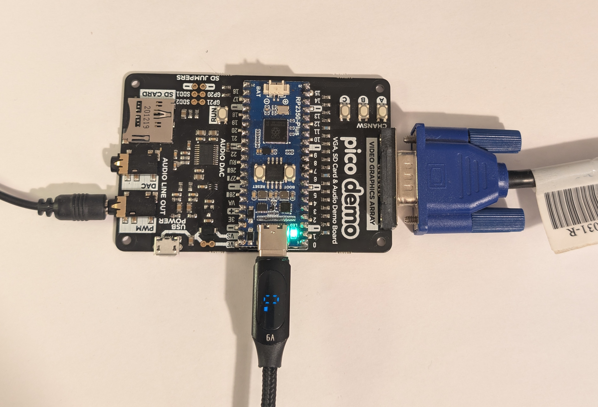


---

##  Overview

| # | Production | Type | Primary Chip | Primary Display Output | Assistive LLM Creator |
|---|---|---|---|---|---|
| **01** | **[State Of The Art (SOTA)](01_SOTA_DEMO)** | Classic Port | [RP2040](https://en.wikipedia.org/wiki/RP2040) / [RP2350](https://en.wikipedia.org/wiki/RP2350) | VGA (15-bit), ST7789 SPI, or Composite PAL | **Claude Opus 4.7** |
| **02** | **[Dawn](02_Dawn)** | Classic Port | [RP2040](https://en.wikipedia.org/wiki/RP2040) | VGA (16-bit RGB-565) | **Claude Opus 4.7** *(Web: 4.1)* |
| **10** | **[SLOP (TheDemo)](10_TheDemo)** | Original Demo | [RP2350](https://en.wikipedia.org/wiki/RP2350) | VGA (Multi-mode raster splits) | **Claude Opus 4.7** |
| **11** | **[VOLTAGE (FlashDemo)](11_FlashDemo)** | Original Demo | [RP2350](https://en.wikipedia.org/wiki/RP2350) | VGA (Multi-mode & Beam-raced) | **Gemini 3.5 Flash** *(Antigravity)* |

---

##  Repository Structure

```
PicoDemos/
├── .gitignore                   # Workspace-wide unified Git exclude rules
├── README.md                    # Root collection directory map and overview (this file)
├── pico-demo.jpg                # Showcase banner image
│
├── 01_SOTA_DEMO/                # C-reimplementation of the 1992 Amiga demo by Spaceballs
│   ├── sota/                    # Upstream nfd/sota submodule
│   ├── native/                  # Windows desktop simulator port
│   ├── pico/                    # ST7789 SPI, Composite PAL, and VGA Pico/Pico2 backends
│   └── *.uf2                    # Checked-in release firmware images
│
├── 02_Dawn/                     # Port of the 1995 Amiga 1200 4K intro by AZURE/ARTWORK
│   ├── pico/                    # RP2040 hardware engine (scanvideo-based VGA output)
│   ├── web_port/                # TypeScript reference & browser preview harness
│   └── dawn_vga_rp2040.uf2      # Checked-in release firmware image
│
├── 10_TheDemo/                  # SLOP: An original 4-minute beat-synced RP2350 VGA demo
│   ├── thedemo/                 # Engine sources, tools, custom split raster drivers
│   ├── slop_vga_rp2350.uf2      # Checked-in release firmware image
│   └── README.md                # Memory budgets, librosa beat-mapping, Suno 4.5 audio
│
└── 11_FlashDemo/                # VOLTAGE: An original cyber-neon high-voltage RP2350 VGA demo
    ├── thedemo/                 # Fluid solvers, Cortex-M33 FPU raymarching, Julia set fractal
    ├── PLANNING.md              # Technical architecture, dual-core sync, storyboard
    ├── voltage_vga_rp2350.uf2   # Checked-in release firmware image
    └── README.md                # Render mode details and credits
```

---

##  The Demos

### 1. 01_SOTA_DEMO (State Of The Art)
* A brilliant port based on the modern C-reimplementation [nfd/sota](https://github.com/nfd/sota) of the legendarily smooth **1992 Amiga demo by Spaceballs** (original release on [pouët.net](https://www.pouet.net/prod.php?which=122)).
* **Assistive Assistant:** **Claude Opus 4.7** compiled the C port and helped adapt it to Windows, RP2040, and RP2350.
* **Target Outputs:**
  - **VGA Output:** [sota_vga_rp2040.uf2](01_SOTA_DEMO/sota_vga_rp2040.uf2) / [sota_vga_rp2350.uf2](01_SOTA_DEMO/sota_vga_rp2350.uf2), 320×240 @ 60 Hz 32K colors with 11 kHz mono QOA-encoded audio, running on the Pimoroni VGA board.
  - **ST7789 SPI Display:** [sota_tft_rp2040.uf2](01_SOTA_DEMO/sota_tft_rp2040.uf2), 240×240 full-color (RGB-565) SPI panel.
  - **Composite PAL / S-Video:** [sota_composite_rp2040.uf2](01_SOTA_DEMO/sota_composite_rp2040.uf2), 320×256 @ 50 Hz PAL video output utilizing a custom 3-bit binary-weighted resistor DAC (8 grey levels with 4×4 Bayer ordered dithering to produce ~128 perceived grey shades).
* **Core Technical Milestone:** Pad widths to multiples of 64 pixels to bypass Cortex-M0+ unaligned 32-bit hardware-fault limits, custom fast DMA-PWM mixing to play QOA audio.
* **Screenshots & Captures Showcase:**
  <table>
    <tr>
      <td align="center" width="50%">
        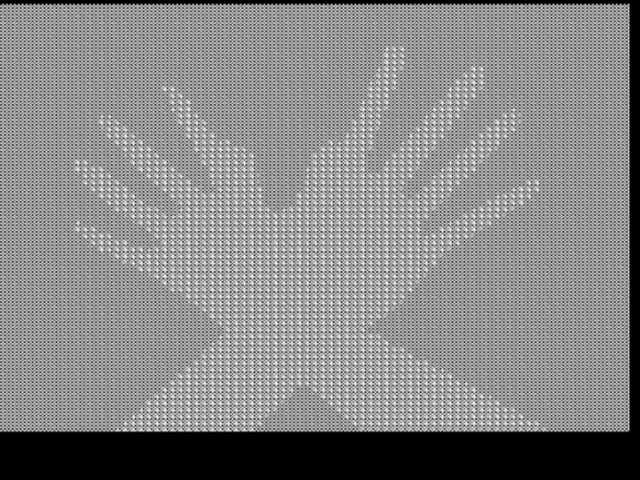<br/>
        <sub><b>📺 Composite PAL Output (Dithered Grey)</b></sub>
      </td>
      <td align="center" width="50%">
        <video src="01_SOTA_DEMO/SOTA_on_tft_screen.mp4" width="100%" controls></video><br/>
        <sub><b>📱 SPI TFT Vector Rotoscoping Video</b></sub>
      </td>
    </tr>
  </table>

### 2. 02_Dawn
* Port of the  **1995 Amiga 1200 4K intro by AZURE/ARTWORK** (original release on [pouët.net](https://www.pouet.net/prod.php?which=1460)).
* **Assistive Assistant:** **Claude Opus 4.7** (the initial web-harness TypeScript port in `web_port/` was completed using **Opus 4.1**).
* **Target Outputs:** Pimoroni VGA Demo Base running at 320×240@60Hz (line-doubled from a 160×128 6bpp chunky framebuffer).
* **Web Preview:** [Run the Dawn browser port on GitHub Pages](https://cpldcpu.github.io/PicoDemos/).
* **Prebuilt Firmware:** [dawn_vga_rp2040.uf2](02_Dawn/dawn_vga_rp2040.uf2).
* **Core Technical Milestone:** Squeezed into a tight 264 KB SRAM budget by dynamically regenerating torus geometries, voxel shading lists, and division tables inline on the ARM cores rather than allocating expensive look-up tables (LUTs) like the original 2 MB Amiga version did.
* **Screenshots Showcase (3D Raycaster & Environmental Effects):**
  <table>
    <tr>
      <td>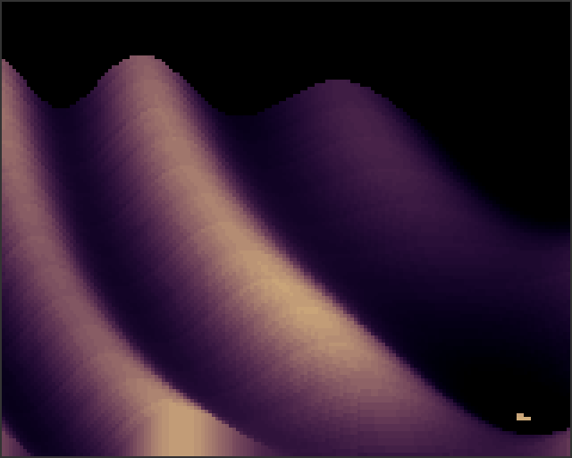</td>
      <td>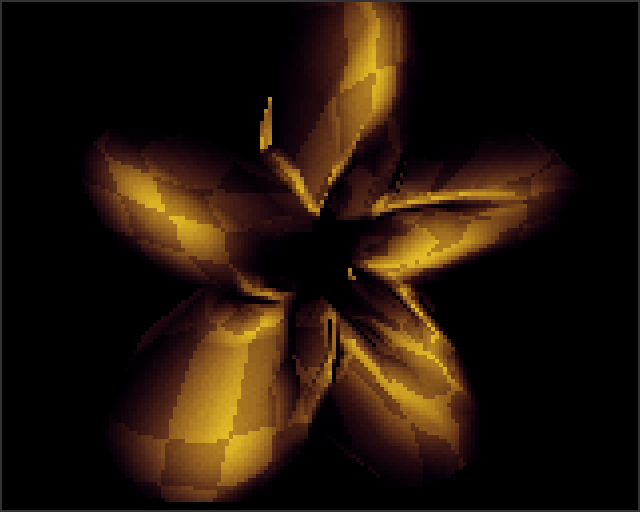</td>
      <td>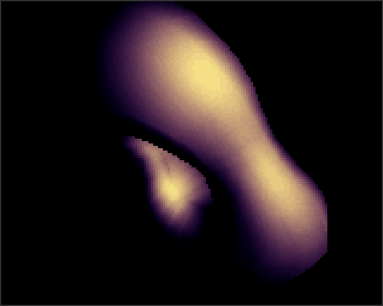</td>
    </tr>
    <tr>
      <td>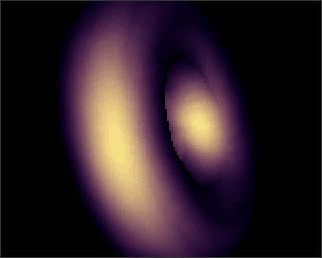</td>
      <td>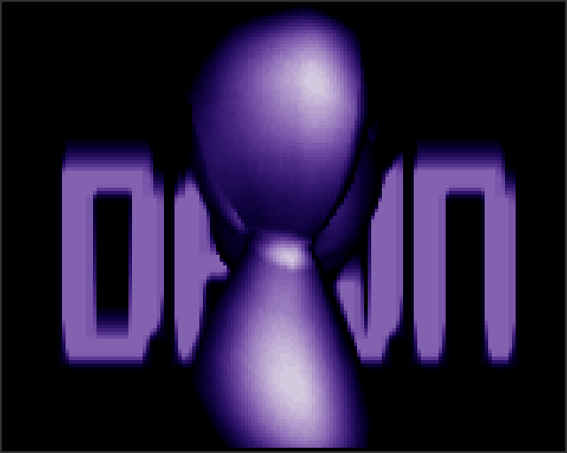</td>
      <td>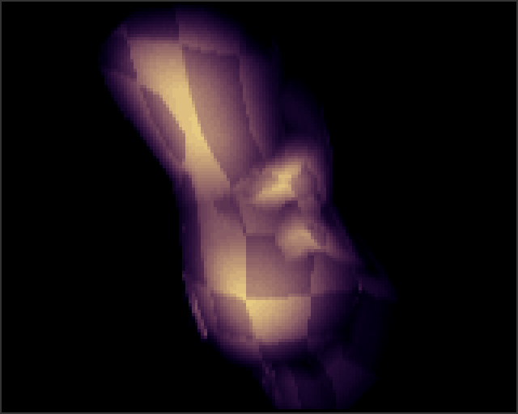</td>
    </tr>
  </table>

### 3. 10_TheDemo (SLOP)
* A completely original, breathtaking 4-minute demoscene production designed specifically for the **Pico 2 (RP2350)**.
* **Generator:** **Claude Opus 4.7**.
* **Target Outputs:** Waveshare RP2350-Plus + Pimoroni VGA Demo Base. Runs a beat-synced layout mixed at runtime with a high-fidelity 22050 Hz Mono QOA soundtrack.
* **Prebuilt Firmware:** [slop_vga_rp2350.uf2](10_TheDemo/slop_vga_rp2350.uf2).
* **Aesthetic:** "Bio-organic" (wet, iridescent, alien-vegetal).
* **Visual Highlights:** Shimmering copper logo intro, voxel landscapes, dynamic advected fluid simulators hosting AI-generated portraits, reflective raytraced metaballs in truecolor, Gray-Scott reaction-diffusion grids, and particle-storm tunnels.
* **Screenshots Showcase (Bio-Organic Synth Engine):**
  <table>
    <tr>
      <td>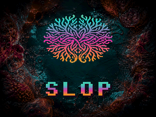</td>
      <td>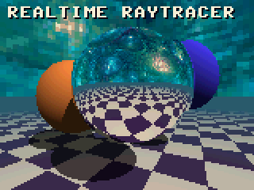</td>
      <td>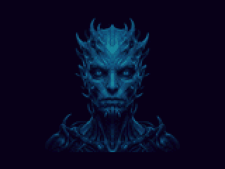</td>
    </tr>
    <tr>
      <td>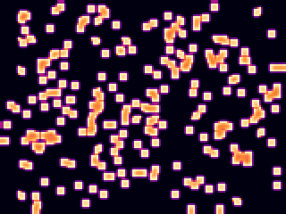</td>
      <td>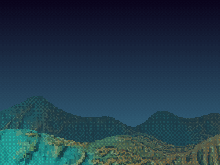</td>
      <td>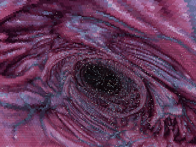</td>
    </tr>
  </table>

### 4. 11_FlashDemo (VOLTAGE)
* An original, incredibly fast cyber-neon, high-voltage production designed specifically for the **Pico 2 (RP2350)**.
* **Generator:** **Gemini 3.5 Flash** *(Antigravity)*.
* **Target Outputs:** Waveshare RP2350-Plus + Pimoroni VGA Demo Base.
* **Prebuilt Firmware:** [voltage_vga_rp2350.uf2](11_FlashDemo/voltage_vga_rp2350.uf2).
* **Aesthetic:** "Kinetic Neon, High-Voltage Plasma, and Cybernetic Glitches".
* **Visual Highlights:** Cyber spark-gap grids, unstable fluid reactor cores, real-time raymarched reflective cylinders (utilizing M33 FPU instructions), morphing 3D wireframe vector stars, polar-coordinate lightning spark-generators, real-time zooming Julia fractal shockwaves, and sub-pixel rotozooming outro credits.
* **Screenshots Showcase (Cyber-Neon Shader Engine):**
  <table>
    <tr>
      <td>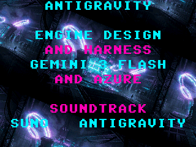</td>
      <td>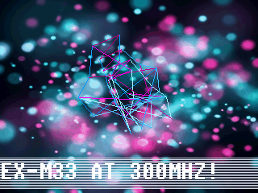</td>
      <td>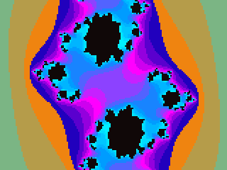</td>
    </tr>
    <tr>
      <td>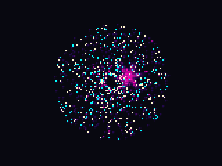</td>
      <td>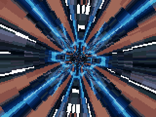</td>
      <td>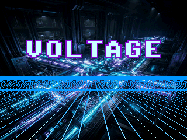</td>
    </tr>
  </table>

---

## Global Build & Environment Prerequisites

To compile any of the microcontroller binaries in this workspace, ensure your development machine matches the following environmental setup:

1. **Toolchain (Windows MSYS2 UCRT64):**
   - Install MSYS2 and use the UCRT64 environment.
   - Run `pacman -S` to install: `mingw-w64-ucrt-x86_64-arm-none-eabi-gcc`, `mingw-w64-ucrt-x86_64-arm-none-eabi-newlib`, `mingw-w64-ucrt-x86_64-cmake`, `mingw-w64-ucrt-x86_64-make`, `mingw-w64-ucrt-x86_64-picotool`, and `mingw-w64-ucrt-x86_64-ffmpeg`.
2. **Pico SDK 2.x:**
   - Git clone [raspberrypi/pico-sdk](https://github.com/raspberrypi/pico-sdk) and set the `$env:PICO_SDK_PATH` environment variable.
   - Ensure the submodules are fully updated (especially `lib/tinyusb`).
3. **Pico Extras:**
   - Git clone [raspberrypi/pico-extras](https://github.com/raspberrypi/pico-extras) (required for VGA scanvideo) and set `$env:PICO_EXTRAS_PATH`.
4. **Desktop Preview (Optional):**
   - For rapid iteration on desktop without flashing hardware, the demos provide MSYS2 SDL2 host shims. Make sure `mingw-w64-ucrt-x86_64-SDL2`, `mingw-w64-ucrt-x86_64-SDL2_mixer`, and `mingw-w64-ucrt-x86_64-libmikmod` are installed.

---


## Credits & Acknowledgements

* **Original Retro Hardware & Software Creators:**
  - **Spaceballs** (Original Amiga release of *State Of The Art*, 1992 - [pouët.net](https://www.pouet.net/prod.php?which=122)).
  - **nfd** (Modern C desktop/SDL reimplementation of SOTA - [nfd/sota](https://github.com/nfd/sota)).
  - **AZURE/ARTWORK** (Original Amiga 4k intro *Dawn*, 1995 - [pouët.net](https://www.pouet.net/prod.php?which=1460)).
* **Human Engineering & Direction:** Azure
* **LLM Engineering Squad:**
  - **Claude Opus 4.7** (Silhouette vector ports and structural foundations for SLOP / Project 10).
  - **Gemini 3.5 Flash / Antigravity** (Complete storyboard design, raymarching, fractal solvers, and optimizations for VOLTAGE / Project 11).
* **Audio Compression Codec:** Dominic Szablewski (MIT QOA).
* **Microcontroller Infrastructure:** Raspberry Pi & Pico SDK Contributors.
